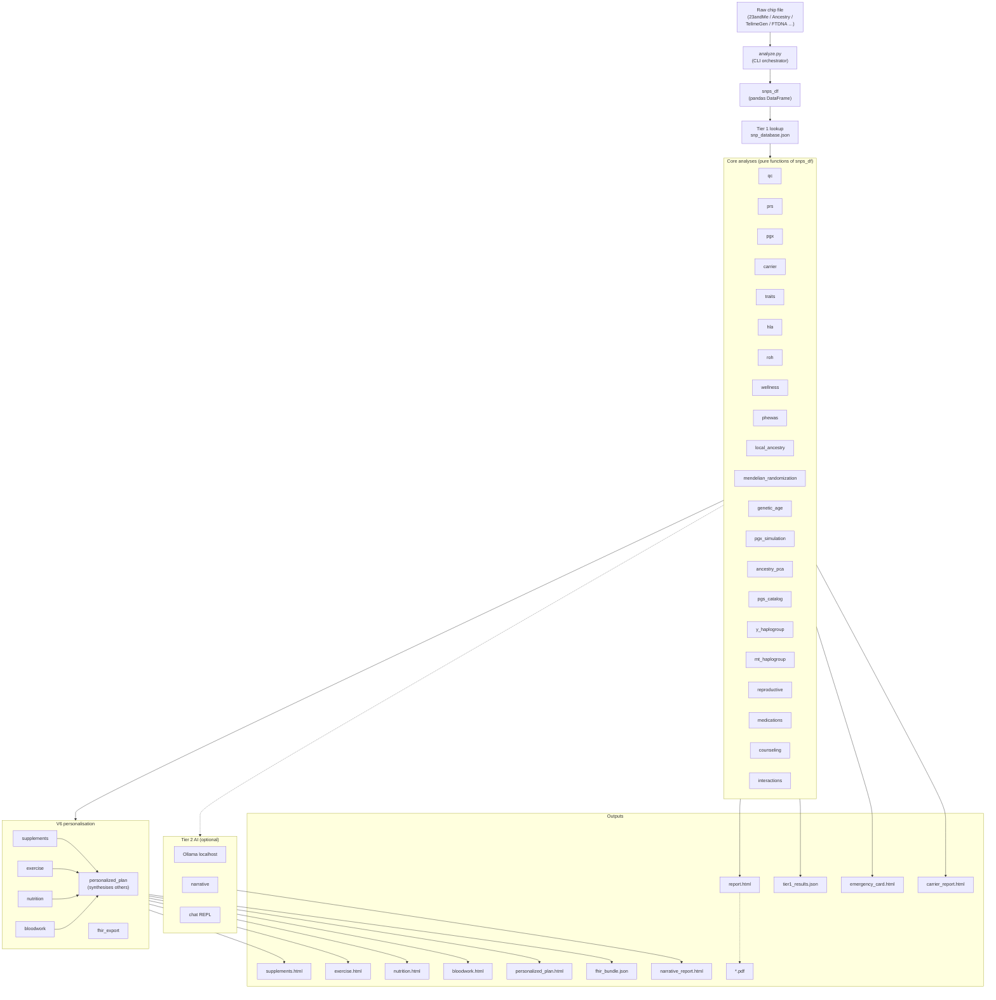

© 2026 Conall Aque. All Rights Reserved.

This software is proprietary and confidential. 
Unauthorized copying, modification, or distribution is prohibited.

---
# GenomeLens

### For reviewers — the 30-second version

1. **What this is:** an applied **health-economics** model that answers *what is knowing
   your genome actually worth?* — cost–utility analysis, value of information, and budget
   impact — computed on real genomic data, entirely offline.
2. **Method:** cost-utility analysis reporting cost, QALYs, ICER and INMB **separately**;
   correlated findings **pooled on the risk scale rather than summed**; a cohort
   state-transition model against US life-table mortality; probabilistic sensitivity
   analysis with a CEAC and a one-way tornado; EVPI, EVPPI and breakeven; an efficiency
   frontier with **extended** dominance; a Second Panel dual perspective with an impact
   inventory; and CHEERS 2022 reporting.
3. **What it will not do,** which is the part worth reading:
   - It **pools findings by condition instead of adding them.** Eight of twenty-one
     finding sources route onto the same cardiometabolic anchor. Summing them claimed a
     79% risk reduction — not a probability. Pooling removes ~52% of that inflation, and
     the report shows the size of its own correction rather than quietly banking it.
   - It **tells you how much of the answer is guesswork.** Every parameter carries a
     provenance tier; 47% of the model's ~350 figures resolve to a PMID or DOI, 99% carry
     a named source. When declared assumptions drive most of the variance, the report
     says so in a coloured box instead of leaving it in a footnote.
   - It **refuses to price some things.** Reproductive outcomes are never monetised —
     attaching a figure to an affected birth prices a prospective child and embeds one
     set of preferences as universal. A negative ICER is never reported, because the
     ratio is ambiguous in the dominance quadrants.
4. **The methods, with every equation and citation:** [`docs/METHODS.md`](docs/METHODS.md).
5. **Authorship, plainly:** the health-economics modelling, scientific decisions, and
   product direction are mine; the **software implementation was largely AI-generated**
   under my direction and review. What's on offer here is the economics and the judgement,
   not hand-written production code.

---

## 📄 Look at the output first

### **[→ `docs/samples/econ-output-sample.pdf`](docs/samples/econ-output-sample.pdf)** — 26 pages, real output

Faster than reading this page. **Synthetic input — no human genome, no personal health
data** was used to produce it.

| In the sample | Why it matters |
|---|---|
| Cost and QALYs reported **separately**, ICER **withheld** under dominance | a negative ICER is ambiguous; reporting one is the classic error |
| A **double-counting correction**, stating what the naive figure claimed and how much came out | the model shows the size of its own correction instead of banking it |
| An **adherence discount** charged to benefit *and* ongoing cost | trial efficacy is not real-world effectiveness |
| Three statistical corrections shown **before → after** | liability threshold, ancestry portability, competing-risk incidence |
| A footnote saying which figures rest on the sourced registry and which do not | you can see exactly how much of the answer is evidence |

Reproduce it end to end — no genome required:

```bash
python scripts/make_econ_sample.py /tmp/econ-sample
```

---

> **An applied health-economics engine that treats your health like a portfolio —
> running entirely on your own machine.**
> GenomeLens reads a consumer DNA file (23andMe, AncestryDNA, MyHeritage, FTDNA, …)
> *or* a full whole-genome / exome **VCF**, and models the decisions that improve your
> lifetime **return on health**: what each finding is worth, what *acting* on it is worth,
> and whether it is worth acting at all — reducing the left-tail risk of adverse drug
> reactions and informing everyday diet, fitness, and environmental choices.
>
> **Nothing ever leaves your machine — no cloud, no accounts, no telemetry.
> Even the AI interpretation runs on a local LLM.**


[](https://github.com/conallaque/genomelens/actions/workflows/ci.yml)


[](https://buymeacoffee.com/caque)

> **Not medical advice — educational & research use only.** Genetic
> predispositions are probabilistic; confirm anything actionable with a licensed
> physician and a board-certified genetic counsellor.

---

## Quickstart

No bioinformatics experience needed. If you can copy-paste into a terminal, you can run
this. **Prerequisites:** Python 3.10+ (`python3 --version`) and your raw DNA file.

### 1 — Get your raw DNA file
- **23andMe:** Account → *Settings* → *Download raw data* → you get a `.txt` (or `.zip`).
- **AncestryDNA / MyHeritage / TellMeGen / FamilyTreeDNA:** each has a "download raw
  data" option in account settings → a `.txt`/`.csv`.
- **Whole genome:** the `.vcf` / `.vcf.gz` from your sequencing provider.

### 2 — Install (one time, ~2 minutes)
```bash
git clone https://github.com/conallaque/genomelens.git
cd genomelens
python3 -m venv .venv && source .venv/bin/activate
pip install pandas numpy snps scipy scikit-learn requests
```

### 3 — Run it (fast path, no AI required)
```bash
# point it at wherever your file downloaded
python analyze.py ~/Downloads/genome.txt --no-ai

open report.html          # macOS   ·   use  xdg-open report.html  on Linux
```
That's it — `report.html` opens in your browser with the full analysis (plus
`supplements.html`, `nutrition.html`, `exercise.html`, `personalized_plan.html`).
Add `--bloodwork labs.json` to fold in real lab values (this unlocks biological age
**and the full health-economics model**), or `--fhir` for an HL7 FHIR R4 bundle
(EHR-*format*-compatible; educational data, not a certified clinical record).

### 4 — Run it with the local AI (Ollama)
The AI layer writes a plain-language interpretation of **every** section and powers an
offline Q&A chat — all running **locally**, so nothing ever leaves your machine.

**a. Install Ollama** (free, one time) — download from
[ollama.com/download](https://ollama.com/download) (or `brew install ollama` on macOS),
then make sure it's running (open the Ollama app, or run `ollama serve`).

**b. Download a model** (one time):
```bash
ollama pull qwen3:14b        # the default (~9 GB) — comfortable on 16 GB+ RAM
ollama pull llama3.1:8b      # lighter alternative for tighter RAM
```

**c. Run — just drop `--no-ai`:**
```bash
python analyze.py ~/Downloads/genome.txt
# using the lighter model instead of the default:
python analyze.py ~/Downloads/genome.txt --model llama3.1:8b
```

**d. Ask questions** — add `--chat` for an interactive Q&A grounded in your results:
```bash
python analyze.py ~/Downloads/genome.txt --chat
```
The AI only ever sees your deterministic findings, and a guardrail rejects any number
it tries to invent (see [Engineering notes](#engineering-notes)).

> ### ⚠ Important — read before using the chat
>
> **This is not medical advice, and the AI is not a doctor or a genetic counsellor.**
>
> - The chat assistant is an **educational tool only**. It cannot diagnose, cannot
>   prescribe, cannot interpret your results clinically, and must **never** be used to
>   start, stop, or change any medication, treatment, screening, or health decision.
> - **Language models make mistakes.** The grounding guardrail reduces fabricated
>   figures but **cannot eliminate error**. Anything the assistant says may be wrong,
>   incomplete, or misleading — including statements that sound confident and specific.
> - **Consumer and self-sequenced DNA data is not clinical-grade.** It carries false
>   positives and false negatives. A finding here is a *hypothesis to confirm*, never a
>   result to act on.
> - **A "clear" result does not mean you are not at risk.** Most disease risk is not
>   captured by this tool at all.
> - **Take every question or concern to a licensed physician and a board-certified
>   genetic counsellor**, who can order accredited confirmatory testing and interpret it
>   in the context of your personal and family history. If you believe you may have a
>   medical emergency, contact emergency services immediately.
>
> By using this software you accept that it is provided for education and research
> **"as is", without warranty of any kind**, and that you are solely responsible for any
> decisions you make. See the [LICENSE](LICENSE) and the disclaimers throughout this
> document.

### Using a whole genome instead of a chip?
Same commands — just point at your `.vcf`/`.vcf.gz` and fetch the predictor tables once:
```bash
python setup.py --predictors                      # AlphaMissense + gnomAD + REVEL (~4 GB)
python analyze.py ~/Downloads/genome.vcf.gz        # add --chat / --bloodwork as above
```
Disk/RAM/runtime for both input types are in **Runs on any laptop**, below.

> **Disclaimer.** Not medical advice. Educational and research use only.
> Genetic predispositions are probabilistic; environment, lifestyle, and
> chance dominate most outcomes. Confirm any clinically actionable finding
> with a licensed physician and a board-certified genetic counsellor.

---

## Why I built this

I've spent the last five years in health economics — a BA focused on it (with a
published paper), now finishing a master's at Northeastern — circling one question:
**what is the actual payoff of understanding your own health, in decisions?**

Your genome is the richest, longest-lived input to that question. But the payoff is
locked behind two barriers. First, **price**: buying the equivalent analyses and
interpretation piecemeal runs from a few hundred to a few thousand dollars. Second,
**privacy**: the usual way to
unlock them is to hand your genome — the one piece of data you can never change or
revoke — to a company's cloud, where it can be breached, sold, or repurposed.

That's a health-economics problem hiding in plain sight. The **value of information** in
a genome is real but individual — GenomeLens's own model puts it anywhere from
negligible to tens of thousands of dollars depending on what the file contains, and
reports which of the two it is rather than assuming the flattering answer — yet access
is gated by cost and by an unacceptable privacy price. So the *return on health* that genomics promises is, in
practice, only available to people who can pay and are willing to give themselves away.

**GenomeLens removes both barriers at once.** It runs the analysis locally, for free, on
a laptop someone might already own — and it doesn't just hand you data, it models the
return on health: what each finding is worth, what *acting* on it is worth, and whether
it's worth acting at all. That is applied health economics — value of information,
cost-effectiveness, and access — turned into something one person can run on their own
DNA, privately, at zero marginal cost.

The point was never a slick genomics toy. It's that the payoff of knowing your own
biology shouldn't require a big budget or a surrendered genome. On an ordinary laptop,
it doesn't.

## What this demonstrates, for anyone screening it as HEOR work

A portfolio project can show that someone is able to run a cost-effectiveness analysis.
That is table stakes. What follows is the part that is harder to fake, and each item is
traceable to a commit and a named test.

| Competency | Where to look |
|---|---|
| **Cost–utility analysis done properly** | Cost, QALYs, ICER and INMB reported separately, never blended into one "value" figure. ICER suppressed in the dominance quadrants, because a negative ratio is ambiguous. `econ_engine.CEAResult` |
| **Finding your own errors** | Eight of twenty-one finding sources routed onto one cardiometabolic anchor and were summed — a 79% risk reduction, which is not a probability. The fix is pooling on the risk scale; the report shows the size of its own correction. `ConditionPool`, `test_stacked_findings_do_not_sum_their_risk_reductions` |
| **Parameter provenance** | Every figure carries a source and a tier. 47% resolve to a PMID or DOI, 99% carry a named source, and the model states its own coverage rather than claiming "sourced". `econ_params.py`, `test_econ_params.py` |
| **Uncertainty that is real** | PSA over documented distributions, CEAC, one-way tornado. An earlier version reported a strategy as cost-saving in 100% of simulations — the finding-level parameters were pinned. Now the interval crosses zero and the report names the assumptions driving it. `test_psa_without_rebuild_understates_uncertainty` |
| **Value of information** | EVPI, EVPPI per parameter, and breakeven — so "this assumption matters" becomes "resolving it is worth \$X". EVPPI bounded above by EVPI, which an earlier draft violated. `econ_decision.py` |
| **Reporting standards** | CHEERS 2022 checklist including the items *not* addressed, Second Panel dual perspective, impact inventory listing what is deliberately excluded. |
| **Knowing what not to monetise** | Reproductive outcomes are never priced. The reasoning is stated in the code, enforced by a test, and surfaced in the report as a decision rather than an omission. `NOT_VALUED` |
| **Structural modelling** | Cohort state-transition model against US life-table mortality with Simpson's 1/3 within-cycle correction, cross-checked against an independent implementation. `test_within_cycle_weights_match_the_published_implementation` |
| **Communicating to non-specialists** | Number needed to screen, healthy time in days, payback period, confidence as a count out of a hundred — with the conditional mood wherever the underlying baseline is an assumption. `econ_plain.py` |

The recurring theme is that the model is built to report an unflattering answer as
readily as a flattering one, and several of the commits above exist because it did.

## What it does

GenomeLens runs **79 interlocking analysis modules** (≈54,800 lines of Python, a
780-test suite) entirely offline — across two input tiers: a consumer chip file
or a whole-genome / exome **VCF**.

**Health economics — the headline capability**
- **Health ROI — Value of Information (health economics):** answers one question — **what is knowing your genome actually worth?** — with a real decision model, not a marketing number:
  - **Puts a dollar value on each finding** — how much acting on it (screening, prevention, safer prescriptions) is worth to your health.
  - **Says how much is evidence and how much is judgement** — every parameter carries a provenance tier. 47% of the model's figures resolve to a PMID or DOI, 99% carry a named source, and the handful of declared assumptions are listed individually. Where those assumptions drive most of the variance, the report says so rather than claiming the whole thing is "sourced".
  - **Counts future health and money fairly** — discounts both costs and quality-adjusted life-years (QALYs) at 3%, the health-economics standard.
  - **Tells you whether sequencing is worth buying** — prospectively, from published yields, not by counting sequencing-only findings a chip file cannot contain. (That retrospective figure is structurally $0 for every array user; the report now explains this rather than letting it read as "sequencing adds nothing".)
  - **Shows its uncertainty honestly** — a Monte-Carlo simulation gives a *range* (95% confidence interval), never one fake-precise number, plus the **downside case** (VaR/CVaR) and **EVPI**, the ceiling on what further testing could be worth.
  - **Models health as depreciating capital** (Grossman) and **when to test** as a real option — so it can tell you the information is worth more *now* than later.
  - **Corrects the genetics before the economics** — penetrance is de-biased for ascertainment before it reaches the cost model, so the dollar figures don't inherit an inflated risk estimate. The liability-threshold, ancestry-portability and competing-mortality corrections are computed and reported step by step. Winner's-curse shrinkage is implemented but **not applied**: it needs a standard error per effect estimate, and the curated tables carry effect sizes without them — so the capability exists and the claim that it moves the dollar figures does not.
  - **Separates price from value** — what the tests *cost to buy* vs what acting on them is *worth*.
  - **Reports in plain English as well as in QALYs** — "roughly 1 in 56 people carry a serious actionable variant their array missed", "about 25 extra days of healthy life", "worth it in 98 of every 100 runs of the model". Number needed to screen, healthy time in days, and payback period sit alongside the ICER.
  - *No headline figure is quoted here. A previous version cited ≈$24k on the public GIAB HG001 genome; the pooling correction and the removal of an unsourced longevity term changed the arithmetic materially, and that genome has not been re-run since. Quoting the old number would be the exact error this model was rebuilt to stop making. **Any figure is individual and can be far lower.***

**Clinical & pharmacogenomic**
- **Pharmacogenomics (CPIC):** drug-response variants + dosing implications that *flag and reduce* adverse-drug-reaction risk.
- **Clinical variants (ClinVar) — Phase 2:** whole-genome pathogenic / likely-pathogenic screen with ACMG actionable findings, carrier status, compound-heterozygote detection, and ClinVar star-graded confidence.
- **Novel & rare variants (predictors) — Phase 3:** for variants *not* in ClinVar, an offline predictor screen (AlphaMissense · REVEL · CADD · SpliceAI · gnomAD rarity) surfaces predicted-damaging rare variants — clearly labelled as computational predictions, never clinical calls, and independently license-toggleable (`--commercial-safe`).
- **Carrier & family planning:** recessive carrier status with Hardy-Weinberg partner risk — transmission probability kept distinct from disease penetrance.

**Risk, aging & synthesis**
- **Polygenic risk:** curated PRS **plus** full PGS Catalog scoring files, EUR-normalised percentiles with coverage-bounded confidence.
- **Genetics × your bloodwork:** cross-references genotype against uploaded labs — PhenoAge biological age, AHA PREVENT 2023 10-year cardiovascular risk, 20+ composite indices.
- **Holistic synthesis:** a Genome-Leverage score and cross-panel pattern detection — where genes, labs, and lifestyle compound.

**Ancestry & traits**
- **Ancestry:** autosomal PCA + Y-DNA / mtDNA haplogroups + deep ancestry (Neanderthal %, Yamnaya / EEF / WHG affinity, migration timelines).
- Literature-grounded **immunogenetics, neurochemistry, addiction genetics, blood type,** and **trait genetics** panels.

**Lifestyle, interop & AI**
- Nutrigenomics, chronotype-based light timing, exercise programming, and a decade-by-decade life-stage playbook.
- **HL7 FHIR R4** export — EHR-*format*-compatible (educational data, not a certified clinical record).
- **Local AI on every tier — with hallucination guardrails:** an Ollama LLM interprets each module and powers an offline chat assistant; no data ever leaves the machine. Every interpretation is grounded **only** in the deterministic findings under a strict no-invention prompt, and a **post-generation validator flags any statistic the model introduced that is not in the source data** — appending a caution, or dropping the interpretation entirely when it is riddled with fabricated figures.

## Health economics — the return-on-health engine

Health economics is the lens GenomeLens is built around. The question that started
it: *what is the actual payoff of understanding your own biology — not in theory, but
in decisions?* The **Value-of-Information (VOI) engine** answers it with a proper
decision-analytic model instead of a marketing number.

**The model.** Each actionable finding is a decision node — *act* (screen, prevent,
avoid a drug) vs *population-default care*. The value of the genome is the difference
in expected net benefit between the informed and uninformed strategies, net of the
test's cost:

> value ≈ E[net benefit | genome known] − E[net benefit | not known] − test cost

**Net Monetary Benefit** is the headline metric — `NMB = ΔQALY × λ − ΔCost` — where λ
is the willingness-to-pay threshold (**\$50k / \$100k / \$150k per QALY**; Neumann et
al., *NEJM* 2014). Both future **costs and QALYs** are discounted at 3% (0/3/5%
sensitivity), the second-panel cost-effectiveness standard. ICER is reported as a
secondary metric; NMB leads because it handles dominance and negative ICERs cleanly.

**Grounded inputs.**
- **Cost-of-illness** per condition — lifetime direct + indirect cost (ADA, AHA,
  Alzheimer's Association), discounted to present value.
- **Pharmacogenomic economics** from published cost-effectiveness studies: expected
  averted-adverse-drug-reaction value = `P(prescribed) × P(ADR | genotype) ×
  RRR(genotype-guided) × [ADR cost + QALY loss·λ]` — HLA-B\*57:01/abacavir (Schackman
  2008), CYP2C19/clopidogrel (Kazi 2014), DPYD/fluoropyrimidine (Deenen 2016), and more.
  *(Chip-imputed HLA-B\*57:01 must be confirmed by clinical HLA typing before any abacavir
  prescribing decision — a false negative here is dangerous. These are educational
  estimates, not prescribing guidance.)*
- Phase-3 **predicted (unconfirmed)** variants enter **down-weighted by predictor
  confidence** — uncertain findings contribute less expected value, by construction.

**Three numbers, never conflated.**
- **Ex-ante (EVSI-style)** — value to a random person *before* testing (population priors).
- **Ex-post** — value given *this* genome.
- **Marginal ROI of chip → whole genome** — quantifying "is sequencing worth it *for me*?"

**Uncertainty is first-class.** A seeded **Monte-Carlo probabilistic sensitivity
analysis** (Beta on probabilities, Gamma on costs; the willingness-to-pay threshold is
swept across its range for the curve) yields a mean and **95% credible interval**, a
**cost-effectiveness acceptability curve**, and a one-way **tornado** — every figure is
a distribution, not a false point estimate. Reporting follows the **CHEERS 2022**
checklist in spirit.

**Beyond the base case — five further framings.** Each is fully derived in
[`docs/METHODS.md`](docs/METHODS.md):

| Framing | Question it answers | Theory |
|---|---|---|
| **VaR / CVaR** | How bad is a bad outcome? | coherent tail-risk measures |
| **Health capital** | Why is this worth more when I'm younger? | Grossman (1972) |
| **Real options** | Should I test now or wait for cheaper sequencing? | Dixit & Pindyck (1994) |
| **EVPI / EVPPI** | Could *any* further testing change my decision — and which input matters? | Raiffa & Schlaifer (1961); Claxton (1999); Strong et al. (2014) |
| **Expected utility** | What is certainty itself worth to me? | Arrow (1963); Pratt (1964) |
| **Prospect theory + hyperbolic discounting** | Why don't people buy a test that's clearly worth it? | Kahneman & Tversky (1979); Laibson (1997) |

**And on the genetics side, before any of it is monetised:**

| Correction | What it prevents | Theory |
|---|---|---|
| **Liability threshold** | Reporting a scary relative risk without the absolute risk | Falconer (1965) |
| **Competing risks** | Counting disease risk in years you may not be alive for | Fine & Gray (1999) |
| **Ascertainment de-biasing** | Family-study penetrance applied to an incidental carrier | Begg (2002) |
| **Winner's curse + James–Stein** | Taking selected, noisy effect sizes at face value | Zhong & Prentice (2008); James & Stein (1961) |
| **Ancestry portability** | Pretending a European-derived score transfers unchanged | Martin (2019); Privé (2022) |

Full derivations, every equation, and all citations for the above are in
[`docs/METHODS.md`](docs/METHODS.md).

**The genetics is corrected before the economics.** Two biases would otherwise inflate every
dollar figure: **ascertainment bias** (penetrance from clinically-ascertained families
overstates risk for an incidentally-identified carrier — Begg 2002; Gabai-Kapara 2014) and the
**winner's curse** (GWAS effect sizes are upward-biased by the discovery threshold — Zhong &
Prentice 2008). Both are shrunk before they reach the model, which makes the outputs *smaller*
and more defensible.

**Price ≠ value.** Market *price* (what equivalent tests cost to buy) is reported
separately from health-economic *value* (what acting on the findings is worth) —
conflating the two is exactly the error a health economist should refuse to make.

**Limitations.** Every parameter is sourced or flagged an assumption; PRS-derived
estimates carry an **ancestry-transferability caveat** (EUR-biased scores are
attenuated for other ancestries); and the output is explicitly an *illustrative
decision-analytic model — not a formal economic evaluation, and not financial or
medical advice.*

> **On worked examples.** Earlier versions of this README quoted ≈\$24,070 for the public
> GIAB HG001 genome. That figure is withdrawn rather than updated: pooling correlated
> findings and removing an unsourced longevity term changed the arithmetic materially,
> and HG001 has not been re-run since. A stale headline number is precisely the kind of
> claim this model was rebuilt to stop making, so it is not carried forward on the
> strength of having once been true. The engine's outputs are reproducible from any input
> file in a few seconds; the figures in the report are the ones to read.


## Engineering notes

- **Unified, strand-aware SNP registry** — one source of truth for GRCh37/38 coordinates and ancestral/derived alleles; caught and fixed palindrome/strand bugs that silently mis-call ancestry.
- **KING-robust relationship inference** — a proper kinship estimator (not naive percent-identity), IBS0-refined for parent-child vs full-sibling.
- **No fabricated figures** — no invented polygenic percentiles; transmission ≠ disease penetrance; ClinVar review-star confidence; Phase-3 findings are labelled computational predictions, never clinical calls; and a **grounding guardrail rejects any AI-introduced figure absent from the deterministic data**, so the local LLM cannot invent a risk or a statistic.
- **Runs cleanly end-to-end on a public genome** — a *functional* end-to-end test (not a clinical accuracy validation): the full **GIAB HG001 (NA12878)** reference genome runs through build detection, Phase-2 ClinVar, the Phase-3 predictor screen, and the health-ROI engine with **no runtime errors** — 3 ClinVar pathogenic (incl. a carrier), 141 predicted-damaging rare variants, and a modelled ROI reported with a confidence interval. (Functional check — outputs are computational estimates, not accuracy-validated against a clinical truth set.)
- **780-test suite**, reference-build auto-detection (GRCh37/38 incl. rsID-less whole-genome VCFs), and graceful degradation when optional data or models are absent.

## Runs on any laptop — no expensive setup

GenomeLens deliberately **trades speed for accessibility**. The heavy analyses use
tabix-indexed lookups that *stream* the genome region-by-region instead of loading it
into memory, so the whole thing runs on an ordinary laptop — just slower. No
workstation, no GPU, no cloud, and every tool is free and open-source. Developed and
tested on an **Apple M5 / 24 GB**; runs on macOS or Linux, Apple Silicon or Intel.

| Input | RAM | Disk | Typical runtime |
|---|---|---|---|
| **Standard chip** (23andMe / AncestryDNA / TellMeGen, ~0.6M SNPs) | ~2–4 GB (fine on 8 GB) | **< 1 GB** (the tool itself) | **~30 s–1 min** deterministic (see the AI note below ↓) |
| **Whole genome (~30×, VCF)** | **~8 GB** recommended (ran comfortably within 24 GB) | **~2–5 GB** for the practical predictor set (AlphaMissense ≈0.65 GB + gnomAD AF ≈3 GB + ClinVar ≈11 MB) **+ room for your VCF** (≈0.5–2 GB) | **~2–10 min** deterministic (≈2 min on GIAB; see the AI note below ↓) |

- The whole-genome **Phase-3 predictor scan is the slow part** — it queries every
  carried variant — and that is the speed-for-accessibility tradeoff. It's also a
  **one-time cost**: results cache, so you re-report and re-interpret instantly.
- **CADD is the only large table** (~81 GB if you host it locally, non-commercial).
  It's optional — skip it, or let the analyzer query it remotely on public data. The
  commercial-safe set (AlphaMissense + gnomAD) fits in **under 4 GB**.
- A **chip file needs no extra downloads at all** — the predictor/ClinVar tables are
  only used for whole-genome input.
- **The local AI is by far the slowest part — and it's entirely your choice.** The
  times above are the fast **deterministic** report (`--no-ai`). Turning the AI on runs a
  local LLM interpretation for *every* module plus the summaries — dozens of calls. This
  is true for **both** a chip and a whole genome (the AI interprets the same modules
  either way), so **with AI on, both take a long time** — the total is dominated by your
  model, not your data:
  - **Small model** (e.g. `--model llama3.1:8b`): roughly **20–60 minutes**.
  - **Large / unfiltered model** (e.g. a 30B): **2–4+ hours** on a laptop.

  It's a deliberate **speed-for-accessibility** tradeoff — and a **one-time cost** (results
  cache, so re-reports are instant). You control it: pick a smaller `--model`, use
  `--no-module-ai` to keep only the executive summary, or run `--no-ai` and read the
  deterministic report immediately. Times are on an Apple M5; older/lower-RAM machines are
  slower — but it still *runs*, which is the whole point.

Bottom line: **you don't need an expensive rig to analyze your own genome.** A regular
laptop, some patience, and disk space is enough — and nothing ever leaves the machine.

## How this was built

GenomeLens was conceived, architected, and directed by **[Conall Aque](https://www.linkedin.com/in/conalla/)** — MS
candidate in Commerce & Economic Development (**financial-economics** focus) at
Northeastern University, with an undergraduate focus in **health economics**. To be
explicit about who did what: the **health-economics modeling, the scientific and product
decisions, and the privacy-first design are the author's**; the **software implementation
was largely AI-generated (via an AI coding assistant), directed and reviewed by the
author**. The contribution on offer here is the applied-economics thinking and the
direction — not hand-written production code. Release history is in [`CHANGELOG.md`](CHANGELOG.md)
(current: **v6.23 — Phase-3 novel-variant predictors, the Value-of-Information
health-ROI engine, and AI hallucination guardrails**).

**Market-value context.** Two different numbers matter here — *price* and *value* —
and GenomeLens is built to model the second.

**Price (what comparable analysis costs).** GenomeLens doesn't sequence you — you bring
your own raw data, and it *substitutes for, at the consumer tier,* the
**analysis-and-interpretation layer** on top of it. Where people get that data, and the
rough market range **across** providers (prices vary widely by provider, tier, insurance,
and promotions — ballpark ranges, not quotes):

- **Consumer genotyping chips** (~0.6M SNPs) — 23andMe, AncestryDNA, MyHeritage,
  TellMeGen, FamilyTreeDNA — **roughly \$50–\$230**.
- **30× whole-genome sequencing** — Nebula Genomics, Dante Labs, Sequencing.com,
  Full Genomes — **roughly \$300–\$1,000+** (raw 30× at the low end; higher-coverage or
  analysis-bundled tiers at the top).

The **analysis and interpretation** GenomeLens runs on that data — the reports people
otherwise buy piecemeal (pharmacogenomics, carrier / trait / ancestry, polygenic scores,
nutrigenomics, counsellor-style write-ups) — is realistically **a few hundred dollars** of
consumer services, consolidated into one free, private, offline tool.

Some of what it surfaces has **clinical-grade** equivalents at accredited labs
(hereditary-cancer / ACMG panels, clinically interpreted whole genomes, genetic
counseling), which run from a few hundred to **several thousand dollars**. GenomeLens is an
**educational analog** of those, **not a clinical-grade substitute**, and doesn't claim to
hand you those savings.

**Value (what acting on the findings is worth).** Price is not value — and at its
core GenomeLens is a health-economics tool that models the latter. Its built-in
**Value-of-Information engine** estimates the expected **return on health** of acting
on your genome (averted adverse drug reactions, earlier screening, prevention), reported
with a confidence interval and with the share of that interval attributable to declared
assumptions rather than evidence. The magnitude is individual and frequently small — the
model is built to report a modest or negative result as readily as a large one.

*Illustrative comparison using typical U.S. self-pay pricing; the value figure is a
modelled, uncertain estimate from the built-in health-economics engine. Not a formal
valuation, and not a substitute for clinical-grade testing.*

---

## Features

### Core analyses
- **Curated SNP catalogue** — thousands of variants annotated for disease risk,
  drug response, traits, methylation, detox, hormones, and more.
- **APOE genotype** — Alzheimer's risk and lipid metabolism inference.
- **Y-DNA haplogroup** — recursive tree walker (Macro-K → N/O/Q/P/R) with full
  N-subclade hierarchy (M231 → N1a1a → L1026/Z1936) and migration narratives.
- **mtDNA haplogroup** — maternal lineage classification.
- **Pharmacogenomics (PGx)** — CYP2D6, CYP2C19, CYP2C9, VKORC1, TPMT, DPYD,
  SLCO1B1, UGT1A1, HLA-B*57:01 etc. CPIC phenotypes + drug-level recs.
- **Polygenic Risk Scores (PRS)** — 20+ panels (CAD, T2D, breast/prostate
  cancer, Alzheimer's, …) with percentile, tier, and confidence.
- **Expanded PGS Catalog** — additional published polygenic scores.
- **Carrier status** — autosomal-recessive screening (CF, HH, FV Leiden, …).
- **Compound heterozygosity** — cross-variant interaction detection.
- **Trait predictions** — 100+ traits (eye, hair, taste, alcohol flush, …).
- **HLA imputation** — tag-SNP method for clinically relevant alleles.
- **Wellness predictions** — vitamin metabolism, sleep, fitness, stress.
- **ROH scan** — runs of homozygosity / consanguinity context.
- **Ancestry PCA + lineage cross-check** — global ancestry proportions from
  1000 Genomes, strand-aware and reconciled against the Y-DNA/mtDNA haplogroups
  (flags autosomal calls that contradict the deep paternal/maternal lineage).
- **Local ancestry painting** — chromosome-by-chromosome SVG ideogram.
- **Detoxification & environmental resilience** — Phase I/II xenobiotic handling
  (CYP1A1/1A2/1B1, GSTs, NQO1, EPHX1, NAT2), NRF2 antioxidant axis, and
  heavy-metal handling, with a wildfire-smoke resilience score + protocol.
- **Metal handling, oxidative defense & neurodegeneration** — LRRK2/GBA, HFE,
  G6PD, ATP7B, metallothioneins, ZIP transporters, catalase.
- **Gut-health panel** — FUT2 secretor status, lactase, histamine (AOC1), and
  related loci.
- **Top-prescribed-drugs screen + PharmGKB clinical annotations** — genotype
  actionability across the most common prescriptions.
- **Health economics** — modeled clinical/payer ROI for genomic interventions.
- **PheWAS** — phenome-wide biomarker percentile predictions (LDL, HDL, CRP,
  HbA1c, vitamin D, ferritin, testosterone, TSH, …).
- **Mendelian randomization** — causal-direction projections.
- **Genetic longevity** — biological-age proxy.
- **Reproductive simulator** — partner-by-partner offspring risk modelling.
- **Imputation** — Beagle 5.4 against 1000G Phase 3 (optional, ≈30-90 min).
- **QC** — callability grading, sex inference, file hash, format detection.

### V6 personalisation modules
- **Comprehensive blood-work analysis** (`--bloodwork labs.json`) — two layers:
  (1) a clinical engine classifying ≈50 biomarkers against standard *and*
  functional/optimal ranges across 12 body systems, with ≈12 calculated markers
  (non-HDL, TG:HDL, ApoB:ApoA1, HOMA-IR, eGFR, transferrin saturation, NLR,
  FIB-4, …), genotype-aware interpretation (HFE, APOE, TCF7L2, MTHFR, GC, FUT2,
  ABCG2, UGT1A1, LPA), and per-system + overall health scores; and (2) the
  original genetics-vs-labs comparison flagging confirmed/partial/diverged rows
  with SD-scaled deltas.
- **Personalised supplement stack** — tiered (essential/recommended/optional)
  recommendations driven by methylation, vitamin, hormone, inflammation, and
  detox SNPs. Includes dose, timing, form, monthly cost, and interactions.
- **Personalised exercise programming** — ACTN3, ACE, COL1A1/5A1, PPARGC1A,
  IL6, BDNF, CLOCK driven power/endurance bias, injury risk, recovery speed,
  chronotype window, and a 7-day template.
- **Personalised nutrition plan** — FTO/TCF7L2/FADS/APOE-driven macro ratio,
  food emphasis/avoid lists, caffeine + alcohol + salt + lactose + gluten +
  methylation guidance, daily meal pattern.

### Clinical / portfolio outputs
- **HL7 FHIR R4 export** (`--fhir`) — clinically *actionable* finding **types**
  (PGx, carrier, HLA, APOE), chip-derived and requiring confirmatory clinical
  testing, emitted as an HL7 FHIR R4 Bundle JSON — **format-compatible** with EHR
  ingestion (Epic / Cerner / Athena), not a certified clinical record.
- **PDF export** (`--pdf`) — paginated WeasyPrint render.
- **Emergency medical card** (`--emergency-card`) — one-page actionable summary
  for clinicians.
- **Narrative report** (`--narrative`) — warm, LLM-written prose summary.
- **Carrier-status standalone report** (`--carrier-report`).
- **Chat REPL** (`--chat`) — Q&A backed by local Ollama with full results
  loaded as context.
- **Compare runs** (`--compare prev.json`) — diff two analyses.

---

## Architecture



The pipeline is **horizontally pluggable** — every module is imported in a
`try / except ImportError` block, so deleting a single file degrades gracefully
rather than breaking the run. The V6 personalisation layer reads only the
structured dicts produced by the core modules; it never re-derives genotype
calls. The `personalized_plan` dashboard is a pure synthesiser — it imports
only its sibling V6 outputs and stitches them into a single executive-summary
page.

---

## Installation

### 1. Clone

```bash
git clone https://github.com/conallaque/genomelens.git
cd genomelens
```

### 2. Python deps

```bash
python3 -m venv .venv
source .venv/bin/activate
pip install -r requirements.txt
```

`requirements.txt` minimally needs: `pandas`, `numpy`, `snps`, `scipy`,
`scikit-learn`, `requests`. Optional: `weasyprint` (PDF), `pysam` + Beagle 5.4
(imputation).

### 3. One-time data setup (≈3 GB)

```bash
python setup.py --all
```

Downloads 1000 Genomes reference data, GWAS summary statistics, and ancestry
PCA panels. Cached locally; subsequent runs are instant.

### 4. (Optional) Local LLM via Ollama

```bash
brew install ollama          # macOS
ollama pull qwen3:14b         # default model
ollama serve                  # in another shell
```

---

## Usage

```bash
# Basic — produces report.html
python analyze.py ~/Downloads/genome.csv

# Skip the AI tier (~3× faster, no Ollama needed)
python analyze.py genome.csv --no-ai

# Add imputation (one-time ~30-90 min, cached afterwards)
python analyze.py genome.csv --impute

# Generate a paginated PDF
python analyze.py genome.csv --pdf

# Medication review
python analyze.py genome.csv --medications "sertraline, ibuprofen, warfarin"

# Compare predictions to actual blood work
python analyze.py genome.csv --bloodwork labs.json

# Clinical EHR export
python analyze.py genome.csv --fhir

# All the bells and whistles
python analyze.py genome.csv --impute --pdf --carrier-report \
    --emergency-card --narrative --bloodwork labs.json --fhir --chat
```

### `--bloodwork` JSON format

```json
{
  "sex": "M",            "age": 41,
  "total_cholesterol": 210, "ldl": 142,     "hdl": 48,
  "triglycerides": 180,  "apob": 105,       "lp_a": 35,
  "fasting_glucose": 96, "hba1c": 5.7,      "fasting_insulin": 9,
  "crp": 2.4,            "homocysteine": 11, "uric_acid": 6.2,
  "alt": 28,             "ast": 24,          "ggt": 30,
  "bilirubin_total": 0.9, "creatinine": 1.0, "bun": 15,
  "tsh": 1.8,            "ferritin": 180,   "iron": 110, "tibc": 320,
  "vitamin_d": 22,       "vitamin_b12": 410, "folate": 12,
  "hemoglobin": 14.8,    "wbc": 6.1,        "platelets": 235,
  "neutrophils": 3.6,    "lymphocytes": 1.9, "magnesium": 2.0,
  "testosterone": 480,   "shbg": 32,        "omega3_index": 6.5,
  "systolic_bp": 128,    "diastolic_bp": 82, "resting_hr": 64
}
```

Every field is optional — supply whatever your panel reports and the rest is
skipped. Keys are case-insensitive and accept common synonyms (`ldl_c`, `hgb`,
`hb`, `b12`, `e2`, `sbp`, …). Adding `sex` and `age` unlocks sex-specific
reference ranges and the eGFR / FIB-4 calculated markers. Calculated markers
(non-HDL, TG:HDL, ApoB:ApoA1, HOMA-IR, transferrin saturation, …) are derived
automatically wherever their inputs are present.

**Biological age, AHA PREVENT 10-year cardiovascular risk, and 20+ literature-
cited composite indices** are computed automatically. For **longitudinal tracking**, pass a
history of dated panels and the report charts your trajectory over time:

```json
{
  "sex": "M", "age": 41,
  "history": [
    { "date": "2024-02-10", "ldl": 165, "hdl": 38, "hba1c": 6.0, "crp": 4.0 },
    { "date": "2025-03-01", "ldl": 105, "hdl": 52, "hba1c": 5.3, "crp": 0.9 }
  ]
}
```

---

## Output files

After a full run, the working directory will contain:

| File | Trigger | Contents |
|---|---|---|
| `report.html` | always | The main report (Tier 1 + Tier 2 AI). |
| `tier1_results.json` | always | Machine-readable variant matches + summary. |
| `failed_categories.json` | AI run | Categories whose AI pass timed out — replay via `--retry-failed`. |
| `report.pdf` | `--pdf` | Paginated PDF of the main report. |
| `carrier_report.html` | `--carrier-report` | Standalone family-planning doc. |
| `emergency_card.html` | `--emergency-card` | One-page actionable summary. |
| `narrative_report.html` | `--narrative` | LLM-written prose summary. |
| `bloodwork.html` | `--bloodwork` | Comprehensive clinical panel (reference/optimal ranges, calculated markers, genotype-aware flags, system scores) + genetics-vs-labs comparison. |
| `economic_analysis.html` | auto | Modeled 10-year economic impact of acting on your results (cost avoidance + QALY value, net value, ROI). |
| `supplements.html` | auto | Tiered supplement stack with reasoning + chip gaps. |
| `exercise.html` | auto | Power/endurance bias + weekly template. |
| `nutrition.html` | auto | Macro ratios + food lists + daily plan. |
| `personalized_plan.html` | auto | **Master dashboard** synthesising the four above. |
| `fhir_bundle.json` | `--fhir` | HL7 FHIR R4 Bundle (DiagnosticReport + Provenance). |
| `changelog.json` | `--compare prev.json` | Diff vs. previous run. |

---

## Sample output

One run writes a self-contained set of HTML pages next to the output path — no
server, no build step, no network. Every one opens in a browser on its own.

| File | What is in it |
|---|---|
| `report.html` | The main report. Every module's section, including the pooled cost-effectiveness analysis, the plain-language summary, and the Y-DNA / mtDNA lineage chains. |
| `economic_analysis.html` | The individual's economic sheet — cost avoided, QALYs, net monetary benefit, and the cost-saving / cost-effective split kept explicitly apart. |
| `emergency_card.html` | One page, actionable findings only: drug hypersensitivities, clotting disorders, pharmacogenomic extremes. Designed to be printed and carried. |
| `supplements.html` | Ranked supplement stack with the genotype behind each entry and a tier for how well evidenced it is. |
| `nutrition.html` | Macronutrient pressures, food-specific guidance, and a 30-day meal plan. |
| `exercise.html` | Power/endurance bias, trainability tiers, and lift-level protocol cards. |
| `longevity.html` | Longevity composite and a quarterly year-long plan. |
| `personalized_plan.html` | The master dashboard tying the other pages together. |

| `economics.html` | **Every economic result in one place** — the pooled payer analysis, the individual sheet, and the per-finding detail, assembled from one computation so the three views cannot disagree. |

### 📄 [See the actual output → `docs/samples/econ-output-sample.pdf`](docs/samples/econ-output-sample.pdf)

**26 pages of real output from a synthetic whole genome.** No human genome and no
personal health data were used to produce it — the input is a constructed VCF
(200,023 chip-equivalent variants plus 8 rare missense variants in genes the model
has cost anchors for, scored offline against AlphaMissense).

It is the fastest way to judge whether this is HEOR work or vocabulary. What is in it:

- the disaggregated headline — **cost and QALYs reported separately**, with the ICER
  *withheld* rather than reported as a negative number, because a ratio in the
  dominance quadrants is ambiguous
- a **double-counting correction** stating what the naive additive figure would have
  claimed and how much was removed
- an **adherence card** charging the efficacy-to-effectiveness gap to both the benefit
  *and* the ongoing cost, and naming the fixed cost that does not scale
- three **statistical corrections** shown before → after: Falconer liability threshold,
  ancestry portability, competing-risk incidence
- a **CEAC**, one-way tornado, EVPI/EVPPI, a Second Panel dual perspective, and CHEERS
  2022 reporting
- a footnote stating, for every figure, whether it rests on the provenance registry or
  on a curated table that is **not** on it

Reproduce it end to end:

```bash
python scripts/make_econ_sample.py /tmp/econ-sample
# then print /tmp/econ-sample/economics.html to PDF
```

---

## Tech stack

- **Language:** Python 3.10+
- **Data:** pandas, numpy, scipy, scikit-learn
- **Genetics libs:** [`snps`](https://pypi.org/project/snps/) (file parsing),
  Beagle 5.4 (imputation), 1000 Genomes Phase 3 (reference panel)
- **AI:** Local Ollama runtime (`qwen3:14b` default; any chat model works)
- **PDF:** WeasyPrint
- **Clinical export:** HL7 FHIR R4 + Clinical Genomics IG v2.0
- **Tested chips:** 23andMe (v3 / v4 / v5), AncestryDNA, MyHeritage, FTDNA,
  TellmeGen (Illumina GSA), Living DNA
- **OS:** macOS, Linux. Windows untested.

---

## Privacy

- **No network calls** during analysis except optional Ollama (`localhost:11434`).
- DNA files never leave your machine.
- `tier1_results.json` and HTML reports contain genotypes and should be
  treated as PHI — the bundled `.gitignore` prevents them being committed.

---

## Roadmap

- Additional PRS panels from PGS Catalog API
- Bring-your-own-LLM (OpenAI / Anthropic) for users without local GPU
- Streamlit web UI for non-CLI users (still 100% local)

---

## Development

### Running tests

```bash
pip install -r requirements-dev.txt
pytest                                  # full suite
pytest -m "not slow"                    # fast subset
pytest --cov --cov-report=term-missing  # with coverage
pytest --snapshot-update tests/golden/  # regenerate golden snapshots (review the diff!)
```

The suite ships **780 tests** across:

- `tests/unit/` — per-module behavioural tests (strand-handling, threshold
  boundaries, render smoke tests).
- `tests/registry/` — invariants for the unified SNP registry (frozen
  records, allele validation, position lookup).
- `tests/golden/` — JSON snapshot regression tests; any intentional output
  change requires `--snapshot-update` + a deliberate review of the diff.

### Linting and types

```bash
ruff check .          # lint
ruff format .         # format
mypy snp_registry.py cli.py    # strict-mode modules (new V7 code)
```

The `pyproject.toml` config is intentionally conservative: ruff selects a
small focused rule set, mypy is strict only on new modules. The strict-mode
set grows as legacy modules are cleaned up.

### CI

[`.github/workflows/ci.yml`](.github/workflows/ci.yml) runs on every push and
pull request:

- **tests** — the full suite on Python 3.10 / 3.11 / 3.12, then an import of the
  CLI entry point and a full end-to-end report generation from the committed
  synthetic genome. The suite imports modules directly and never exercises the
  facade `pipeline.py` imports through, so a green suite alone is not proof the
  CLI starts — that is checked separately.
- **lint and types** — `ruff check` and `mypy` on its configured strict set,
  both clean on a clean tree.
- **dna-guard** — asserts the two `.gitignore` rules that keep genotype data
  out of the repository are still in place, and that nothing genotype-shaped
  besides the synthetic test file is tracked.

`ruff format --check` is deliberately **not** gated: the formatter reflows 132
files, collapsing hand-aligned parameter tables and comment blocks that carry
most of this codebase's explanation. Lint catches defects; the formatter has an
opinion about layout, and here the layout is load-bearing.

### Extending it

*(The licence is All Rights Reserved, so this is a note on how the code is organised rather than an invitation for pull requests.)*

The project is structured so each analysis module is independent — the
easiest way to extend it is to add a new module that takes `snps_df` and
returns a structured dict, then wire it into `analyze.py` behind a
`try / except ImportError` block.

**When adding genotype-based rules:**

- **Use the unified SNP registry** (`snp_registry.risk_dose_from_df`)
  rather than re-implementing strand-aware dose. Every new rsID must be
  declared once in `snp_registry._RECORDS` — chip strand differences,
  GRCh37/38 coordinates, and ancestral/derived alleles flow from there.
  Adding a per-module dict of rsIDs is rejected in code review; see
  `docs/MIGRATION_PLAYBOOK.md` for the reasoning.
- **Surface chip gaps explicitly.** A silent `return []` when the SNP is
  missing is indistinguishable to the user from "checked and ancestral".
  Use the `_chip_gap()` placeholder so the user can see what *couldn't* be
  evaluated.
- **Document the variance-explained reality.** Common-variant polygenic
  predictions typically explain 5–20% of trait variance; phrase tier labels
  and thresholds accordingly. "Diverged" in `bloodwork.py` means "non-genetic
  driver dominating," not "the genetic prediction is wrong."
- **Add unit tests + a golden snapshot.** New behaviour must be locked
  against regression. See `tests/unit/test_supplements.py` as the template.

For larger architectural changes (new pipeline stages, output formats, the
ongoing analyze.py decomposition), open an issue first to discuss.

---

## Support

GenomeLens is built and maintained by one person, in the open. If it saved you a
consult, taught you something about your own biology, or you just appreciate the
engineering, you can help fuel the next module:

[](https://buymeacoffee.com/caque)

---

## Citation

If this tool informs research or teaching material, please cite it as:

```bibtex
@software{dna_analysis_tool,
  title  = {GenomeLens — a local, privacy-first health-economics engine for consumer genomics},
  author = {Aque, Conall R.},
  year   = {2026},
  url    = {https://github.com/conallaque/genomelens},
  note   = {Local chip/whole-genome analysis with HL7 FHIR R4 export (educational; not a certified clinical record)}
}
```

Underlying datasets and guidelines should be cited independently — CPIC for
pharmacogenomic recommendations, ClinVar for variant interpretation, PGS
Catalog for polygenic scores, ISOGG / YFull for Y-DNA phylogeny, the relevant
GWAS consortia (UK Biobank, GIANT, GLGC, MAGIC, PGC, Astle 2016, Yengo 2022,
…) for biomarker effect sizes, and the HL7 Clinical Genomics IG for the FHIR
output format.

---

## License

**Proprietary — © 2026 Conall Aque. All Rights Reserved.** This repository is
public for viewing and reference only. Use, copying, modification, or
distribution without the author's written permission is prohibited. No warranty.

---

## Acknowledgements

Built on top of the work of countless GWAS consortia (PGC, UK Biobank, GIANT,
GLGC, MAGIC, Astle 2016, …), CPIC, ClinVar, PharmGKB, ISOGG, YFull, and the
PGS Catalog. Reference genome positions are GRCh37/hg19 unless noted.
