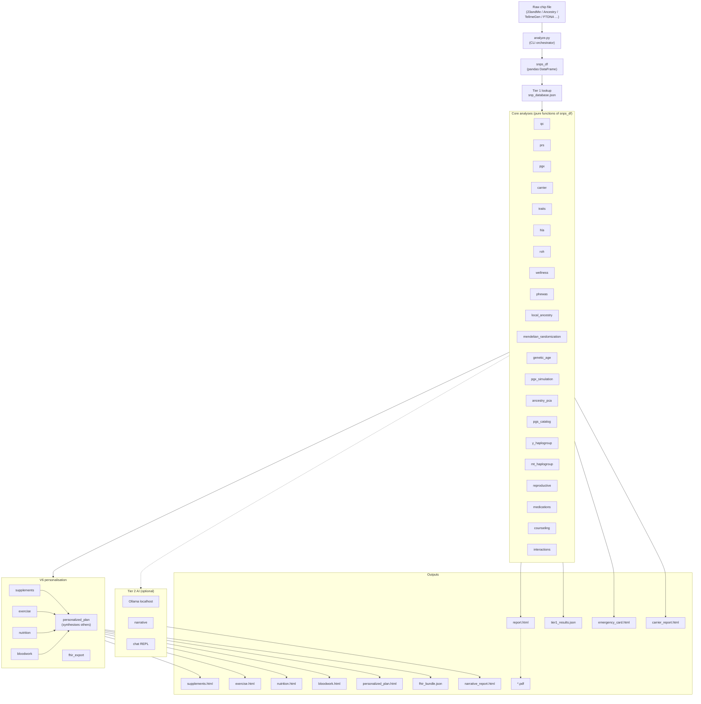

© 2026 Conall Aque. All Rights Reserved.

This software is proprietary and confidential. 
Unauthorized copying, modification, or distribution is prohibited.

---
# GenomeLens

> **A local, privacy-first genomics engine that treats your health like a portfolio.**
> GenomeLens turns a consumer DNA file (23andMe, AncestryDNA, MyHeritage, FTDNA, …)
> *or* a full whole-genome / exome **VCF** into a comprehensive, actionable health
> report — and models the decisions that improve your lifetime **return on health**:
> reducing the left-tail risk of adverse drug reactions and informing everyday
> diet, fitness, and environmental choices.
>
> **Nothing ever leaves your machine — no cloud, no accounts, no telemetry.
> Even the AI interpretation runs on a local LLM.**


[](https://buymeacoffee.com/caque)

> **Not medical advice — educational & research use only.** Genetic
> predispositions are probabilistic; confirm anything actionable with a licensed
> physician and a board-certified genetic counsellor.

---

## Quickstart

No bioinformatics experience needed. If you can copy-paste into a terminal, you can run
this. **Prerequisites:** Python 3.10+ (`python3 --version`) and your raw DNA file.

### 1 — Get your raw DNA file
- **23andMe:** Account → *Settings* → *Download raw data* → you get a `.txt` (or `.zip`).
- **AncestryDNA / MyHeritage / TellMeGen / FamilyTreeDNA:** each has a "download raw
  data" option in account settings → a `.txt`/`.csv`.
- **Whole genome:** the `.vcf` / `.vcf.gz` from your sequencing provider.

### 2 — Install (one time, ~2 minutes)
```bash
git clone https://github.com/conallaque/genomelens.git
cd genomelens
python3 -m venv .venv && source .venv/bin/activate
pip install pandas numpy snps scipy scikit-learn requests
```

### 3 — Run it (fast path, no AI required)
```bash
# point it at wherever your file downloaded
python analyze.py ~/Downloads/genome.txt --no-ai

open report.html          # macOS   ·   use  xdg-open report.html  on Linux
```
That's it — `report.html` opens in your browser with the full analysis (plus
`supplements.html`, `nutrition.html`, `exercise.html`, `personalized_plan.html`).
Add `--bloodwork labs.json` to fold in real lab values (this unlocks biological age
**and the full health-economics model**), or `--fhir` for an HL7 FHIR R4 bundle
(EHR-*format*-compatible; educational data, not a certified clinical record).

### 4 — Run it with the local AI (Ollama)
The AI layer writes a plain-language interpretation of **every** section and powers an
offline Q&A chat — all running **locally**, so nothing ever leaves your machine.

**a. Install Ollama** (free, one time) — download from
[ollama.com/download](https://ollama.com/download) (or `brew install ollama` on macOS),
then make sure it's running (open the Ollama app, or run `ollama serve`).

**b. Download a model** (one time):
```bash
ollama pull qwen3:14b        # the default (~9 GB) — comfortable on 16 GB+ RAM
ollama pull llama3.1:8b      # lighter alternative for tighter RAM
```

**c. Run — just drop `--no-ai`:**
```bash
python analyze.py ~/Downloads/genome.txt
# using the lighter model instead of the default:
python analyze.py ~/Downloads/genome.txt --model llama3.1:8b
```

**d. Ask questions** — add `--chat` for an interactive Q&A grounded in your results:
```bash
python analyze.py ~/Downloads/genome.txt --chat
```
The AI only ever sees your deterministic findings, and a guardrail rejects any number
it tries to invent (see [Engineering notes](#engineering-notes)).

> ### ⚠ Important — read before using the chat
>
> **This is not medical advice, and the AI is not a doctor or a genetic counsellor.**
>
> - The chat assistant is an **educational tool only**. It cannot diagnose, cannot
>   prescribe, cannot interpret your results clinically, and must **never** be used to
>   start, stop, or change any medication, treatment, screening, or health decision.
> - **Language models make mistakes.** The grounding guardrail reduces fabricated
>   figures but **cannot eliminate error**. Anything the assistant says may be wrong,
>   incomplete, or misleading — including statements that sound confident and specific.
> - **Consumer and self-sequenced DNA data is not clinical-grade.** It carries false
>   positives and false negatives. A finding here is a *hypothesis to confirm*, never a
>   result to act on.
> - **A "clear" result does not mean you are not at risk.** Most disease risk is not
>   captured by this tool at all.
> - **Take every question or concern to a licensed physician and a board-certified
>   genetic counsellor**, who can order accredited confirmatory testing and interpret it
>   in the context of your personal and family history. If you believe you may have a
>   medical emergency, contact emergency services immediately.
>
> By using this software you accept that it is provided for education and research
> **"as is", without warranty of any kind**, and that you are solely responsible for any
> decisions you make. See the [LICENSE](LICENSE) and the disclaimers throughout this
> document.

### Using a whole genome instead of a chip?
Same commands — just point at your `.vcf`/`.vcf.gz` and fetch the predictor tables once:
```bash
python setup.py --predictors                      # AlphaMissense + gnomAD + REVEL (~4 GB)
python analyze.py ~/Downloads/genome.vcf.gz        # add --chat / --bloodwork as above
```
Disk/RAM/runtime for both input types are in **Runs on any laptop**, below.

> **Disclaimer.** Not medical advice. Educational and research use only.
> Genetic predispositions are probabilistic; environment, lifestyle, and
> chance dominate most outcomes. Confirm any clinically actionable finding
> with a licensed physician and a board-certified genetic counsellor.

---

## Why I built this

I've spent the last five years in health economics — a BA focused on it (with a
published paper), now a master's in financial economics — circling one question:
**what is the actual payoff of understanding your own health, in decisions?**

Your genome is the richest, longest-lived input to that question. But the payoff is
locked behind two barriers. First, **price**: buying the equivalent analyses and
interpretation piecemeal runs from a few hundred to a few thousand dollars. Second,
**privacy**: the usual way to
unlock them is to hand your genome — the one piece of data you can never change or
revoke — to a company's cloud, where it can be breached, sold, or repurposed.

That's a health-economics problem hiding in plain sight. The **value of information** in
a genome is large — GenomeLens's own model (a transparent but uncertain estimate) puts it
in the *tens of thousands of dollars* of expected health value — yet access is gated by
cost and by an
unacceptable privacy price. So the *return on health* that genomics promises is, in
practice, only available to people who can pay and are willing to give themselves away.

**GenomeLens removes both barriers at once.** It runs the analysis locally, for free, on
a laptop someone might already own — and it doesn't just hand you data, it models the
return on health: what each finding is worth, what *acting* on it is worth, and whether
it's worth acting at all. That is applied health economics — value of information,
cost-effectiveness, and access — turned into something one person can run on their own
DNA, privately, at zero marginal cost.

The point was never a slick genomics toy. It's that the payoff of knowing your own
biology shouldn't require a big budget or a surrendered genome. On an ordinary laptop,
it doesn't.

## What it does

GenomeLens runs **41 interlocking analysis modules** (≈42,700 lines of Python, a
386-test suite) entirely offline — across two input tiers: a consumer chip file
or a whole-genome / exome **VCF**.

**Clinical & pharmacogenomic**
- **Pharmacogenomics (CPIC):** drug-response variants + dosing implications that *flag and reduce* adverse-drug-reaction risk.
- **Clinical variants (ClinVar) — Phase 2:** whole-genome pathogenic / likely-pathogenic screen with ACMG actionable findings, carrier status, compound-heterozygote detection, and ClinVar star-graded confidence.
- **Novel & rare variants (predictors) — Phase 3:** for variants *not* in ClinVar, an offline predictor screen (AlphaMissense · REVEL · CADD · SpliceAI · gnomAD rarity) surfaces predicted-damaging rare variants — clearly labelled as computational predictions, never clinical calls, and independently license-toggleable (`--commercial-safe`).
- **Carrier & family planning:** recessive carrier status with Hardy-Weinberg partner risk — transmission probability kept distinct from disease penetrance.

**Risk, aging & synthesis**
- **Polygenic risk:** curated PRS **plus** full PGS Catalog scoring files, EUR-normalised percentiles with coverage-bounded confidence.
- **Genetics × your bloodwork:** cross-references genotype against uploaded labs — PhenoAge biological age, AHA PREVENT 2023 10-year cardiovascular risk, 20+ composite indices.
- **Holistic synthesis:** a Genome-Leverage score and cross-panel pattern detection — where genes, labs, and lifestyle compound.
- **Health ROI — Value of Information (health economics):** answers one question — **what is knowing your genome actually worth?** — with a real decision model, not a marketing number:
  - **Puts a dollar value on each finding** — how much acting on it (screening, prevention, safer prescriptions) is worth to your health.
  - **Uses real data, not guesses** — sourced cost-of-illness figures and published drug cost-effectiveness studies.
  - **Counts future health and money fairly** — discounts both costs and quality-adjusted life-years (QALYs) at 3%, the health-economics standard.
  - **Tells you if a full genome is worth it *for you*** — the extra value of upgrading a chip → whole genome ("marginal ROI").
  - **Shows its uncertainty honestly** — a Monte-Carlo simulation gives a *range* (95% confidence interval), never one fake-precise number, plus the **downside case** (VaR/CVaR) and **EVPI**, the ceiling on what further testing could be worth.
  - **Models health as depreciating capital** (Grossman) and **when to test** as a real option — so it can tell you the information is worth more *now* than later.
  - **Corrects the genetics before the economics** — penetrance is de-biased for ascertainment and GWAS effects are winner's-curse shrunk, so the dollar figures don't inherit inflated risk estimates.
  - **Separates price from value** — what the tests *cost to buy* vs what acting on them is *worth*.
  - *Example (public GIAB genome): ≈ **\$24k** modelled expected value (with a confidence range) — almost all of it from the whole-genome findings; for this healthy reference genome the chip-only part nets ≈ \$0 after test cost. **Your number is individual and can be far lower.***

**Ancestry & traits**
- **Ancestry:** autosomal PCA + Y-DNA / mtDNA haplogroups + deep ancestry (Neanderthal %, Yamnaya / EEF / WHG affinity, migration timelines).
- Literature-grounded **immunogenetics, neurochemistry, addiction genetics, blood type,** and **trait genetics** panels.

**Lifestyle, interop & AI**
- Nutrigenomics, chronotype-based light timing, exercise programming, and a decade-by-decade life-stage playbook.
- **HL7 FHIR R4** export — EHR-*format*-compatible (educational data, not a certified clinical record).
- **Local AI on every tier — with hallucination guardrails:** an Ollama LLM interprets each module and powers an offline chat assistant; no data ever leaves the machine. Every interpretation is grounded **only** in the deterministic findings under a strict no-invention prompt, and a **post-generation validator flags any statistic the model introduced that is not in the source data** — appending a caution, or dropping the interpretation entirely when it is riddled with fabricated figures.

## Health economics — the return-on-health engine

Health economics is the lens GenomeLens is built around. The question that started
it: *what is the actual payoff of understanding your own biology — not in theory, but
in decisions?* The **Value-of-Information (VOI) engine** answers it with a proper
decision-analytic model instead of a marketing number.

**The model.** Each actionable finding is a decision node — *act* (screen, prevent,
avoid a drug) vs *population-default care*. The value of the genome is the difference
in expected net benefit between the informed and uninformed strategies, net of the
test's cost:

> value ≈ E[net benefit | genome known] − E[net benefit | not known] − test cost

**Net Monetary Benefit** is the headline metric — `NMB = ΔQALY × λ − ΔCost` — where λ
is the willingness-to-pay threshold (**\$50k / \$100k / \$150k per QALY**; Neumann et
al., *NEJM* 2014). Both future **costs and QALYs** are discounted at 3% (0/3/5%
sensitivity), the second-panel cost-effectiveness standard. ICER is reported as a
secondary metric; NMB leads because it handles dominance and negative ICERs cleanly.

**Grounded inputs.**
- **Cost-of-illness** per condition — lifetime direct + indirect cost (ADA, AHA,
  Alzheimer's Association), discounted to present value.
- **Pharmacogenomic economics** from published cost-effectiveness studies: expected
  averted-adverse-drug-reaction value = `P(prescribed) × P(ADR | genotype) ×
  RRR(genotype-guided) × [ADR cost + QALY loss·λ]` — HLA-B\*57:01/abacavir (Schackman
  2008), CYP2C19/clopidogrel (Kazi 2014), DPYD/fluoropyrimidine (Deenen 2016), and more.
  *(Chip-imputed HLA-B\*57:01 must be confirmed by clinical HLA typing before any abacavir
  prescribing decision — a false negative here is dangerous. These are educational
  estimates, not prescribing guidance.)*
- Phase-3 **predicted (unconfirmed)** variants enter **down-weighted by predictor
  confidence** — uncertain findings contribute less expected value, by construction.

**Three numbers, never conflated.**
- **Ex-ante (EVSI-style)** — value to a random person *before* testing (population priors).
- **Ex-post** — value given *this* genome.
- **Marginal ROI of chip → whole genome** — quantifying "is sequencing worth it *for me*?"

**Uncertainty is first-class.** A seeded **Monte-Carlo probabilistic sensitivity
analysis** (Beta on probabilities, Gamma on costs; the willingness-to-pay threshold is
swept across its range for the curve) yields a mean and **95% credible interval**, a
**cost-effectiveness acceptability curve**, and a one-way **tornado** — every figure is
a distribution, not a false point estimate. Reporting follows the **CHEERS 2022**
checklist in spirit.

**Beyond the base case — five further framings.** Each is derived in *The math* below:

| Framing | Question it answers | Theory |
|---|---|---|
| **VaR / CVaR** | How bad is a bad outcome? | coherent tail-risk measures |
| **Health capital** | Why is this worth more when I'm younger? | Grossman (1972) |
| **Real options** | Should I test now or wait for cheaper sequencing? | Dixit & Pindyck (1994) |
| **EVPI / EVPPI** | Could *any* further testing change my decision — and which input matters? | Raiffa & Schlaifer (1961); Claxton (1999); Strong et al. (2014) |
| **Expected utility** | What is certainty itself worth to me? | Arrow (1963); Pratt (1964) |
| **Prospect theory + hyperbolic discounting** | Why don't people buy a test that's clearly worth it? | Kahneman & Tversky (1979); Laibson (1997) |

**And on the genetics side, before any of it is monetised:**

| Correction | What it prevents | Theory |
|---|---|---|
| **Liability threshold** | Reporting a scary relative risk without the absolute risk | Falconer (1965) |
| **Competing risks** | Counting disease risk in years you may not be alive for | Fine & Gray (1999) |
| **Ascertainment de-biasing** | Family-study penetrance applied to an incidental carrier | Begg (2002) |
| **Winner's curse + James–Stein** | Taking selected, noisy effect sizes at face value | Zhong & Prentice (2008); James & Stein (1961) |
| **Ancestry portability** | Pretending a European-derived score transfers unchanged | Martin (2019); Privé (2022) |

**The genetics is corrected before the economics.** Two biases would otherwise inflate every
dollar figure: **ascertainment bias** (penetrance from clinically-ascertained families
overstates risk for an incidentally-identified carrier — Begg 2002; Gabai-Kapara 2014) and the
**winner's curse** (GWAS effect sizes are upward-biased by the discovery threshold — Zhong &
Prentice 2008). Both are shrunk before they reach the model, which makes the outputs *smaller*
and more defensible.

**Price ≠ value.** Market *price* (what equivalent tests cost to buy) is reported
separately from health-economic *value* (what acting on the findings is worth) —
conflating the two is exactly the error a health economist should refuse to make.

**Limitations.** Every parameter is sourced or flagged an assumption; PRS-derived
estimates carry an **ancestry-transferability caveat** (EUR-biased scores are
attenuated for other ancestries); and the output is explicitly an *illustrative
decision-analytic model — not a formal economic evaluation, and not financial or
medical advice.*

> **Worked example — public GIAB HG001 genome:** modelled expected value ≈ **\$24,070**
> (95% CI ≈ \$11k–\$41k). The chip→WGS marginal (**≈ \$24,479**, reported *gross* of test
> cost) nearly equals the total because, for this essentially-healthy reference genome, the
> chip-only contribution nets ≈ \$0 after test cost — so almost all the modelled value comes
> from the whole-genome findings. A different genome would give a very different number.
> Computed end-to-end, locally.

### The math — with a plain-English translation under every equation

Written like a methods section, but **each equation has a translation underneath** so
you don't need a stats background to follow what's happening. Equations use GitHub's
math blocks; every symbol is also spelled out in words.

**Notation.** For a finding `i`: `λ` = how much one year of healthy life is worth in
dollars; `p_i` = the chance the condition actually happens; `RRR_i` = how much acting
cuts that risk; `COI_i` = the lifetime cost of the illness; `q_i` = healthy life-years
(QALYs) preserved by acting; `h_i` = a confidence discount (1 for confirmed findings,
less for computational predictions); `T_i` = the years it plays out over; `r` = the
discount rate; `C_test` = the cost of the DNA test.

**1 · Discounting — value the future a little less than today**

```math
D(T,r)=\frac{1}{T}\left(\frac{1}{2}+\sum_{t=1}^{T}\frac{1}{(1+r)^{t}}\right),\qquad r=0.03
```

*In plain English:* a dollar — or a healthy year — decades from now is worth less than
one today. This shrinks future costs **and** future health benefits by 3% per year so we
never overstate things that pay off far away. It's the standard, conservative convention.

**2 · What acting on a finding is expected to be worth**

```math
\Delta\text{Cost}_i = p_i\cdot\text{RRR}_i\cdot\text{COI}_i\cdot D(T_i,r)\cdot h_i
```
```math
\Delta\text{QALY}_i = p_i\cdot\text{RRR}_i\cdot q_i\cdot D(T_i,r)\cdot h_i
```

*In plain English:* the benefit of acting = **how likely the problem is** × **how much
acting reduces it** × **how costly/harmful it is** — discounted for time, and dialed back
if the finding is only a prediction. One line is money saved; the other is healthy years
gained.

**2b · Drug-response (pharmacogenomic) findings**

```math
\Delta\text{Cost}^{\text{PGx}}_i = P(\text{Rx})\cdot P(\text{ADR}\mid g)\cdot\text{RRR}\cdot C_\text{ADR}
```

*In plain English:* for a medication gene, the value = **chance you'll be prescribed the
drug** × **chance it harms you given your genotype** × **how much genotype-guided dosing
avoids that** × **cost of the bad reaction**. In short: the harm and money avoided by not
getting the wrong prescription.

**3 · Net Monetary Benefit — the bottom line for each finding**

```math
\text{NMB}_i = \lambda\cdot\Delta\text{QALY}_i + \Delta\text{Cost}_i - c^{\text{int}}_i
```

*In plain English:* turn the healthy years gained into dollars (at `λ`), add the money
saved, then subtract what acting costs (the screening, drug, or visit, `c_int`).
**Positive means it's worth doing.** We lead with this instead of the usual ratio because
it still behaves sensibly when a step actually *saves* money.

**4 · Value of Information — what the whole test is worth**

```math
\text{VOI}_{\text{ex-post}}=\sum_{i}\text{NMB}_i - C_\text{test}
```
```math
\text{VOI}_{\text{ex-ante}}=\sum_{k}\pi_k\,\text{NMB}_k - C_\text{test}
```
```math
\text{VOI}_{\Delta}=\sum_{i\,\in\,\text{WGS-only}}\text{NMB}_i
```

*In plain English:* add up the value of every finding, then subtract what the test cost.
**Ex-post** = what *your* results are worth. **Ex-ante** = what testing is worth to a
typical person *before* they know their results (`π_k` = how common finding *k* is in the
population). The third line (**VOI-Δ**) isolates how much *more* a full genome gives you
than a cheap chip — i.e. "is upgrading worth it?"

**5 · Honest uncertainty — the simulation behind the range**

```math
P_{\text{CE}}(\lambda)=\frac{1}{N}\sum_{j=1}^{N}\mathbb{1}\!\left[\text{NMB}^{(j)}(\lambda)>0\right],\qquad N=10{,}000
```

*In plain English:* every input above is uncertain, so instead of one number we run the
whole calculation **10,000 times**, each time drawing plausible values (chances from a
Beta distribution, costs from a Gamma distribution). That yields a **range** (a 95%
confidence interval) rather than false precision. The curve this produces — the CEAC —
reads as: *"at a given value of a healthy year, what's the probability this is actually
worth it?"*

**6 · Left-tail risk — how bad could this reasonably go?**

```math
\mathrm{VaR}_{95}=F^{-1}(0.05),\qquad
\mathrm{CVaR}_{95}=\mathbb{E}\!\left[V \mid V\le \mathrm{VaR}_{95}\right]
```

*In plain English:* an average hides the downside. **VaR** is the 5th-percentile outcome —
a bad-but-plausible case. **CVaR** (expected shortfall) is the *average of everything at or
below that*, i.e. "if it does go badly, how badly on average?" CVaR is the measure risk
managers prefer because, unlike VaR, it's *coherent* — diversifying can never make it look
artificially worse. This is the metric behind the tool's "left-tail risk" framing.

**7 · Health as depreciating capital (Grossman 1972)**

```math
H_{t+1}=H_t\bigl(1-\delta(a)\bigr)+I\cdot(1+\varepsilon),\qquad
\delta(a)=\delta_0 e^{g(a-20)}
```

*In plain English:* your health is a **stock**, like a machine or a portfolio. It wears out
a bit each year — and the wear rate `δ` accelerates as you age — while your effort `I`
(exercise, screening, treatment) tops it back up. Genomic information doesn't add health
directly; it makes each unit of effort **more efficient** (`ε`) because you target what
actually matters for you. The key consequence: an efficiency gain compounds over the years
you have left, so **the same information is worth more the younger you are** — the model
reproduces exactly that.

**8 · When to test — the option to wait (Dixit & Pindyck 1994)**

```math
V(T)=\frac{\text{VOI}\cdot\left(1-\tfrac{T}{H}\right)-C\,(1-c)^{T}}{(1+r)^{T}}
```

*In plain English:* sequencing gets cheaper every year, so why not wait? Because two things
cut the other way. First, **you can re-analyse stored data for free forever** — so improving
science reaches early testers too, and isn't a reason to delay. Second, **every year you
wait is a year you can't act** on what you'd have found (the `1 − T/H` term). For a genome
with real findings, waiting destroys more value than the price drop recovers → *test now*.
The model still says "wait" when the value is low relative to price — which is the honest
answer in that case.

**9 · The ceiling on information value — EVPI**

```math
\text{EVPI}=\mathbb{E}_{\theta}\!\left[\max_{a} \text{NB}(a,\theta)\right]-\max_{a}\mathbb{E}_{\theta}\!\left[\text{NB}(a,\theta)\right]\;\ge\;0
```

*In plain English:* imagine a clairvoyant who removes **all** remaining uncertainty. EVPI is
the most that clairvoyance could possibly be worth — therefore an upper bound on the value of
*any* further study or confirmatory test. Crucially, **a small EVPI is good news**: it means
the recommended actions stay optimal across nearly the whole uncertainty range, so the
decision is robust and more data wouldn't change it. Low EVPI means "act," not "weak analysis."

**10 · Risk preferences — why information is worth more than its average (Arrow–Pratt)**

```math
u(\text{CE})=\mathbb{E}\bigl[u(W+X)\bigr]
\;\;\Longrightarrow\;\;
\text{CE}\approx\mu-\tfrac{1}{2}\,\gamma\,\frac{\sigma^{2}}{W+\mu}
```

*In plain English:* most people would take a guaranteed \$900 over a coin-flip for \$2,000 —
that gap is **risk aversion** (`γ`). The **certainty equivalent** is the guaranteed amount
you'd accept instead of the uncertain outcome; the difference from the average is the **risk
premium** you'd pay to avoid uncertainty. Since genomic information *reduces* uncertainty
about your health, a risk-averse person values it **above** its expected dollar value — the
same logic that makes insurance markets exist (Arrow 1963).

**11 · Correcting the genetics before the economics**

```math
\text{odds}_{\text{pop}}=\frac{\text{odds}_{\text{lit}}}{\kappa},\qquad
\text{odds}_{\text{post}}=\text{odds}_{\text{pop}}\times \text{BF}_{\text{FH}},\qquad
\hat\beta_{\text{shrunk}}=\hat\beta\cdot\phi(|z|)
```

*In plain English:* two well-known statistical traps would silently inflate every dollar
figure, so both are corrected **before** the economics runs:

- **Ascertainment bias.** Classic penetrance numbers come from families studied *because*
  they had lots of cancer. Applying those to someone who found a variant incidentally
  overstates their risk — so the estimate is shrunk toward the population rate (`κ`), then
  updated on family history (`BF`).
- **Winner's curse.** A gene effect discovered *because* it cleared a significance cutoff is
  biased upward — the discovery sample's noise had to help it get found. Effect sizes are
  shrunk (`φ`) accordingly.

Both make the final numbers **smaller and more defensible** — which is the point.

**12 · From percentile to actual risk — the liability-threshold model (Falconer 1965)**

```math
T=\Phi^{-1}(1-K),\qquad
P(\text{affected}\mid \text{PRS})=1-\Phi\!\left(\frac{T-z_q\sqrt{R^2}}{\sqrt{1-R^2}}\right)
```

*In plain English:* "you're in the 95th percentile" is not a risk. This is the standard
way to turn it into one. Picture a hidden "liability" scale everyone sits on; you get the
disease if you cross a threshold `T` set by how common it is (`K`). Your score nudges you
along that scale, and the answer is how much of your remaining bell curve sits past the
line. **Crucially it returns absolute risk, not just relative risk** — a "3× higher risk"
of something rare is still rare, and that's the single most common way consumer genomics
misleads people.

*(A subtlety worth knowing: risk is convex here, so the median-PRS person sits slightly
below the population average while the average across everyone comes out exactly at `K`.
Verified numerically — see the docstring.)*

**13 · Penetrance is a curve, not a number — with competing risks (Fine & Gray 1999)**

```math
\text{CIF}(t)=\int_0^{t} S_{\text{all}}(u)\,h_{\text{disease}}(u)\,du
\;<\;1-e^{-\int_0^t h_{\text{disease}}}
```

*In plain English:* "55% lifetime risk" hides *when*, and ignores that **you can only die
once**. If something else takes you first, you never get the disease. The naive formula
(right side) quietly assumes nobody dies of anything else and therefore **overstates
risk** — by about 9 percentage points in our worked case. The left side is the honest
version: risk accumulated only over the years you're actually alive to accumulate it.

**14 · Longer lifespans make this worth *more*, not less**

Rising life expectancy pushes in the same direction twice: less competing mortality means
more genetic risk is actually realised, **and** a longer horizon means prevention compounds
for more years. Modelled explicitly:

| Scenario | Life expectancy | Realised risk | vs today |
|---|---|---|---|
| 2025 baseline | ~79 | 73.2% | — |
| 2050 projection | ~85 | 77.0% | +5.3% |
| Longevity-advance | ~95 | 81.0% | +10.8% |

*In plain English:* the model's default assumes today's lifespans. If medicine and applied
AI extend healthy life within our lifetimes — plausible — then the value reported here is an
**under**-estimate, not an over-estimate. The conservative choice is genuinely conservative.

**15 · Shrinking many noisy estimates at once (James–Stein / empirical Bayes)**

```math
\tau^{2}=\max\!\left(0,\ \widehat{\mathrm{Var}}(\hat\beta)-\overline{SE^{2}}\right),\quad
w_i=\frac{\tau^{2}}{\tau^{2}+SE_i^{2}},\quad
\beta_i^{*}=w_i\hat\beta_i+(1-w_i)\bar\beta
```

*In plain English:* when you hold many noisy estimates, taking each at face value is
provably worse than pulling them all toward the average — the famous James–Stein result.
The weight `w` is each estimate's reliability, so **the noisiest numbers get pulled the
hardest**. Same instinct as not trading on a single noisy signal.

**16 · Polygenic scores don't transfer across ancestries — so the model attenuates them**

```math
R^{2}_{\text{eff}}=R^{2}_{\text{EUR}}\times \rho_{\text{ancestry}},\qquad
\rho \approx 1.00\,/\,0.65\,/\,0.50\,/\,0.25
```

*In plain English:* most genetic studies were done in European-ancestry cohorts, so those
scores predict less well elsewhere — retaining roughly a quarter of their accuracy in
African-ancestry individuals. Because risk runs through the liability model, **a less
informative score automatically pulls your estimate back toward the population average**,
which is the statistically correct behaviour. This is a data-equity problem in genomics,
and the model surfaces it rather than burying it in a footnote.

**17 · Which uncertainty is worth resolving (EVPPI), and why people still don't test**

```math
\text{EVPPI}(\varphi)=\mathbb{E}_{\varphi}\!\left[\max_a \mathbb{E}_{\theta\mid\varphi}\text{NB}\right]-\max_a\mathbb{E}_{\theta}\text{NB},
\qquad 0\le\text{EVPPI}\le\text{EVPI}
```

*In plain English:* EVPPI asks, one input at a time, *"if I could know this perfectly,
would I actually decide differently?"* It tells you where a confirmatory test is worth
buying — and where more precision would be wasted money.

And a behavioural coda: under **prospect theory**, a certain up-front cost hurts about
**2.25×** more than an equivalent uncertain future gain feels good, while **hyperbolic
discounting** further shrinks benefits that arrive decades out. Together they explain the
gap between a test that is clearly worth it on paper and one people actually buy — an
*adoption* problem, not a valuation problem.

**18 · Asymmetric information — what the model deliberately does not price**

Genomic results create textbook **asymmetric information**: if you know your risk and an
insurer doesn't, that's **adverse selection** (Akerlof 1970; Rothschild–Stiglitz 1976); if the
insurer can price on it, fear of **genetic discrimination** deters testing, and socially
valuable information goes unacquired. In the US, **GINA (2008) covers health insurance and
employment but *not* life, disability, or long-term-care insurance.**

**19 · The welfare case for local analysis — and the number that decides it**

This is the economic argument for the tool's whole design, stated so it can be *falsified*
rather than asserted. The naive version is circular:

```math
S_{\text{local}} = B - 0 \;>\; S_{\text{central}} = B - C_{\text{privacy}}
```

That holds for any positive privacy cost **by construction**, because it assumes both
options deliver the same gross benefit. So the model instead **concedes that centralised
platforms are better at the analysis** (bigger reference panels, curated pipelines, expert
review) by a capability premium `π`:

```math
S_{\text{local}} = B_L - C_{\text{test}},\qquad
S_{\text{central}} = \underbrace{B_L(1+\pi)}_{\text{better analysis}} - C_{\text{test}} - \mathbb{E}[L_{\text{privacy}}]
```

```math
\textbf{Local wins} \iff \mathbb{E}[L_{\text{privacy}}] > \pi B_L
```

*In plain English:* going local costs you something real — a platform with more data may
genuinely analyse it better. Local only wins if the expected privacy cost is **bigger than
that sacrifice**. Note what cancels: `B_L` and the sequencing cost drop out of the
comparison entirely, because you pay the test either way.

**Exposure is an absorbing state.** A genome cannot be re-keyed after disclosure, so the
hazard applies every year the data sits in someone else's system, and one breach is enough
— forever:

```math
\mathbb{E}[L_{\text{privacy}}] = \underbrace{\bigl[1-(1-p)^{T}\bigr]}_{\text{at least one breach in }T\text{ yrs}} \cdot L \cdot (1+r)^{-T/2}
```

*(Not `p × T` — that double-counts years after the first breach, and exceeds 1 when
`pT > 1`. It's a survival problem, not a counting problem.)*

**The break-even.** Setting the two surpluses equal and solving gives the annual breach
probability at which a rational person is exactly indifferent:

```math
p^{*} = 1-\left(1-\frac{\pi B_L}{L\,(1+r)^{-T/2}}\right)^{1/T}
```

With the shipped defaults (`B_L` = \$25k, `π` = 15%, `L` = \$25k, `T` = 40, `r` = 3%):
**`p* ≈ 0.79% per year.`** Below that, centralised analysis genuinely wins; above it, local
does. **The model can and does conclude "centralised wins" at low breach risk** — which is
precisely what makes the opposite conclusion meaningful.

**Then check it against reality.** In 2023 a single credential-stuffing incident exposed
roughly **6.9 million of ~14 million** 23andMe users — about **49% in one event**, some
**60×** the 0.79% annual threshold. The empirical hazard clears the bar decisively.

**The bigger channel is access, not exposure — and this one is empirically grounded.**
Disclosure risk doesn't just impose a cost on people who upload; it stops people testing at
all, and a non-tester forfeits *100%* of the value. Weighting surplus by participation (`θ`):

```math
W = \theta \cdot S,\qquad
\underbrace{(\theta_L-\theta_C)\,S_{\text{local}}}_{\text{access channel}}
```

The participation gap is **not an assumption**. Miller & Tucker (2018, *Management Science*)
exploit state-level variation in US genetic-privacy law and find that regimes granting
patients **control** over their genetic data raise testing incidence by **+83%**, while
regimes that merely notify people of privacy risk and ask them to consent — *without*
granting control — **lower testing by 69%**. That contrast maps almost directly onto the
choice modelled here: local analysis is the maximal-control regime; uploading under a
terms-of-service click is the notice-without-control regime. Survey evidence agrees on
direction — NORC finds **~80%** of Americans hold privacy concerns about DNA testing, **~17%**
of non-testers name privacy as their reason, and **four in five** non-testers say they would
be more willing if privacy were assured.

The defaults used here (`θ_L` = 0.85 vs `θ_C` = 0.60, a 1.42× ratio) are **deliberately
more conservative than that literature**, whose implied control-vs-notice ratio is far
larger. Even so, the access channel is worth **\$6,175** — *larger than the entire
per-person privacy effect (\$3,923)*.

So the dominant welfare loss from centralisation is **Akerlof-style unravelling among the
people who never test at all** — a deadweight loss concentrated in transactions that never
happen, which is precisely why it is easy to miss: it is invisible in the data of people who
did test. It also reframes what this tool is. GenomeLens is not mainly "the private option
for people who would have tested anyway" — modelled this way it is an **access
intervention**, and in welfare terms access effects typically dominate quality effects.

*Why this matters methodologically:* the model converts a values argument ("privacy is
good") into **a falsifiable empirical question** — *is the annual breach hazard above
0.79%?* — and then the data answers it. Every parameter here is an assumption you can
change and re-run; none of it is a slogan.

**20 · Markov cohort model and budget impact — the two standard HEOR deliverables**

A static decision model cannot answer "what happens over 40 years?" or "can a payer afford
this?" Both canonical structures are implemented in [`markov_model.py`](markov_model.py).

**Markov state-transition cohort model.** A closed cohort moves between health states
(Well → Disease → Dead) on annual cycles under a validated transition matrix:

```math
\mathbf{s}_{t+1}=\mathbf{s}_t\mathbf{P},\qquad
p = 1-e^{-r\Delta t},\qquad
\text{ICER}=\frac{\Delta \text{Cost}}{\Delta \text{QALY}}
```

*In plain English:* track a group of people year by year. Each year some stay well, some
develop the disease, some die — of the disease or of anything else. Add up the costs and
quality-adjusted life-years each arm accrues, and the difference between the
genotype-guided arm and standard care gives the **ICER**, the number an HTA body reads.

Conventions a reviewer checks for, all implemented: **half-cycle correction** (states are
entered continuously, not on cycle boundaries), **rate→probability conversion**
`p = 1 − e^{−rΔt}` (never `r·Δt`, which can exceed 1), **age-dependent competing mortality**,
discounting of both costs and QALYs, and structural validation that the cohort is conserved
and death is absorbing.

**Budget impact analysis (BIA).** CEA asks *is it worth it?*; BIA asks *can we afford it?* —
and the conventions deliberately differ (ISPOR Task Force):

```math
\text{PMPM}_y=\frac{\text{Cost}_y^{\text{test}}+\text{Cost}_y^{\text{intervention}}-\text{Offsets}_y}{N_{\text{members}}\times 12}
```

*In plain English:* a payer doesn't care about 40-year QALYs — they care what hits next
year's budget. So BIA is short-horizon (1–5 years), scaled to a real plan population,
**undiscounted** (these are actual cash outlays), phases in **uptake** rather than assuming
instant adoption, and reports **per-member-per-month** — the metric that actually decides
formulary placement.

**Thresholds & sources.** `λ` = \$50k / \$100k / \$150k per healthy year (Neumann et al.,
*NEJM* 2014); `r` = 3% (Second Panel on Cost-Effectiveness in Health and Medicine);
cost-of-illness from the ADA, AHA, and Alzheimer's Association; drug–gene values from
published cost-effectiveness studies (Schackman 2008; Kazi 2014; Deenen 2016; CPIC);
health capital from Grossman (1972); option timing from Dixit & Pindyck (1994); EVPI from
Raiffa & Schlaifer (1961) and Claxton (1999); risk preferences from Arrow (1963) and Pratt
(1964); ascertainment correction from Begg (2002) and Gabai-Kapara (2014); winner's-curse
shrinkage from Zhong & Prentice (2008). Every figure is illustrative — a transparent model
you can inspect, not a clinical or financial guarantee.

## Engineering notes

- **Unified, strand-aware SNP registry** — one source of truth for GRCh37/38 coordinates and ancestral/derived alleles; caught and fixed palindrome/strand bugs that silently mis-call ancestry.
- **KING-robust relationship inference** — a proper kinship estimator (not naive percent-identity), IBS0-refined for parent-child vs full-sibling.
- **No fabricated figures** — no invented polygenic percentiles; transmission ≠ disease penetrance; ClinVar review-star confidence; Phase-3 findings are labelled computational predictions, never clinical calls; and a **grounding guardrail rejects any AI-introduced figure absent from the deterministic data**, so the local LLM cannot invent a risk or a statistic.
- **Runs cleanly end-to-end on a public genome** — a *functional* end-to-end test (not a clinical accuracy validation): the full **GIAB HG001 (NA12878)** reference genome runs through build detection, Phase-2 ClinVar, the Phase-3 predictor screen, and the health-ROI engine with **no runtime errors** — 3 ClinVar pathogenic (incl. a carrier), 141 predicted-damaging rare variants, and a modelled ROI reported with a confidence interval. (Functional check — outputs are computational estimates, not accuracy-validated against a clinical truth set.)
- **386-test suite**, reference-build auto-detection (GRCh37/38 incl. rsID-less whole-genome VCFs), and graceful degradation when optional data or models are absent.

## Runs on any laptop — no expensive setup

GenomeLens deliberately **trades speed for accessibility**. The heavy analyses use
tabix-indexed lookups that *stream* the genome region-by-region instead of loading it
into memory, so the whole thing runs on an ordinary laptop — just slower. No
workstation, no GPU, no cloud, and every tool is free and open-source. Developed and
tested on an **Apple M5 / 24 GB**; runs on macOS or Linux, Apple Silicon or Intel.

| Input | RAM | Disk | Typical runtime |
|---|---|---|---|
| **Standard chip** (23andMe / AncestryDNA / TellMeGen, ~0.6M SNPs) | ~2–4 GB (fine on 8 GB) | **< 1 GB** (the tool itself) | **~30 s–1 min** deterministic (see the AI note below ↓) |
| **Whole genome (~30×, VCF)** | **~8 GB** recommended (ran comfortably within 24 GB) | **~2–5 GB** for the practical predictor set (AlphaMissense ≈0.65 GB + gnomAD AF ≈3 GB + ClinVar ≈11 MB) **+ room for your VCF** (≈0.5–2 GB) | **~2–10 min** deterministic (≈2 min on GIAB; see the AI note below ↓) |

- The whole-genome **Phase-3 predictor scan is the slow part** — it queries every
  carried variant — and that is the speed-for-accessibility tradeoff. It's also a
  **one-time cost**: results cache, so you re-report and re-interpret instantly.
- **CADD is the only large table** (~81 GB if you host it locally, non-commercial).
  It's optional — skip it, or let the analyzer query it remotely on public data. The
  commercial-safe set (AlphaMissense + gnomAD) fits in **under 4 GB**.
- A **chip file needs no extra downloads at all** — the predictor/ClinVar tables are
  only used for whole-genome input.
- **The local AI is by far the slowest part — and it's entirely your choice.** The
  times above are the fast **deterministic** report (`--no-ai`). Turning the AI on runs a
  local LLM interpretation for *every* module plus the summaries — dozens of calls. This
  is true for **both** a chip and a whole genome (the AI interprets the same modules
  either way), so **with AI on, both take a long time** — the total is dominated by your
  model, not your data:
  - **Small model** (e.g. `--model llama3.1:8b`): roughly **20–60 minutes**.
  - **Large / unfiltered model** (e.g. a 30B): **2–4+ hours** on a laptop.

  It's a deliberate **speed-for-accessibility** tradeoff — and a **one-time cost** (results
  cache, so re-reports are instant). You control it: pick a smaller `--model`, use
  `--no-module-ai` to keep only the executive summary, or run `--no-ai` and read the
  deterministic report immediately. Times are on an Apple M5; older/lower-RAM machines are
  slower — but it still *runs*, which is the whole point.

Bottom line: **you don't need an expensive rig to analyze your own genome.** A regular
laptop, some patience, and disk space is enough — and nothing ever leaves the machine.

## How this was built

GenomeLens was conceived, architected, and directed by **[Conall Aque](https://www.linkedin.com/in/conalla/)** — MS
candidate in Commerce & Economic Development (**financial-economics** focus) at
Northeastern University, with an undergraduate focus in **health economics**. To be
explicit about who did what: the **health-economics modeling, the scientific and product
decisions, and the privacy-first design are the author's**; the **software implementation
was largely AI-generated (via an AI coding assistant), directed and reviewed by the
author**. The contribution on offer here is the applied-economics thinking and the
direction — not hand-written production code. Release history is in [`CHANGELOG.md`](CHANGELOG.md)
(current: **v6.23 — Phase-3 novel-variant predictors, the Value-of-Information
health-ROI engine, and AI hallucination guardrails**).

**Market-value context.** Two different numbers matter here — *price* and *value* —
and GenomeLens is built to model the second.

**Price (what comparable analysis costs).** GenomeLens doesn't sequence you — you bring
your own raw data, and it *substitutes for, at the consumer tier,* the
**analysis-and-interpretation layer** on top of it. Where people get that data, and the
rough market range **across** providers (prices vary widely by provider, tier, insurance,
and promotions — ballpark ranges, not quotes):

- **Consumer genotyping chips** (~0.6M SNPs) — 23andMe, AncestryDNA, MyHeritage,
  TellMeGen, FamilyTreeDNA — **roughly \$50–\$230**.
- **30× whole-genome sequencing** — Nebula Genomics, Dante Labs, Sequencing.com,
  Full Genomes — **roughly \$300–\$1,000+** (raw 30× at the low end; higher-coverage or
  analysis-bundled tiers at the top).

The **analysis and interpretation** GenomeLens runs on that data — the reports people
otherwise buy piecemeal (pharmacogenomics, carrier / trait / ancestry, polygenic scores,
nutrigenomics, counsellor-style write-ups) — is realistically **a few hundred dollars** of
consumer services, consolidated into one free, private, offline tool.

Some of what it surfaces has **clinical-grade** equivalents at accredited labs
(hereditary-cancer / ACMG panels, clinically interpreted whole genomes, genetic
counseling), which run from a few hundred to **several thousand dollars**. GenomeLens is an
**educational analog** of those, **not a clinical-grade substitute**, and doesn't claim to
hand you those savings.

**Value (what acting on the findings is worth).** Price is not value — and at its
core GenomeLens is a health-economics tool that models the latter. Its built-in
**Value-of-Information engine** estimates the expected **return on health** of acting
on your genome (averted adverse drug reactions, earlier screening, prevention) — on
the order of **tens of thousands of dollars** in risk-adjusted expected value for a
whole genome (**≈\$24k with a 95% confidence interval on the public GIAB demo**).

*Illustrative comparison using typical U.S. self-pay pricing; the value figure is a
modelled, uncertain estimate from the built-in health-economics engine. Not a formal
valuation, and not a substitute for clinical-grade testing.*

---

## Features

### Core analyses
- **Curated SNP catalogue** — thousands of variants annotated for disease risk,
  drug response, traits, methylation, detox, hormones, and more.
- **APOE genotype** — Alzheimer's risk and lipid metabolism inference.
- **Y-DNA haplogroup** — recursive tree walker (Macro-K → N/O/Q/P/R) with full
  N-subclade hierarchy (M231 → N1a1a → L1026/Z1936) and migration narratives.
- **mtDNA haplogroup** — maternal lineage classification.
- **Pharmacogenomics (PGx)** — CYP2D6, CYP2C19, CYP2C9, VKORC1, TPMT, DPYD,
  SLCO1B1, UGT1A1, HLA-B*57:01 etc. CPIC phenotypes + drug-level recs.
- **Polygenic Risk Scores (PRS)** — 20+ panels (CAD, T2D, breast/prostate
  cancer, Alzheimer's, …) with percentile, tier, and confidence.
- **Expanded PGS Catalog** — additional published polygenic scores.
- **Carrier status** — autosomal-recessive screening (CF, HH, FV Leiden, …).
- **Compound heterozygosity** — cross-variant interaction detection.
- **Trait predictions** — 100+ traits (eye, hair, taste, alcohol flush, …).
- **HLA imputation** — tag-SNP method for clinically relevant alleles.
- **Wellness predictions** — vitamin metabolism, sleep, fitness, stress.
- **ROH scan** — runs of homozygosity / consanguinity context.
- **Ancestry PCA + lineage cross-check** — global ancestry proportions from
  1000 Genomes, strand-aware and reconciled against the Y-DNA/mtDNA haplogroups
  (flags autosomal calls that contradict the deep paternal/maternal lineage).
- **Local ancestry painting** — chromosome-by-chromosome SVG ideogram.
- **Detoxification & environmental resilience** — Phase I/II xenobiotic handling
  (CYP1A1/1A2/1B1, GSTs, NQO1, EPHX1, NAT2), NRF2 antioxidant axis, and
  heavy-metal handling, with a wildfire-smoke resilience score + protocol.
- **Metal handling, oxidative defense & neurodegeneration** — LRRK2/GBA, HFE,
  G6PD, ATP7B, metallothioneins, ZIP transporters, catalase.
- **Gut-health panel** — FUT2 secretor status, lactase, histamine (AOC1), and
  related loci.
- **Top-prescribed-drugs screen + PharmGKB clinical annotations** — genotype
  actionability across the most common prescriptions.
- **Health economics** — modeled clinical/payer ROI for genomic interventions.
- **PheWAS** — phenome-wide biomarker percentile predictions (LDL, HDL, CRP,
  HbA1c, vitamin D, ferritin, testosterone, TSH, …).
- **Mendelian randomization** — causal-direction projections.
- **Genetic longevity** — biological-age proxy.
- **Reproductive simulator** — partner-by-partner offspring risk modelling.
- **Imputation** — Beagle 5.4 against 1000G Phase 3 (optional, ≈30-90 min).
- **QC** — callability grading, sex inference, file hash, format detection.

### V6 personalisation modules
- **Comprehensive blood-work analysis** (`--bloodwork labs.json`) — two layers:
  (1) a clinical engine classifying ≈50 biomarkers against standard *and*
  functional/optimal ranges across 12 body systems, with ≈12 calculated markers
  (non-HDL, TG:HDL, ApoB:ApoA1, HOMA-IR, eGFR, transferrin saturation, NLR,
  FIB-4, …), genotype-aware interpretation (HFE, APOE, TCF7L2, MTHFR, GC, FUT2,
  ABCG2, UGT1A1, LPA), and per-system + overall health scores; and (2) the
  original genetics-vs-labs comparison flagging confirmed/partial/diverged rows
  with SD-scaled deltas.
- **Personalised supplement stack** — tiered (essential/recommended/optional)
  recommendations driven by methylation, vitamin, hormone, inflammation, and
  detox SNPs. Includes dose, timing, form, monthly cost, and interactions.
- **Personalised exercise programming** — ACTN3, ACE, COL1A1/5A1, PPARGC1A,
  IL6, BDNF, CLOCK driven power/endurance bias, injury risk, recovery speed,
  chronotype window, and a 7-day template.
- **Personalised nutrition plan** — FTO/TCF7L2/FADS/APOE-driven macro ratio,
  food emphasis/avoid lists, caffeine + alcohol + salt + lactose + gluten +
  methylation guidance, daily meal pattern.

### Clinical / portfolio outputs
- **HL7 FHIR R4 export** (`--fhir`) — clinically *actionable* finding **types**
  (PGx, carrier, HLA, APOE), chip-derived and requiring confirmatory clinical
  testing, emitted as an HL7 FHIR R4 Bundle JSON — **format-compatible** with EHR
  ingestion (Epic / Cerner / Athena), not a certified clinical record.
- **PDF export** (`--pdf`) — paginated WeasyPrint render.
- **Emergency medical card** (`--emergency-card`) — one-page actionable summary
  for clinicians.
- **Narrative report** (`--narrative`) — warm, LLM-written prose summary.
- **Carrier-status standalone report** (`--carrier-report`).
- **Chat REPL** (`--chat`) — Q&A backed by local Ollama with full results
  loaded as context.
- **Compare runs** (`--compare prev.json`) — diff two analyses.

---

## Architecture



The pipeline is **horizontally pluggable** — every module is imported in a
`try / except ImportError` block, so deleting a single file degrades gracefully
rather than breaking the run. The V6 personalisation layer reads only the
structured dicts produced by the core modules; it never re-derives genotype
calls. The `personalized_plan` dashboard is a pure synthesiser — it imports
only its sibling V6 outputs and stitches them into a single executive-summary
page.

---

## Installation

### 1. Clone

```bash
git clone https://github.com/conallaque/genomelens.git
cd genomelens
```

### 2. Python deps

```bash
python3 -m venv .venv
source .venv/bin/activate
pip install -r requirements.txt
```

`requirements.txt` minimally needs: `pandas`, `numpy`, `snps`, `scipy`,
`scikit-learn`, `requests`. Optional: `weasyprint` (PDF), `pysam` + Beagle 5.4
(imputation).

### 3. One-time data setup (≈3 GB)

```bash
python setup.py --all
```

Downloads 1000 Genomes reference data, GWAS summary statistics, and ancestry
PCA panels. Cached locally; subsequent runs are instant.

### 4. (Optional) Local LLM via Ollama

```bash
brew install ollama          # macOS
ollama pull qwen3:14b         # default model
ollama serve                  # in another shell
```

---

## Usage

```bash
# Basic — produces report.html
python analyze.py ~/Downloads/genome.csv

# Skip the AI tier (~3× faster, no Ollama needed)
python analyze.py genome.csv --no-ai

# Add imputation (one-time ~30-90 min, cached afterwards)
python analyze.py genome.csv --impute

# Generate a paginated PDF
python analyze.py genome.csv --pdf

# Medication review
python analyze.py genome.csv --medications "sertraline, ibuprofen, warfarin"

# Compare predictions to actual blood work
python analyze.py genome.csv --bloodwork labs.json

# Clinical EHR export
python analyze.py genome.csv --fhir

# All the bells and whistles
python analyze.py genome.csv --impute --pdf --carrier-report \
    --emergency-card --narrative --bloodwork labs.json --fhir --chat
```

### `--bloodwork` JSON format

```json
{
  "sex": "M",            "age": 41,
  "total_cholesterol": 210, "ldl": 142,     "hdl": 48,
  "triglycerides": 180,  "apob": 105,       "lp_a": 35,
  "fasting_glucose": 96, "hba1c": 5.7,      "fasting_insulin": 9,
  "crp": 2.4,            "homocysteine": 11, "uric_acid": 6.2,
  "alt": 28,             "ast": 24,          "ggt": 30,
  "bilirubin_total": 0.9, "creatinine": 1.0, "bun": 15,
  "tsh": 1.8,            "ferritin": 180,   "iron": 110, "tibc": 320,
  "vitamin_d": 22,       "vitamin_b12": 410, "folate": 12,
  "hemoglobin": 14.8,    "wbc": 6.1,        "platelets": 235,
  "neutrophils": 3.6,    "lymphocytes": 1.9, "magnesium": 2.0,
  "testosterone": 480,   "shbg": 32,        "omega3_index": 6.5,
  "systolic_bp": 128,    "diastolic_bp": 82, "resting_hr": 64
}
```

Every field is optional — supply whatever your panel reports and the rest is
skipped. Keys are case-insensitive and accept common synonyms (`ldl_c`, `hgb`,
`hb`, `b12`, `e2`, `sbp`, …). Adding `sex` and `age` unlocks sex-specific
reference ranges and the eGFR / FIB-4 calculated markers. Calculated markers
(non-HDL, TG:HDL, ApoB:ApoA1, HOMA-IR, transferrin saturation, …) are derived
automatically wherever their inputs are present.

**Biological age, AHA PREVENT 10-year cardiovascular risk, and 20+ literature-
cited composite indices** are computed automatically. For **longitudinal tracking**, pass a
history of dated panels and the report charts your trajectory over time:

```json
{
  "sex": "M", "age": 41,
  "history": [
    { "date": "2024-02-10", "ldl": 165, "hdl": 38, "hba1c": 6.0, "crp": 4.0 },
    { "date": "2025-03-01", "ldl": 105, "hdl": 52, "hba1c": 5.3, "crp": 0.9 }
  ]
}
```

---

## Output files

After a full run, the working directory will contain:

| File | Trigger | Contents |
|---|---|---|
| `report.html` | always | The main report (Tier 1 + Tier 2 AI). |
| `tier1_results.json` | always | Machine-readable variant matches + summary. |
| `failed_categories.json` | AI run | Categories whose AI pass timed out — replay via `--retry-failed`. |
| `report.pdf` | `--pdf` | Paginated PDF of the main report. |
| `carrier_report.html` | `--carrier-report` | Standalone family-planning doc. |
| `emergency_card.html` | `--emergency-card` | One-page actionable summary. |
| `narrative_report.html` | `--narrative` | LLM-written prose summary. |
| `bloodwork.html` | `--bloodwork` | Comprehensive clinical panel (reference/optimal ranges, calculated markers, genotype-aware flags, system scores) + genetics-vs-labs comparison. |
| `economic_analysis.html` | auto | Modeled 10-year economic impact of acting on your results (cost avoidance + QALY value, net value, ROI). |
| `supplements.html` | auto | Tiered supplement stack with reasoning + chip gaps. |
| `exercise.html` | auto | Power/endurance bias + weekly template. |
| `nutrition.html` | auto | Macro ratios + food lists + daily plan. |
| `personalized_plan.html` | auto | **Master dashboard** synthesising the four above. |
| `fhir_bundle.json` | `--fhir` | HL7 FHIR R4 Bundle (DiagnosticReport + Provenance). |
| `changelog.json` | `--compare prev.json` | Diff vs. previous run. |

---

## Sample output

> *(Add screenshots of `report.html`, `supplements.html`, `bloodwork.html`,
> and the FHIR JSON here once running on your own data — placeholders below.)*

|  |  |
|---|---|
| Main HTML report (`report.html`) | Personalised supplement stack |

---

## Tech stack

- **Language:** Python 3.10+
- **Data:** pandas, numpy, scipy, scikit-learn
- **Genetics libs:** [`snps`](https://pypi.org/project/snps/) (file parsing),
  Beagle 5.4 (imputation), 1000 Genomes Phase 3 (reference panel)
- **AI:** Local Ollama runtime (`qwen3:14b` default; any chat model works)
- **PDF:** WeasyPrint
- **Clinical export:** HL7 FHIR R4 + Clinical Genomics IG v2.0
- **Tested chips:** 23andMe (v3 / v4 / v5), AncestryDNA, MyHeritage, FTDNA,
  TellmeGen (Illumina GSA), Living DNA
- **OS:** macOS, Linux. Windows untested.

---

## Privacy

- **No network calls** during analysis except optional Ollama (`localhost:11434`).
- DNA files never leave your machine.
- `tier1_results.json` and HTML reports contain genotypes and should be
  treated as PHI — the bundled `.gitignore` prevents them being committed.

---

## Roadmap

- Additional PRS panels from PGS Catalog API
- Bring-your-own-LLM (OpenAI / Anthropic) for users without local GPU
- Streamlit web UI for non-CLI users (still 100% local)

---

## Development

### Running tests

```bash
pip install -r requirements-dev.txt
pytest                                  # full suite
pytest -m "not slow"                    # fast subset
pytest --cov --cov-report=term-missing  # with coverage
pytest --snapshot-update tests/golden/  # regenerate golden snapshots (review the diff!)
```

The suite ships **386 tests** across:

- `tests/unit/` — per-module behavioural tests (strand-handling, threshold
  boundaries, render smoke tests).
- `tests/registry/` — invariants for the unified SNP registry (frozen
  records, allele validation, position lookup).
- `tests/golden/` — JSON snapshot regression tests; any intentional output
  change requires `--snapshot-update` + a deliberate review of the diff.

### Linting and types

```bash
ruff check .          # lint
ruff format .         # format
mypy snp_registry.py cli.py    # strict-mode modules (new V7 code)
```

The `pyproject.toml` config is intentionally conservative: ruff selects a
small focused rule set, mypy is strict only on new modules. The strict-mode
set grows as legacy modules are cleaned up.

### CI

`.github/workflows/ci.yml` runs the test suite across Python 3.10 / 3.11 /
3.12, plus `ruff check`, `ruff format --check`, and `mypy` on the strict
module set, on every push and pull request.

### Contributing

The project is structured so each analysis module is independent — the
easiest way to extend it is to add a new module that takes `snps_df` and
returns a structured dict, then wire it into `analyze.py` behind a
`try / except ImportError` block.

**When adding genotype-based rules:**

- **Use the unified SNP registry** (`snp_registry.risk_dose_from_df`)
  rather than re-implementing strand-aware dose. Every new rsID must be
  declared once in `snp_registry._RECORDS` — chip strand differences,
  GRCh37/38 coordinates, and ancestral/derived alleles flow from there.
  Adding a per-module dict of rsIDs is rejected in code review; see
  `docs/MIGRATION_PLAYBOOK.md` for the reasoning.
- **Surface chip gaps explicitly.** A silent `return []` when the SNP is
  missing is indistinguishable to the user from "checked and ancestral".
  Use the `_chip_gap()` placeholder so the user can see what *couldn't* be
  evaluated.
- **Document the variance-explained reality.** Common-variant polygenic
  predictions typically explain 5–20% of trait variance; phrase tier labels
  and thresholds accordingly. "Diverged" in `bloodwork.py` means "non-genetic
  driver dominating," not "the genetic prediction is wrong."
- **Add unit tests + a golden snapshot.** New behaviour must be locked
  against regression. See `tests/unit/test_supplements.py` as the template.

For larger architectural changes (new pipeline stages, output formats, the
ongoing analyze.py decomposition), open an issue first to discuss.

---

## Support

GenomeLens is built and maintained by one person, in the open. If it saved you a
consult, taught you something about your own biology, or you just appreciate the
engineering, you can help fuel the next module:

[](https://buymeacoffee.com/caque)

---

## Citation

If this tool informs research or teaching material, please cite it as:

```bibtex
@software{dna_analysis_tool,
  title  = {DNA Analysis Tool — local, privacy-first genomics pipeline},
  author = {Aque, Conall R.},
  year   = {2026},
  url    = {https://github.com/conallaque/genomelens},
  note   = {Local chip/whole-genome analysis with HL7 FHIR R4 export (educational; not a certified clinical record)}
}
```

Underlying datasets and guidelines should be cited independently — CPIC for
pharmacogenomic recommendations, ClinVar for variant interpretation, PGS
Catalog for polygenic scores, ISOGG / YFull for Y-DNA phylogeny, the relevant
GWAS consortia (UK Biobank, GIANT, GLGC, MAGIC, PGC, Astle 2016, Yengo 2022,
…) for biomarker effect sizes, and the HL7 Clinical Genomics IG for the FHIR
output format.

---

## License

**Proprietary — © 2026 Conall Aque. All Rights Reserved.** This repository is
public for viewing and reference only. Use, copying, modification, or
distribution without the author's written permission is prohibited. No warranty.

---

## Acknowledgements

Built on top of the work of countless GWAS consortia (PGC, UK Biobank, GIANT,
GLGC, MAGIC, Astle 2016, …), CPIC, ClinVar, PharmGKB, ISOGG, YFull, and the
PGS Catalog. Reference genome positions are GRCh37/hg19 unless noted.
