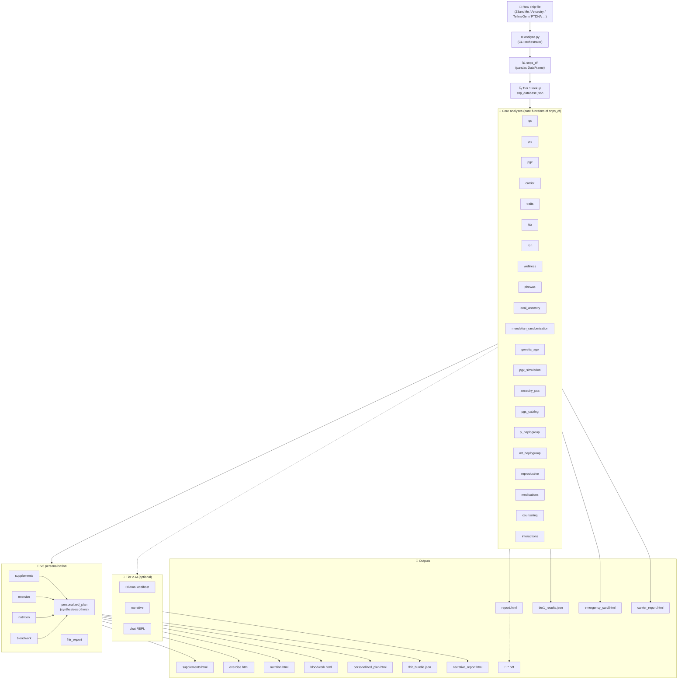

© 2026 Conall Aque. All Rights Reserved.

This software is proprietary and confidential. 
Unauthorized copying, modification, or distribution is prohibited.

---
# DNA Analysis Tool

> **Local, privacy-first DNA analysis pipeline.** Turns a consumer raw-data file
> (23andMe, AncestryDNA, MyHeritage, TellmeGen, FTDNA, …) into a comprehensive
> HTML report covering pharmacogenomics (217 CPIC drugs), polygenic risk,
> carrier status, ancestry with a Y-DNA/mtDNA lineage cross-check, traits,
> a detoxification & environmental-resilience panel, comprehensive
> genotype-aware blood-work analysis, wellness, personalised
> supplement/exercise/nutrition stacks, and a clinical-grade HL7 FHIR R4 export
> — with optional local-LLM interpretation via Ollama.
>
> **No DNA file ever leaves your machine.**


---

## Quickstart (90 seconds, zero AI required)

```bash
git clone https://github.com/conallaque/genomelens.git
cd genomelens
python3 -m venv .venv && source .venv/bin/activate
pip install pandas numpy snps scipy scikit-learn requests

# Drop your raw DNA file here (don't worry — .gitignore excludes *.csv / *.txt)
python analyze.py ~/Downloads/genome.csv --no-ai

# Open the result
open report.html                # macOS
xdg-open report.html            # Linux
```

That's it. You'll get `report.html`, `supplements.html`, `exercise.html`,
`nutrition.html`, and `personalized_plan.html` in the current directory. Add
`--bloodwork labs.json` to compare against measured lab values, or `--fhir` to
emit a clinical EHR bundle.

> **Disclaimer.** Not medical advice. Educational and research use only.
> Genetic predispositions are probabilistic; environment, lifestyle, and
> chance dominate most outcomes. Confirm any clinically actionable finding
> with a licensed physician and a board-certified genetic counsellor.

---

## What's new in V18–V19 — analysis depth (current)

The most recent releases add three major analysis capabilities. Full details in
[`CHANGELOG.md`](CHANGELOG.md); headline items:

- 🩸 **Comprehensive blood-work engine (V19).** Beyond the original
  genetics-vs-labs comparison, every biomarker is now classified against both
  standard clinical ranges *and* tighter functional/optimal ranges across 12
  body-system panels, with ~12 calculated markers (non-HDL, TG:HDL, ApoB:ApoA1,
  HOMA-IR, eGFR, transferrin saturation, NLR, FIB-4, …), **genotype-aware
  interpretation** (your HFE/APOE/TCF7L2/MTHFR/GC/FUT2/ABCG2/UGT1A1/LPA variants
  contextualise flagged results), and per-system + overall health scores.
- 🧬 **Ancestry lineage cross-check (V18).** The autosomal ancestry estimate is
  now reconciled against the Y-DNA and mtDNA haplogroups (geographic
  concordant/discordant verdict). Fixes a strand/palindrome bug that could
  mis-call European samples; dosage is now strand-aware.
- 🌫️ **Detoxification & environmental-resilience panel (V18).** Phase I/II
  xenobiotic handling (CYP1A1/1A2/1B1, GSTs, NQO1, EPHX1, NAT2), the NRF2
  antioxidant axis, and heavy-metal handling — with a wildfire-smoke resilience
  score and a genotype-personalised protocol. The metal/oxidative panel is now
  wired into the report.
- 🧪 **225 tests** (was 145 at V8); `REPORT_VERSION` 6.8.0-premium.

## What's new in V8 — completion of the foundation

V8 finishes the consolidation work started in V7. Zero new user-visible
features; substantial structural + correctness gains under the hood.
Full details in [`CHANGELOG.md`](CHANGELOG.md); headline items:

- ♻️ **`analyze.py` fully decomposed.** 4 876 lines → 1 055 (78 % reduction
  over V7 + V8). New focused modules: `cli.py` (parser), `pipeline.py`
  (orchestration), `renderers.py` (every `build_*_html` function),
  `snp_registry.py` (variant metadata). Backwards compatible — legacy
  `from analyze import build_html_report` keeps working via a lazy
  `__getattr__` shim.
- 🧬 **Registry migration — three more modules.** `carrier.py`,
  `wellness.py`, `traits.py` now cross-check against the unified registry
  at import time. The audit surfaced 3 strand-flipped variants (SERPINA1
  PiZ, PAH R408W, APOB R3500Q — historically reported on the gene's
  coding strand; reconciled in CHANGELOG). 0 real biology disagreements.
- 🔬 **Imputation provenance schema + reference-build auto-detection.**
  Every parsed `snps_df` is now tagged with a `source` column
  (`chip` / `imp_high_r2` / `imp_low_r2`) and a `build` attr
  (`grch37` / `grch38` / `mixed` / `unknown`). Schema only — downstream
  PRS / PheWAS scoring weighting is V8.1 work.
- 🧪 **145 tests in ~70 ms** (was 121 in V7). 6 golden snapshots locked
  the V6 outputs byte-exactly through three major refactors (renderers
  extraction, pipeline extraction, registry migration) — none drifted.

**Deferred to V8.1**, with specific next-steps documented in
[`CHANGELOG.md`](CHANGELOG.md): confidence intervals on PRS / PheWAS
(blocked by missing per-variant SE), ancestry-stratified PRS (blocked by
missing per-population effect sizes), downstream consumption of the
imputation provenance schema, indel schema extension for carrier.py's
remaining 33 entries, and registry migration of `pgx` / `phewas` / `prs`
/ `hla`.

## What's new in V7 — the consolidation release

V6 added user-facing features (bloodwork comparison, supplement stack,
exercise programming, nutrition, FHIR export, master dashboard). **V7 is
the foundation-rebuild release** — zero new user-visible features, big
durability and correctness gains under the hood:

- 🧬 **Unified SNP registry** (`snp_registry.py`) — single source of truth
  for every variant's GRCh37/38 coordinates, ancestral/derived alleles,
  gene, and citation. Replaces seven parallel per-module dicts where 46 %
  of rsIDs previously appeared with risk of inconsistent metadata.
- 🧪 **121-test pytest suite** — unit tests for the V6 modules, golden
  snapshot regression tests, registry invariant tests, CLI contract tests.
  All passing in under 100 ms; locks current behaviour against future
  refactors.
- ⚙️ **Real project tooling** — `requirements.txt`, `pyproject.toml`
  (ruff + mypy + pytest configs), GitHub Actions CI on push/PR, pre-commit
  hooks. The project is now contributable in a standard Python-ecosystem
  way.
- ♻️ **Begun decomposition of the 4 876-line `analyze.py`** — CLI parser
  extracted to a focused `cli.py` (`dna-analyze` console script). Pipeline
  + renderers extraction completed in V8.
- 📘 **Migration playbook** (`docs/MIGRATION_PLAYBOOK.md`) — step-by-step
  recipe for porting the remaining six legacy modules to the unified
  registry. `supplements.py` is the V7 proof-of-concept (behaviour
  byte-preserved per golden snapshots).

---

## Features

### Core analyses
- **Curated SNP catalogue** — thousands of variants annotated for disease risk,
  drug response, traits, methylation, detox, hormones, and more.
- **APOE genotype** — Alzheimer's risk and lipid metabolism inference.
- **Y-DNA haplogroup** — recursive tree walker (Macro-K → N/O/Q/P/R) with full
  N-subclade hierarchy (M231 → N1a1a → L1026/Z1936) and migration narratives.
- **mtDNA haplogroup** — maternal lineage classification.
- **Pharmacogenomics (PGx)** — CYP2D6, CYP2C19, CYP2C9, VKORC1, TPMT, DPYD,
  SLCO1B1, UGT1A1, HLA-B*57:01 etc. CPIC phenotypes + drug-level recs.
- **Polygenic Risk Scores (PRS)** — 20+ panels (CAD, T2D, breast/prostate
  cancer, Alzheimer's, …) with percentile, tier, and confidence.
- **Expanded PGS Catalog** — additional published polygenic scores.
- **Carrier status** — autosomal-recessive screening (CF, HH, FV Leiden, …).
- **Compound heterozygosity** — cross-variant interaction detection.
- **Trait predictions** — 100+ traits (eye, hair, taste, alcohol flush, …).
- **HLA imputation** — tag-SNP method for clinically relevant alleles.
- **Wellness predictions** — vitamin metabolism, sleep, fitness, stress.
- **ROH scan** — runs of homozygosity / consanguinity context.
- **Ancestry PCA + lineage cross-check** — global ancestry proportions from
  1000 Genomes, strand-aware and reconciled against the Y-DNA/mtDNA haplogroups
  (flags autosomal calls that contradict the deep paternal/maternal lineage).
- **Local ancestry painting** — chromosome-by-chromosome SVG ideogram.
- **Detoxification & environmental resilience** — Phase I/II xenobiotic handling
  (CYP1A1/1A2/1B1, GSTs, NQO1, EPHX1, NAT2), NRF2 antioxidant axis, and
  heavy-metal handling, with a wildfire-smoke resilience score + protocol.
- **Metal handling, oxidative defense & neurodegeneration** — LRRK2/GBA, HFE,
  G6PD, ATP7B, metallothioneins, ZIP transporters, catalase.
- **Gut-health panel** — FUT2 secretor status, lactase, histamine (AOC1), and
  related loci.
- **Top-prescribed-drugs screen + PharmGKB clinical annotations** — genotype
  actionability across the most common prescriptions.
- **Health economics** — modeled clinical/payer ROI for genomic interventions.
- **PheWAS** — phenome-wide biomarker percentile predictions (LDL, HDL, CRP,
  HbA1c, vitamin D, ferritin, testosterone, TSH, …).
- **Mendelian randomization** — causal-direction projections.
- **Genetic longevity** — biological-age proxy.
- **Reproductive simulator** — partner-by-partner offspring risk modelling.
- **Imputation** — Beagle 5.4 against 1000G Phase 3 (optional, ~30-90 min).
- **QC** — callability grading, sex inference, file hash, format detection.

### V6 personalisation modules
- **Comprehensive blood-work analysis** (`--bloodwork labs.json`) — two layers:
  (1) a clinical engine classifying ~50 biomarkers against standard *and*
  functional/optimal ranges across 12 body systems, with ~12 calculated markers
  (non-HDL, TG:HDL, ApoB:ApoA1, HOMA-IR, eGFR, transferrin saturation, NLR,
  FIB-4, …), genotype-aware interpretation (HFE, APOE, TCF7L2, MTHFR, GC, FUT2,
  ABCG2, UGT1A1, LPA), and per-system + overall health scores; and (2) the
  original genetics-vs-labs comparison flagging confirmed/partial/diverged rows
  with SD-scaled deltas.
- **Personalised supplement stack** — tiered (essential/recommended/optional)
  recommendations driven by methylation, vitamin, hormone, inflammation, and
  detox SNPs. Includes dose, timing, form, monthly cost, and interactions.
- **Personalised exercise programming** — ACTN3, ACE, COL1A1/5A1, PPARGC1A,
  IL6, BDNF, CLOCK driven power/endurance bias, injury risk, recovery speed,
  chronotype window, and a 7-day template.
- **Personalised nutrition plan** — FTO/TCF7L2/FADS/APOE-driven macro ratio,
  food emphasis/avoid lists, caffeine + alcohol + salt + lactose + gluten +
  methylation guidance, daily meal pattern.

### Clinical / portfolio outputs
- **HL7 FHIR R4 export** (`--fhir`) — clinically validated findings only
  (PGx, carrier, HLA, APOE) emitted as a FHIR Bundle JSON compatible with
  Epic / Cerner / Athena ingestion.
- **PDF export** (`--pdf`) — paginated WeasyPrint render.
- **Emergency medical card** (`--emergency-card`) — one-page actionable summary
  for clinicians.
- **Narrative report** (`--narrative`) — warm, LLM-written prose summary.
- **Carrier-status standalone report** (`--carrier-report`).
- **Chat REPL** (`--chat`) — Q&A backed by local Ollama with full results
  loaded as context.
- **Compare runs** (`--compare prev.json`) — diff two analyses.

---

## Architecture



The pipeline is **horizontally pluggable** — every module is imported in a
`try / except ImportError` block, so deleting a single file degrades gracefully
rather than breaking the run. The V6 personalisation layer reads only the
structured dicts produced by the core modules; it never re-derives genotype
calls. The `personalized_plan` dashboard is a pure synthesiser — it imports
only its sibling V6 outputs and stitches them into a single executive-summary
page.

---

## Installation

### 1. Clone

```bash
git clone https://github.com/conallaque/genomelens.git
cd genomelens
```

### 2. Python deps

```bash
python3 -m venv .venv
source .venv/bin/activate
pip install -r requirements.txt
```

`requirements.txt` minimally needs: `pandas`, `numpy`, `snps`, `scipy`,
`scikit-learn`, `requests`. Optional: `weasyprint` (PDF), `pysam` + Beagle 5.4
(imputation).

### 3. One-time data setup (~3 GB)

```bash
python setup.py --all
```

Downloads 1000 Genomes reference data, GWAS summary statistics, and ancestry
PCA panels. Cached locally; subsequent runs are instant.

### 4. (Optional) Local LLM via Ollama

```bash
brew install ollama          # macOS
ollama pull qwen3:14b         # default model
ollama serve                  # in another shell
```

---

## Usage

```bash
# Basic — produces report.html
python analyze.py ~/Downloads/genome.csv

# Skip the AI tier (~3× faster, no Ollama needed)
python analyze.py genome.csv --no-ai

# Add imputation (one-time ~30-90 min, cached afterwards)
python analyze.py genome.csv --impute

# Generate a paginated PDF
python analyze.py genome.csv --pdf

# Medication review
python analyze.py genome.csv --medications "sertraline, ibuprofen, warfarin"

# Compare predictions to actual blood work
python analyze.py genome.csv --bloodwork labs.json

# Clinical EHR export
python analyze.py genome.csv --fhir

# All the bells and whistles
python analyze.py genome.csv --impute --pdf --carrier-report \
    --emergency-card --narrative --bloodwork labs.json --fhir --chat
```

### `--bloodwork` JSON format

```json
{
  "sex": "M",            "age": 41,
  "total_cholesterol": 210, "ldl": 142,     "hdl": 48,
  "triglycerides": 180,  "apob": 105,       "lp_a": 35,
  "fasting_glucose": 96, "hba1c": 5.7,      "fasting_insulin": 9,
  "crp": 2.4,            "homocysteine": 11, "uric_acid": 6.2,
  "alt": 28,             "ast": 24,          "ggt": 30,
  "bilirubin_total": 0.9, "creatinine": 1.0, "bun": 15,
  "tsh": 1.8,            "ferritin": 180,   "iron": 110, "tibc": 320,
  "vitamin_d": 22,       "vitamin_b12": 410, "folate": 12,
  "hemoglobin": 14.8,    "wbc": 6.1,        "platelets": 235,
  "neutrophils": 3.6,    "lymphocytes": 1.9, "magnesium": 2.0,
  "testosterone": 480,   "shbg": 32,        "omega3_index": 6.5,
  "systolic_bp": 128,    "diastolic_bp": 82, "resting_hr": 64
}
```

Every field is optional — supply whatever your panel reports and the rest is
skipped. Keys are case-insensitive and accept common synonyms (`ldl_c`, `hgb`,
`hb`, `b12`, `e2`, `sbp`, …). Adding `sex` and `age` unlocks sex-specific
reference ranges and the eGFR / FIB-4 calculated markers. Calculated markers
(non-HDL, TG:HDL, ApoB:ApoA1, HOMA-IR, transferrin saturation, …) are derived
automatically wherever their inputs are present.

**Biological age, AHA PREVENT 10-year cardiovascular risk, and 20+ literature-
cited composite indices** are computed automatically. For **longitudinal tracking**, pass a
history of dated panels and the report charts your trajectory over time:

```json
{
  "sex": "M", "age": 41,
  "history": [
    { "date": "2024-02-10", "ldl": 165, "hdl": 38, "hba1c": 6.0, "crp": 4.0 },
    { "date": "2025-03-01", "ldl": 105, "hdl": 52, "hba1c": 5.3, "crp": 0.9 }
  ]
}
```

---

## Output files

After a full run, the working directory will contain:

| File | Trigger | Contents |
|---|---|---|
| `report.html` | always | The main report (Tier 1 + Tier 2 AI). |
| `tier1_results.json` | always | Machine-readable variant matches + summary. |
| `failed_categories.json` | AI run | Categories whose AI pass timed out — replay via `--retry-failed`. |
| `report.pdf` | `--pdf` | Paginated PDF of the main report. |
| `carrier_report.html` | `--carrier-report` | Standalone family-planning doc. |
| `emergency_card.html` | `--emergency-card` | One-page actionable summary. |
| `narrative_report.html` | `--narrative` | LLM-written prose summary. |
| `bloodwork.html` | `--bloodwork` | Comprehensive clinical panel (reference/optimal ranges, calculated markers, genotype-aware flags, system scores) + genetics-vs-labs comparison. |
| `economic_analysis.html` | auto | Modeled 10-year economic impact of acting on your results (cost avoidance + QALY value, net value, ROI). |
| `supplements.html` | auto | Tiered supplement stack with reasoning + chip gaps. |
| `exercise.html` | auto | Power/endurance bias + weekly template. |
| `nutrition.html` | auto | Macro ratios + food lists + daily plan. |
| `personalized_plan.html` | auto | **Master dashboard** synthesising the four above. |
| `fhir_bundle.json` | `--fhir` | HL7 FHIR R4 Bundle (DiagnosticReport + Provenance). |
| `changelog.json` | `--compare prev.json` | Diff vs. previous run. |

---

## Sample output

> *(Add screenshots of `report.html`, `supplements.html`, `bloodwork.html`,
> and the FHIR JSON here once running on your own data — placeholders below.)*

|  |  |
|---|---|
| Main HTML report (`report.html`) | Personalised supplement stack |

---

## Tech stack

- **Language:** Python 3.10+
- **Data:** pandas, numpy, scipy, scikit-learn
- **Genetics libs:** [`snps`](https://pypi.org/project/snps/) (file parsing),
  Beagle 5.4 (imputation), 1000 Genomes Phase 3 (reference panel)
- **AI:** Local Ollama runtime (`qwen3:14b` default; any chat model works)
- **PDF:** WeasyPrint
- **Clinical export:** HL7 FHIR R4 + Clinical Genomics IG v2.0
- **Tested chips:** 23andMe (v3 / v4 / v5), AncestryDNA, MyHeritage, FTDNA,
  TellmeGen (Illumina GSA), Living DNA
- **OS:** macOS, Linux. Windows untested.

---

## Privacy

- **No network calls** during analysis except optional Ollama (`localhost:11434`).
- DNA files never leave your machine.
- `tier1_results.json` and HTML reports contain genotypes and should be
  treated as PHI — the bundled `.gitignore` prevents them being committed.

---

## Roadmap

- Whole-genome VCF input
- Additional PRS panels from PGS Catalog API
- Bring-your-own-LLM (OpenAI / Anthropic) for users without local GPU
- Streamlit web UI for non-CLI users (still 100% local)

---

## Development

### Running tests

```bash
pip install -r requirements-dev.txt
pytest                                  # full suite
pytest -m "not slow"                    # fast subset
pytest --cov --cov-report=term-missing  # with coverage
pytest --snapshot-update tests/golden/  # regenerate golden snapshots (review the diff!)
```

The V7 consolidation ships **121 tests** across:

- `tests/unit/` — per-module behavioural tests (strand-handling, threshold
  boundaries, render smoke tests).
- `tests/registry/` — invariants for the unified SNP registry (frozen
  records, allele validation, position lookup).
- `tests/golden/` — JSON snapshot regression tests; any intentional output
  change requires `--snapshot-update` + a deliberate review of the diff.

### Linting and types

```bash
ruff check .          # lint
ruff format .         # format
mypy snp_registry.py cli.py    # strict-mode modules (new V7 code)
```

The `pyproject.toml` config is intentionally conservative: ruff selects a
small focused rule set, mypy is strict only on new modules. The strict-mode
set grows as legacy modules are cleaned up.

### CI

`.github/workflows/ci.yml` runs the test suite across Python 3.10 / 3.11 /
3.12, plus `ruff check`, `ruff format --check`, and `mypy` on the strict
module set, on every push and pull request.

### Contributing

The project is structured so each analysis module is independent — the
easiest way to extend it is to add a new module that takes `snps_df` and
returns a structured dict, then wire it into `analyze.py` behind a
`try / except ImportError` block.

**When adding genotype-based rules:**

- **Use the unified SNP registry** (`snp_registry.risk_dose_from_df`)
  rather than re-implementing strand-aware dose. Every new rsID must be
  declared once in `snp_registry._RECORDS` — chip strand differences,
  GRCh37/38 coordinates, and ancestral/derived alleles flow from there.
  Adding a per-module dict of rsIDs is rejected in code review; see
  `docs/MIGRATION_PLAYBOOK.md` for the reasoning.
- **Surface chip gaps explicitly.** A silent `return []` when the SNP is
  missing is indistinguishable to the user from "checked and ancestral".
  Use the `_chip_gap()` placeholder so the user can see what *couldn't* be
  evaluated.
- **Document the variance-explained reality.** Common-variant polygenic
  predictions typically explain 5–20% of trait variance; phrase tier labels
  and thresholds accordingly. "Diverged" in `bloodwork.py` means "non-genetic
  driver dominating," not "the genetic prediction is wrong."
- **Add unit tests + a golden snapshot.** New behaviour must be locked
  against regression. See `tests/unit/test_supplements.py` as the template.

For larger architectural changes (new pipeline stages, output formats, the
ongoing analyze.py decomposition), open an issue first to discuss.

---

## Citation

If this tool informs research or teaching material, please cite it as:

```bibtex
@software{dna_analysis_tool,
  title  = {DNA Analysis Tool — local, privacy-first genomics pipeline},
  author = {Aque, Conall R.},
  year   = {2026},
  url    = {https://github.com/conallaque/genomelens},
  note   = {Local consumer-chip → clinical-grade FHIR R4 export}
}
```

Underlying datasets and guidelines should be cited independently — CPIC for
pharmacogenomic recommendations, ClinVar for variant interpretation, PGS
Catalog for polygenic scores, ISOGG / YFull for Y-DNA phylogeny, the relevant
GWAS consortia (UK Biobank, GIANT, GLGC, MAGIC, PGC, Astle 2016, Yengo 2022,
…) for biomarker effect sizes, and the HL7 Clinical Genomics IG for the FHIR
output format.

---

## Licence

MIT. Use, fork, and modify freely; no warranty.

---

## Acknowledgements

Built on top of the work of countless GWAS consortia (PGC, UK Biobank, GIANT,
GLGC, MAGIC, Astle 2016, …), CPIC, ClinVar, PharmGKB, ISOGG, YFull, and the
PGS Catalog. Reference genome positions are GRCh37/hg19 unless noted.
