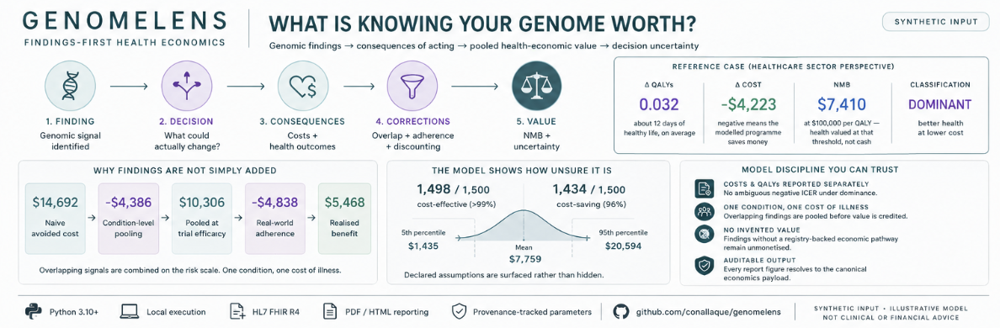
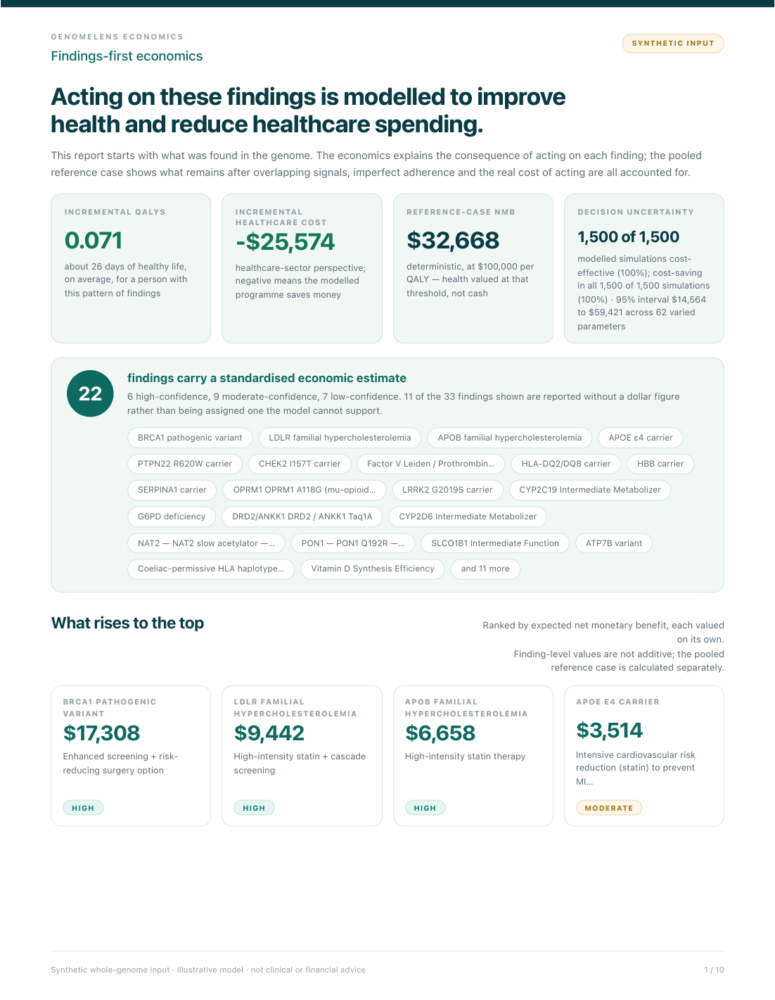

# GenomeLens



**A privacy-preserving genomic decision engine that connects genetic evidence to
actionable decisions, uncertainty, and health-economic consequences.** Cost-utility
analysis, value of information and budget impact — computed on real genomic data,
entirely on your own machine.

### 📄 [See the full report → `docs/samples/econ-output-sample.pdf`](docs/samples/econ-output-sample.pdf)

[](docs/samples/econ-output-sample.pdf)

*Ten pages, generated from a synthetic genome. Click through for the rest.*

**What it can be trusted to do, and the evidence.** Findings first, economics
second: what was found, what it could change, how strong the evidence is, and
what the model estimates. Every figure on those pages comes from one canonical
payload ([`econ-payload-sample.json`](docs/samples/econ-payload-sample.json)),
checked by a validator that **blocks the PDF** on any broken arithmetic identity.
Each parameter carries a provenance tier; each finding carries its evidence
grade; the corrections that reduce the estimate sit beside the figures they
replaced. Independently developed — see [PROVENANCE.md](PROVENANCE.md).

    Summary · Findings at a glance (3 sheets) · Medication-genotype
    Risk & prevention · How findings combine · Uncertainty & evidence
    Testing decision · Methods & provenance

Faster than reading this page. **Synthetic input — no human genome and no personal health
data** were used to make it. Reproduce it with
`python scripts/make_econ_sample.py out/ --refresh-committed`.

**What a clean clone reproduces: all of it.** The ClinVar records this sample can match
are committed (`data/clinvar_sample_subset_grch38.tsv.gz`, 10 rows, NCBI public domain),
and no finding in the sample depends on a downloaded predictor table. A fresh clone
with no setup produces **$32,668 across 33 findings** — byte-identical to the committed
payload. The generator **refuses to run** rather than falling through to a generic
bucket if no ClinVar table is found: a sample that renders correctly and is quietly
wrong is worse than one that will not build.

The generator builds a **purpose-built synthetic whole genome on GRCh37** — the curated
SNP registry at its GRCh37 positions, three pharmacogenomic star-allele variants, and two
real ClinVar pathogenic variants at their real GRCh37 coordinates. Every coordinate comes
from a table already in this repository; none is written from memory. It is **not** a
lifted-over copy of the chip sample in `data/test_genome.txt`, and the two should not be
confused.

The committed PDF and payload come from **one run** of that command and share a build
stamp. The pathogenic pair is LDLR familial hypercholesterolaemia and BRCA1 hereditary
breast/ovarian — a configuration occurring in **roughly 1 in 120,000** people
(approximate, assuming independence; pathogenic-variant heterozygote prevalence, not
carrier frequency — both are dominant, so a heterozygote is at risk rather than a silent
carrier). The pharmacogenomic variants are CYP2C19\\*2, CYP2D6\\*4 and SLCO1B1\\*5, which run at
roughly 15%, 20% and 15% allele frequency: a genome carrying none of them would be the
unusual case, not the conservative one.

In it: cost and QALYs reported **separately** with the ICER *withheld* under dominance ·
a **double-counting correction** showing what naive addition claimed and how much came out ·
an **adherence discount** charged to benefit *and* ongoing cost · findings with no
registry-backed pathway shown as *"not yet standardised"* rather than assigned an invented
value · probability reported as a **count** — *"cost-effective in 1,500 of 1,500
simulations"* — beside its 95% interval, because a bare percentage cannot be told apart
from a model whose parameters stopped varying.


[](https://github.com/conallaque/genomelens/actions/workflows/ci.yml)


[](https://buymeacoffee.com/caque)

### 🔁 [Independent check → `heor-model-replication`](https://github.com/conallaque/heor-model-replication)

Everything on this page is my own model assessing itself. That repo is not: it reproduces
**three peer-reviewed cohort state-transition models in Python**, matching every printed
cost, effect, ICER and dominance verdict exactly. If you want to know whether I can build
a cSTM that agrees with a published one before trusting the numbers here, start there.

**Methods and every equation:** [`docs/METHODS.md`](docs/METHODS.md) ·
**How to run it:** [`docs/USAGE.md`](docs/USAGE.md)

> **Not medical advice — educational and research use.** An illustrative
> decision-analytic model, not a formal economic evaluation.

---

## What this demonstrates as HEOR work

Anyone can run a cost-effectiveness analysis. These are the parts that are harder to
fake, and each is traceable to a named test.

| Competency | Evidence |
|---|---|
| **Cost–utility analysis done properly** | Cost, QALYs, ICER and INMB reported separately, never blended into one "value" figure. ICER suppressed in the dominance quadrants, because a negative ratio is ambiguous. `econ.engine.CEAResult` |
| **Finding my own errors** | Eight findings routed onto one cardiometabolic anchor and were **summed** — a 240% risk reduction, which is not a probability. Fixed by pooling on the risk scale; the report shows the size of its own correction. Six more, with what each cost to find, in [What broke, and how I found it](#what-broke-and-how-i-found-it). `test_stacked_findings_do_not_sum_their_risk_reductions` |
| **Uncertainty that is real** | An earlier version reported a strategy cost-saving in **100% of simulations** — the finding-level parameters were pinned outside the sampling loop. `test_psa_without_rebuild_understates_uncertainty`<br><br>**The current sample also reports 100%, for a different reason, and here is how to tell.** Its profile carries a familial-hypercholesterolaemia finding whose whole distribution sits above zero: 62 varied parameters, a 95% interval of $14,564–$59,421, printed beside the probability so the spread is visible in the same block. The bug reported 100% at *every* willingness-to-pay including **$0/QALY**, which asserts the cash arm has no uncertainty at all. **This profile reports 100% at zero as well** — the honest reading is that on a profile this dominant the CEAC alone no longer separates the two cases, so the spread is what does: the bug's interval was degenerate because nothing varied, while this one moves 4.1x across 62 sampled parameters. The zero-threshold check still guards the engine against a return of the pinning defect, asserted on a non-dominant profile where it can discriminate: `test_ceac_at_zero_threshold_is_below_certainty` |
| **Parameter provenance, enforced** | Every figure carries a tier. `tier="assumption"` **may not** cite a source — the registry fails to load if it does. Two populations, reported separately rather than blended: **49 of 66** registry parameters are sourced (74.2%), and **134 of 306** curated-table figures resolve to a PMID or DOI (43.8%). The model prints its own coverage instead of claiming "sourced". `econ/params.py` |
| **Knowing what not to monetise** | Reproductive outcomes are never priced — attaching a figure to an affected birth prices a prospective child. Stated in code, enforced by a test, surfaced as a decision rather than an omission. `NOT_VALUED` |
| **Structural modelling** | Cohort state-transition model against US life-table mortality, Simpson's 1/3 within-cycle correction cross-checked against an independent implementation. The cross-check runs only where [`heor-model-replication`](https://github.com/conallaque/heor-model-replication) is checked out alongside; it **skips on CI**, where only the endpoint weights are asserted. `test_within_cycle_weights_match_the_published_implementation` |
| **Validated against published models** | Three peer-reviewed cohort state-transition models reproduced in Python, every printed cost, effect, ICER and dominance verdict matched exactly — the one claim here that is not self-assessed. [`heor-model-replication`](https://github.com/conallaque/heor-model-replication) |
| **Distributional equity analysis** | Two complementary methods — Atkinson EDE (age-based) and power-law equity weights (ancestry-based with explicit portability discounts) — so the model can show *who* benefits, not just how much. `econ.decision.distributional_cea`, `econ.frontier.distributional_cea` |
| **Family cascade value** | Monogenic findings (BRCA, Lynch) are worth more than individual NMB because first-degree relatives share a 50% carrier probability. The model computes cascade testing value explicitly rather than ignoring it. `analyze_value_of_information` |
| **Real options framing** | Dixit–Pindyck test-now vs. defer decision — the cost of waiting is computed as foregone preventive value, not assumed to be zero. `econ.value_of_information` |

The recurring theme: the model reports an unflattering answer as readily as a flattering
one, and several commits above exist because it did.

**Authorship, plainly.** The health-economics modelling, scientific decisions and product
direction are mine. The **software implementation was largely AI-generated** under my
direction and review — what is on offer here is the economics and the judgement.

---

---

## What broke, and how I found it

Every model has bugs. What is worth reading is which ones a person catches in their own
work, and what the catching cost. These are mine, with the test that now pins each.

**A reference-build mismatch that ran on real data.** The predictor screen took the first
table on disk and never compared it to the input's build, so a GRCh37 genome was scored
against the hg38 AlphaMissense table. That returns nothing where the coordinate is unused
and *another variant's score* where it is valid in the other build. From this repo's own
tables — APOE rs429358, whose GRCh37 and GRCh38 positions are both real coordinates:
`19:45411941` → `None`; `19:44908684` → `0.0365`. Silent misattribution.
`test_predictor_refuses_a_table_keyed_on_the_other_build`

**Identity that never left the extractor.** `_econ_record` accepted `gene`, `condition` and
`variant` as arguments and never put them in the record it returned. Identity died at the
first hop, so every consumer downstream re-derived it from display text — categories
matched by substring, pathway ids slugified from finding names. That one omission produced
four separate-looking defects: monogenic findings routed to the medication section,
one gene priced twice on different anchors, nine unrelated findings collapsing onto the
same $2,579, and a reproductive finding escaping the policy that forbids pricing it. I
patched three of those symptoms before finding the cause. It hid because each local
re-derivation looked like reasonable behaviour on its own.

**A field name is not a contract.** Three times. `qaly_gain` had no documented semantics,
so two consumers each invented one and their values differed by exactly the effect size
one applied and the other did not. `prevalence` was read as though it meant `p_event`; the
field docs call it payer scaling. `prev_carrier` is a population frequency, not
P(condition | carrier). Every valuation field now states what it means and who applies it.

**A cited test that did not exist.** This page cited
`test_pdf_blocked_on_arithmetic_violation` as proof of the consistency gate. The gate was
real; the test was not — the name appeared nowhere but the line citing it. A second test
now asserts every test name cited here resolves to a real one.
`test_readme_cites_only_tests_that_exist`

**Artifacts that contradicted each other.** The committed PDF was rendered from a chip run
while the payload beside it came from a whole-genome run, so the two described different
inputs while this page claimed both resolved to one canonical payload. Each artifact was
internally valid, so the gate passed on both. Nothing compared them.

**A provenance metric that improved by shrinking its denominator.** Moving the gene table
into its own module took 51 curated figures out of the coverage audit, because discovery
matched on a filename suffix. Reported coverage would have *risen*. Discovery is now
explicit, and a test asserts a newly added table is found.
`test_curated_table_discovery_finds_a_newly_added_table`

### Three things this taught me that generalise

> A consistency check between two derived quantities passes when both derive from the same
> corrupted source.

The count of sequencing-only findings and their total value were each computed from a
duplicated record set. Both were wrong in the same direction, so they agreed with each
other, and the check comparing them stayed green for as long as the duplication lasted.

> A count aggregates over a mechanism you haven't identified yet, so it measures the
> symptom's blast radius and reads like the cause's size.

Four times I reported a count as the scope of a defect — 65% placeholders, nine findings
sharing one figure, a 200× split between two paths, sixteen pathways on two constants —
and each turned out to be the reach of something I had not yet found, not its size.

**Any policy enforced at a call site, rather than at the point of monetisation, is bypassed
by the next path that reaches monetisation.** Five times in one file: two paths valuing the
same gene, two valuing the same carrier, the withholding policy honoured on one pricing
path and not the other, and a monetised flag asserted rather than derived. I named this
pattern and then shipped another instance of it within the hour. The fix that holds is an
invariant on the assembled payload, where every path has already converged.

## Why I built this

I've worked in health economics for five years — a BA focused on it, with a published
paper, and now a master's at Northeastern. One question keeps coming back: **what is
understanding your own health actually worth?**

Your genome is the best input to that question. Two things block it.

**Price.** Buying these analyses and the interpretation separately runs from a few
hundred to a few thousand dollars.

**Privacy.** To get them, you hand your genome to a company's cloud — the one piece of
data you can't change or take back — where it can be breached, sold, or reused.

That's a health-economics problem, not a technical one. The value of information in a
genome is real but individual: this model puts it anywhere from near zero to tens of
thousands, depending on what's actually in the file. It reports which one you got instead
of assuming the better answer. But access is gated by money and by a privacy cost most
people shouldn't accept, so the return genomics promises only reaches people who can pay
and are willing to give themselves up.

GenomeLens removes both. It runs locally, for free, on a laptop you already own. And it
doesn't just list findings — it prices them: what each one is worth, what *acting* on it
is worth, and whether acting is worth it at all.

I wasn't trying to build a genomics toy. The payoff of understanding your own biology
shouldn't cost a lot of money or your DNA. On a normal laptop, it doesn't have to.

---

## What else it tells you

The economics is the headline, but it is computed on top of a full analysis. Briefly,
what a run actually reports:

| Area | What you get |
|---|---|
| **Pharmacogenomics** | CPIC/DPWG star-allele calling across 217 drugs — which medications to avoid, dose-adjust, or expect a poor response from. HLA typing for drug-hypersensitivity risk. Drug–drug and gene–drug interactions. |
| **Clinical risk** | ClinVar pathogenic/likely-pathogenic screen, ACMG actionable genes, carrier status, and an offline computational screen (AlphaMissense) for rare variants beyond ClinVar. |
| **Polygenic risk** | PRS and PGS Catalog scores with coverage and an ancestry-transferability caveat, plus PheWAS biomarker predictions. |
| **Gut health** | Lactase persistence, FUT2 secretor status, coeliac HLA-DQ2.5/DQ8 tags, histamine/DAO clearance, NOD2 and IL23R. |
| **Fitness** | Power vs endurance lean, strength trainability, recovery speed, VO2max response, plus lift-level protocol cards and HR/FTP zones. |
| **Nutrition** | Macronutrient pressures, caffeine and alcohol handling, lactose and gluten, folate/B12 methylation, and a 30-day meal plan with a shopping list. |
| **Supplements** | A ranked stack with the genotype behind each entry, an evidence tier, what to avoid, and a monthly cost. |
| **Blood work** | Genotype-aware interpretation of a supplied lab panel — clinical *and* optimal ranges, biological age (Levine PhenoAge), AHA PREVENT 10-year ASCVD risk, and longitudinal tracking. |
| **Ancestry & lineage** | AIM-based population inference, Neanderthal and ancient-population affinity, chromosome painting, and Y-DNA / mtDNA lineage chains showing every branch point and where the chip runs out. |
| **Other panels** | Detoxification enzymes, metals and oxidative handling, immunogenetics, neurochemistry (COMT/MAOA/BDNF), urologic, addiction genetics, blood type, sleep and chronotype. |
| **Recommendations** | A master plan tying it together: decade-by-decade priorities, behavioural protocols, a printable emergency card for clinicians, and a plain-language summary of what to actually do first. |

Findings that have a **real signal but no proven intervention** carry no dollar value and
say so — a risk you cannot act on is reported as exactly that, not priced.

## Health economics — what the engine actually does

Full derivations, equations and citations: [`docs/METHODS.md`](docs/METHODS.md).
The report: [`docs/samples/econ-output-sample.pdf`](docs/samples/econ-output-sample.pdf) ·
the payload it renders from: [`econ-payload-sample.json`](docs/samples/econ-payload-sample.json) ·
the Markov model as a **live Excel workbook** — inputs editable, every result a formula:
[`cea-model-sample.xlsx`](docs/samples/cea-model-sample.xlsx).

**Cost-utility analysis.** Cost, QALYs, ICER and INMB reported separately. 3% discounting
on both costs and QALYs (0/3/5% in sensitivity). The ICER is **withheld** in the dominance
quadrants rather than reported as a negative number.

**Findings pooled, not summed.** Twenty-two finding sources feed the model and seven route
onto the same cardiometabolic anchor. Summing the findings they produce claimed a risk
reduction above 100% — not a probability. Pooling is complement-of-products on the risk
scale with a correlated-signal penalty, and each condition's cost of illness is charged
once.

**Trial efficacy discounted to real-world effectiveness.** Adherence enters inside the
pooling product, keyed on what acting asks of the person rather than which organ is
involved. It is charged to the benefit *and* the ongoing intervention cost — but not to
the one-off test cost, which is why it moves cost-effectiveness at all.

**Uncertainty.** Probabilistic sensitivity analysis rebuilding the pools inside every
draw, a CEAC, a one-way tornado, EVPI, EVPPI and breakeven. An earlier version reported a
strategy cost-saving in 100% of simulations because the finding-level parameters were
pinned outside the loop.

**Cohort model.** Three-state state-transition model against US life-table mortality, with
`p = 1 − e^(−rΔt)` (never `r·Δt`), Simpson's 1/3 within-cycle correction cross-checked
against an independent implementation, and cohort-conservation validation.

**Budget impact**, on ISPOR conventions that deliberately differ from CEA: short horizon,
population-scaled, undiscounted, uptake phased in, reported PMPM.

**Provenance.** Every parameter carries a tier. `tier="assumption"` **may not** cite a
source — the registry fails to load if it does, which makes anti-assumption-laundering a
machine-checked rule rather than a promise. The main report shows only registry-backed
expected net monetary benefit; the older curated per-finding figures are kept in
the payload for audit and are no longer presented as comparable estimates.

**Reporting.** Second Panel dual perspective with an impact inventory, and a CHEERS 2022
checklist that names the items *not* addressed as well as those that are.

**Employer / insurer perspective.** The report translates individual NMB into an
employer-benefit case: PGx findings reduce adverse drug reaction risk (fewer sick days,
lower treatment costs), monogenic findings enable early surveillance, and the aggregate
maps to avoidable claims. This is a reframing exercise, not a separate model — the
economics are the same CEA seen from the payer's side.

**Behavioural nudge.** High-value findings are loss-framed — "Cost of inaction: $X over
Y years" — because the behavioural economics literature shows loss framing moves
health decisions when gain framing does not (Kahneman & Tversky, 1979; Rothman & Salovey,
1997). Low-value findings are not nudged.

**Cascade testing.** For monogenic pathogenic findings, the model estimates family
cascade value: N first-degree relatives × 50% carrier probability × individual NMB ×
a cascade multiplier. A BRCA2 finding is worth more than its individual NMB because
relatives can be tested.

**Reanalysis value.** The report notes that genomic data compounds in value — the same
raw file can be reanalysed against updated variant databases, new polygenic scores, and
future pharmacogenomic guidelines. A one-time test with recurring returns.

## Known limitations

This model reports its own gaps rather than hiding them.

- **Parameter provenance is incomplete.** The registry enforces tiers (published / derived
  / assumption) and blocks assumption-laundering. Coverage differs by population and the
  two are not interchangeable: **49 of 66 (74.2%)** registry parameters are sourced, but
  only **134 of 306 (43.8%)** figures in the curated clinical tables resolve to a PMID or
  DOI. The rest are stated assumptions. The report prints its own coverage rather than
  claiming "fully sourced."
- **The registry sits below its own sourced-parameter floor.** 49 of 66 registered
  parameters carry a citation (74.2%), against a 75% floor the test suite enforces. The
  floor was lowered to 74% deliberately, once: registering the predictor PPV replaced an
  unregistered magic number that spent a pathogenicity *score* as though it were a
  probability. The assumption was always load-bearing — it was outside the registry, so
  the previous 75.4% was flattering. Surfacing a hidden assumption should not be penalised
  more heavily than leaving it hidden, but the breach is stated here rather than absorbed.
- **Two gene-anchor tables disagree.** `ACMG_GENE_ECONOMICS` and `_gene_to_econ` both
  hold per-gene QALY anchors and give different values for the same gene (LDLR 3.5 vs
  1.5), so a finding's worth depends on which code path reaches it. The provenance
  registry cannot detect this because each table is internally consistent. Not yet fixed.
- **Ancestry portability.** PRS transferability from European-ancestry GWAS to other
  populations is discounted (African: 0.25, East Asian: 0.60, etc.) but the discount
  factors themselves are rough estimates. The model surfaces the portability gap as a
  cost rather than ignoring it.
- **Not a formal economic evaluation.** This is an illustrative decision-analytic model
  built to demonstrate HEOR competency. Dollar figures are model estimates, not clinical
  recommendations.

## Verification

The things you can check without trusting the model's own output:

| Check | What it proves |
|---|---|
| [`heor-model-replication`](https://github.com/conallaque/heor-model-replication) | Three published cSTMs reproduced exactly — cost, effect, ICER, dominance verdict. The one claim here that is not self-assessed. |
| `tools/markov_check.R` | Independent base-R implementation of the Markov cohort trace. If the Python and R answers disagree, something is wrong. |
| [`cea-model-sample.xlsx`](docs/samples/cea-model-sample.xlsx) | The CEA as a live Excel workbook — every cell is a formula, every input is editable. You can change assumptions and watch the ICER move. |
| `econ/params.py` | The provenance registry. `tier="assumption"` **may not** cite a source — the loader rejects it. Grep for `tier=` to see exactly which parameters are sourced and which are not. |
| Consistency gate | The PDF renderer **blocks** on broken arithmetic identities — costs must decompose, QALYs must sum, the ICER must match. `test_pdf_blocked_on_arithmetic_violation` |
| Test suite | Includes `test_psa_without_rebuild_understates_uncertainty` (rebuilding pools inside each PSA draw widens the interval) and `test_stacked_findings_do_not_sum_their_risk_reductions` (eight CAD findings sum to 2.4 and must pool below that). `test_voi_no_silent_drops` is narrower than its name: it asserts that a finding whose *source label* is unrecognised is recorded as unvalued rather than dropped — it does not cover a finding lost upstream of the economics, or one routed to the wrong anchor. |
| `test_readme_cites_only_tests_that_exist` | Asserts every test name cited on this page resolves to a real test. Added because one cited here did not — see "finding my own errors". |

**What the CI badge covers.** The badge attests to all but **two** of the tests. Those two
skip on the runner every run: the within-cycle cross-check above (no replication repo
present) and a `tier1_results.json` integration check. Both pass locally with those
artefacts available. The badge is not evidence for those two.

## Engineering notes

- **Unified, strand-aware SNP registry** — one source of truth for GRCh37/38 coordinates and ancestral/derived alleles; caught and fixed palindrome/strand bugs that silently mis-call ancestry.
- **KING-robust relationship inference** — a proper kinship estimator (not naive percent-identity), IBS0-refined for parent-child vs full-sibling.
- **No fabricated figures** — no invented polygenic percentiles; transmission ≠ disease penetrance; ClinVar review-star confidence; Phase-3 findings are labelled computational predictions, never clinical calls; and a **grounding guardrail rejects any AI-introduced figure absent from the deterministic data**, so the local LLM cannot invent a risk or a statistic.
- **Runs end-to-end on a public genome** — a *functional* check, not a clinical accuracy validation: the full **GIAB HG001 (NA12878)** reference genome ran through build detection, Phase-2 ClinVar, the Phase-3 predictor screen and the health-economics engine with no runtime errors. **This run has not been repeated since, so no counts from it are quoted here.** The per-variant figures it produced were withdrawn rather than restated (see `CHANGELOG.md`), because the model has changed substantially since and a number that was true then is not evidence now.
- **800+ tests**, reference-build auto-detection (GRCh37/38 incl. rsID-less whole-genome VCFs), and graceful degradation when optional data or models are absent.

## Output files

One run writes a self-contained set of HTML pages beside the output path — no
server, no build step, no network.

| File | What is in it |
|---|---|
| `report.html` | The main report. Every module's section, including the pooled cost-effectiveness analysis, the plain-language summary, and the Y-DNA / mtDNA lineage chains. |
| `economic_analysis.html` | The individual's economic sheet — cost avoided, QALYs, net monetary benefit, and the cost-saving / cost-effective split kept explicitly apart. |
| `emergency_card.html` | One page, actionable findings only: drug hypersensitivities, clotting disorders, pharmacogenomic extremes. Designed to be printed and carried. |
| `supplements.html` | Ranked supplement stack with the genotype behind each entry and a tier for how well evidenced it is. |
| `nutrition.html` | Macronutrient pressures, food-specific guidance, and a 30-day meal plan. |
| `exercise.html` | Power/endurance bias, trainability tiers, and lift-level protocol cards. |
| `longevity.html` | Longevity composite and a quarterly year-long plan. |
| `personalized_plan.html` | The master dashboard tying the other pages together. |

## Privacy

- **No network calls** during analysis except optional Ollama (`localhost:11434`).
- DNA files never leave your machine.
- `tier1_results.json` and HTML reports contain genotypes and should be
  treated as PHI — the bundled `.gitignore` prevents them being committed.

---

## Support

GenomeLens is built and maintained by one person, in the open. If it saved you a
consult, taught you something about your own biology, or you just appreciate the
engineering, you can help fuel the next module:

[](https://buymeacoffee.com/caque)

---

## Citation

If this tool informs research or teaching material, please cite it as:

```bibtex
@software{dna_analysis_tool,
  title  = {GenomeLens — a local, privacy-first health-economics engine for consumer genomics},
  author = {Aque, Conall R.},
  year   = {2026},
  url    = {https://github.com/conallaque/genomelens},
  note   = {Local chip/whole-genome analysis with HL7 FHIR R4 export (educational; not a certified clinical record)}
}
```

Underlying datasets and guidelines should be cited independently — CPIC for
pharmacogenomic recommendations, ClinVar for variant interpretation, PGS
Catalog for polygenic scores, ISOGG / YFull for Y-DNA phylogeny, the relevant
GWAS consortia (UK Biobank, GIANT, GLGC, MAGIC, PGC, Astle 2016, Yengo 2022,
…) for biomarker effect sizes, and the HL7 Clinical Genomics IG for the FHIR
output format.

---

## License

**Proprietary — © 2026 Conall Aque. All Rights Reserved.** This repository is
public for viewing and reference only. Use, copying, modification, or
distribution without the author's written permission is prohibited. No warranty.

---

## Acknowledgements

Built on top of the work of countless GWAS consortia (PGC, UK Biobank, GIANT,
GLGC, MAGIC, Astle 2016, …), CPIC, ClinVar, PharmGKB, ISOGG, YFull, and the
PGS Catalog. Reference genome positions are GRCh37/hg19 unless noted.
