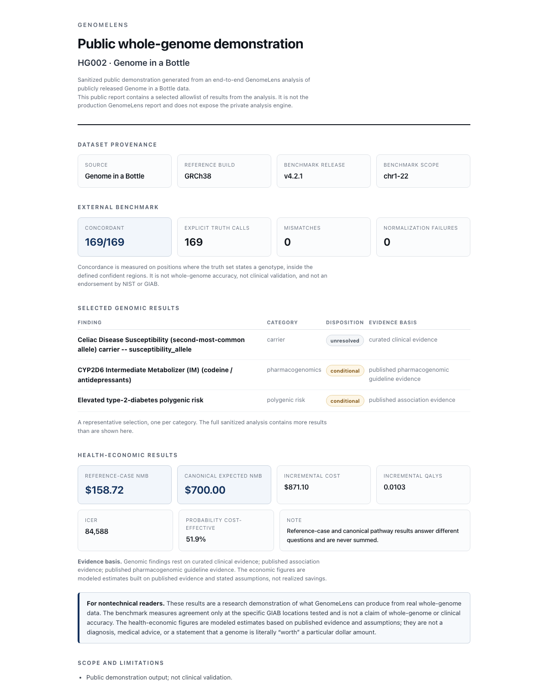
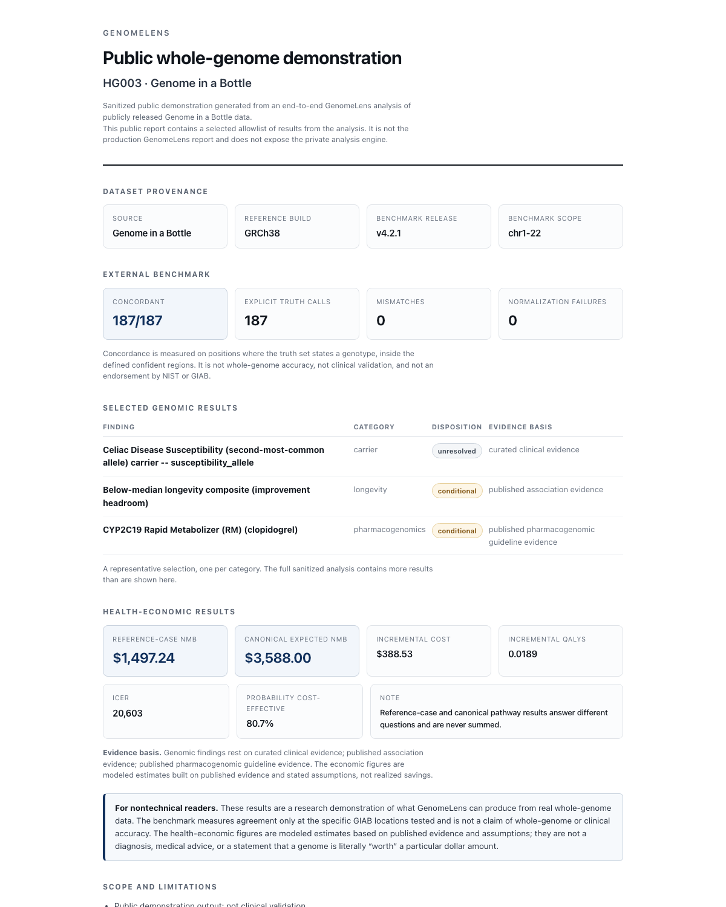
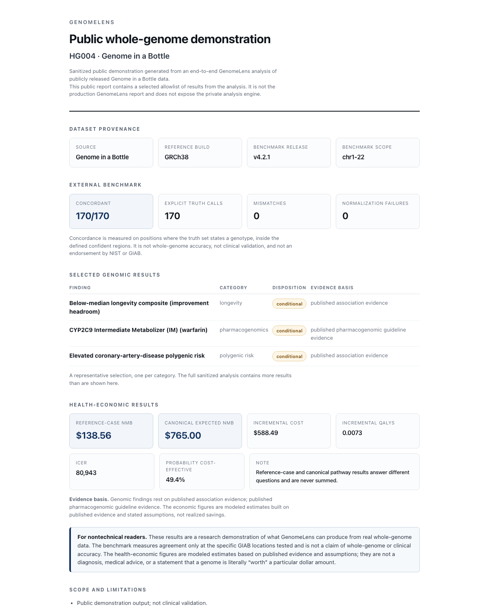

# GenomeLens

**From whole-genome evidence to decision-relevant health economics.**

GenomeLens is an experimental genomics and decision-analysis platform. It asks not only what a genome contains, but what supported findings could change, what evidence stands behind that change, what the modeled health and economic consequences are, how uncertain those consequences remain — and when the system should refuse to make a claim at all.

```
WHOLE-GENOME INTERPRETATION → CLINICAL ACTIONABILITY → EVIDENCE PROVENANCE
→ HEALTH ECONOMICS → UNCERTAINTY / VALUE OF INFORMATION → AUDITABLE REPORTING
```

## Real whole-genome demonstrations

GenomeLens was run end to end on three publicly released Genome in a Bottle whole-genome callsets. The reports below are sanitized public outputs from those runs — real results, not mock-ups.

| Sample | Explicit truth calls | Concordance | Reference-case NMB | Canonical expected NMB | Incremental cost | Incremental QALY | ICER / status\* | Evidence basis | Report |
|---|---|---|---|---|---|---|---|---|---|
| **HG002** | 169 | **100.0%** (169/169, 0 mismatches) | **$158.72** | **$700.00** | $871.10 | 0.0103 | $84,588 | curated clinical, published association, published guideline + modeled economics | [Report (PDF)](artifacts/public-benchmarks/HG002/report-public.pdf) · [Web report](https://conallaque.github.io/genomelens/artifacts/public-benchmarks/HG002/report-public.html) · [JSON](artifacts/public-benchmarks/HG002/summary.json) |
| **HG003** | 187 | **100.0%** (187/187, 0 mismatches) | **$1,497.24** | **$3,588.00** | $388.53 | 0.0189 | $20,603 | curated clinical, published association, published guideline + modeled economics | [Report (PDF)](artifacts/public-benchmarks/HG003/report-public.pdf) · [Web report](https://conallaque.github.io/genomelens/artifacts/public-benchmarks/HG003/report-public.html) · [JSON](artifacts/public-benchmarks/HG003/summary.json) |
| **HG004** | 170 | **100.0%** (170/170, 0 mismatches) | **$138.56** | **$765.00** | $588.49 | 0.0073 | $80,943 | published association, published guideline + modeled economics | [Report (PDF)](artifacts/public-benchmarks/HG004/report-public.pdf) · [Web report](https://conallaque.github.io/genomelens/artifacts/public-benchmarks/HG004/report-public.html) · [JSON](artifacts/public-benchmarks/HG004/summary.json) |

> **\*** ICER shows the additional cost required to gain one additional
> quality-adjusted life year (QALY). Lower positive ICERs generally indicate better
> value at a given willingness-to-pay threshold. **Dominant** means better modeled
> outcomes at lower cost.

```
526 / 526  scoped explicit GIAB truth calls concordant
  0        mismatches
  0        normalization failures
```

Scope: GIAB **v4.2.1** · **GRCh38** · **chr1–22** · a fixed curated validation panel. This is agreement on the explicitly benchmarked calls inside that scope — not whole-genome accuracy, not clinical validation, and not an endorsement by NIST or GIAB. The denominator is published in [`docs/VALIDATION.md`](docs/VALIDATION.md#per-sample).

**What the columns mean**

- **Sample** — The public Genome in a Bottle (GIAB) genome analyzed by GenomeLens.
- **GIAB concordance** — Of the benchmark positions where the GIAB truth set states a
  definitive genotype (the *explicit truth calls*, the denominator shown), how many
  GenomeLens matched. A scoped validation measure over a fixed panel, not a claim of
  whole-genome accuracy.
- **Reference-case NMB** — *Net monetary benefit*: the modeled monetary value of
  expected health gains, minus the additional costs, under the reference-case
  assumptions. Higher positive values mean greater modeled net benefit at the stated
  willingness-to-pay threshold.
- **Canonical expected NMB** — A separate, standardized estimate of expected net benefit
  across the modeled pathways. It answers a different question from reference-case NMB,
  so it is not a component of that figure and the two are never added together.
- **Report** — The sanitized public output for that genome, as a rendered PDF, a web
  page, and the underlying JSON.

Reference-case and canonical expected NMB answer different modeling questions. They are
reported side by side rather than combined, because no single number is "the value of
this genome."

> **For nontechnical readers:** These results are a research demonstration of
> what GenomeLens can produce from real whole-genome data. The benchmark
> measures agreement only at the specific GIAB locations tested and is not a
> claim of whole-genome or clinical accuracy. The health-economic figures are
> modeled estimates based on published evidence and assumptions; they are not a
> diagnosis, medical advice, or a statement that a genome is literally “worth” a
> particular dollar amount.

<p align="center">
  <a href="https://conallaque.github.io/genomelens/artifacts/public-benchmarks/HG002/report-public.html"></a>
  <a href="https://conallaque.github.io/genomelens/artifacts/public-benchmarks/HG003/report-public.html"></a>
  <a href="https://conallaque.github.io/genomelens/artifacts/public-benchmarks/HG004/report-public.html"></a>
</p>

Click any preview for the rendered report. **Report (PDF)** opens in GitHub's
own viewer; **Web report** is the same report rendered via GitHub Pages; **JSON**
is the machine-readable public summary. These reports are built from an explicit
allowlist, not by redacting a production report. The production GenomeLens report is a separate internal artifact and is not published.

## It runs, on real public genomes

GenomeLens is exercised end-to-end against the [Genome in a Bottle](https://www.nist.gov/programs-projects/genome-bottle) Ashkenazim trio — HG002, HG003, HG004 — using the publicly released GIAB GRCh38 benchmark callsets and defined confident regions. These are real public reference genomes with an external truth set, not mockups or simulations.

```
526 / 526  explicit benchmarked calls concordant
  0        mismatches
  0        normalization failures
```

Per sample: [HG002](https://www.nist.gov/programs-projects/genome-bottle) [169](docs/VALIDATION.md#hg002), [HG003](https://www.nist.gov/programs-projects/genome-bottle) [187](docs/VALIDATION.md#hg003), [HG004](https://www.nist.gov/programs-projects/genome-bottle) [170](docs/VALIDATION.md#hg004). The three are a father–mother–son trio, so the calls are not statistically independent.

**What that is not.** Not 100% whole-genome accuracy. Not clinical validation. Not an endorsement by NIST or GIAB. It is agreement on the explicitly benchmarked calls inside the defined truth and callability scope — a denominator we publish rather than hide.

## Validation and QA

[](https://github.com/conallaque/genomelens/actions/workflows/public-validation.yml)

GenomeLens is developed against a private automated regression suite covering
genomic interpretation, evidence handling, health economics, uncertainty,
reproducibility and reporting. Current private-engine release run:
**5,446 passing · 2 known residual failures · 24 skipped**, with both residual
failures tracked outside the three published demonstration paths. Exact status
in [`docs/TESTING.md`](docs/TESTING.md).

That suite stays private, because a test asserting what the engine does under a
given input is a specification of the engine. So a **representative public
verification suite** ships here instead, written from the published artifacts
outward rather than by exporting private tests. It is purpose-built
around the public claims — not a sample drawn from the private suite — and lets
what this repository publishes be inspected independently. **Public validation:
155 checks — 155 passed.**

```bash
pytest tests/public                     # 155 checks: 155 passed
python tools/verify_public_release.py   # one-command release verification
```

Both read only files committed to this repository — no network, no credentials,
no engine dependency, so a fresh clone can run them.

[Public validation suite](tests/public) · [Testing methodology](docs/TESTING.md)

## What a report contains

Each run produces a genomic and health-economic report containing: supported findings, carrier status, pharmacogenomics, callability and source state; evidence provenance per finding; reference-case and standardized pathway economics; incremental cost, incremental QALYs, ICER or dominance; probabilistic sensitivity analysis; explicit refusals and limitations.

Reports are published only through the allowlist export profile in [`PUBLIC-REPORT-SPEC.md`](docs/PUBLIC-REPORT-SPEC.md). A sanitized trio report is [not published in this release](docs/RELEASE-STATUS.md#trio-reports).

## It does not price a genome

GenomeLens deliberately produces no single "your genome is worth $X" number. That figure cannot be constructed honestly: it requires adding quantities that answer different questions, for different beneficiaries, on different evidence.

Seven estimands are kept distinct — reference-case · canonical standardized pathway · reproductive · cascade/family · testing-replacement · payer/budget-impact · value-of-information — and are not summed unless an explicit additive-attribution contract permits it.

Action value and information value can represent closely related economic consequences viewed from different decision perspectives, so GenomeLens does not automatically add them.

Headline trio economics are regenerated against each engine build and published only with the build identifier that produced them. None is [published in this release](docs/RELEASE-STATUS.md#trio-economics).

## Evidence, assumption, and refusal are different states

```
EVIDENCE-DERIVED · MODEL / SCENARIO ASSUMPTION · CONDITIONAL
UNRESOLVED · REFUSED · NOT ECONOMICALLY APPLICABLE
```

Findings and economic arms are classified on two separate axes; both vocabularies are defined in [`GLOSSARY.md`](docs/GLOSSARY.md).

A missing value is never silently converted to $0. A pathway that could not be evaluated and one evaluated at zero are different facts.

A refusal is not a negative biological result. Declining to monetize a finding says nothing about whether the finding is real.

An explicit economic-validation matrix requires every tracked pathway to terminate in a defined disposition rather than falling silently through the model. The claim is "every tracked row reaches an explicit terminal disposition" — coverage and accountability, not a claim that every row is empirically validated.

The matrix counts themselves are regenerated per build and are [not published in this release](docs/RELEASE-STATUS.md#matrix-counts).

## Uncertainty and value of information

GenomeLens carries probabilistic sensitivity analysis, decision-uncertainty summaries, and value-of-information methods for asking whether resolving additional clinical uncertainty could change a modeled decision — and whether that information is worth its acquisition cost.

In the current lipid value-of-information pathway, holding clinical state fixed and changing the genome does not change the result. This is a property of the current model, not a claim that genomes are irrelevant to lipid decisions — and because it derives from the same model as the withheld figures below, it is reported as a current model property rather than as an established finding.

Numerical value-of-information examples are [not published in this release](docs/RELEASE-STATUS.md#methods-hold), pending review of one treatment-effect parameter.

## Where GenomeLens stops

Will not monetize a pharmacogenomic finding merely because a genotype is guideline-actionable when the medication or indication is unknown.

Distinguishes an unsupported absence claim from a true negative.

Does not claim production support for every copy-number, structural, repeat-expansion, CYP2D6 star-allele or mitochondrial-heteroplasmy problem.

Does not read a GIAB benchmark as clinical validation. Concordance establishes agreement with the external truth calls within the benchmarked scope; it says nothing about clinical utility.

Does not treat economic arms as additive by default.

Where a benefit is estimable but its real-world cost is not adequately sourced, GenomeLens can report a maximum model-consistent cost bound rather than silently treating the unknown cost as zero or inventing an actual market price.

## Public repository boundary

This repository contains selected methodology, validation evidence, curated reports and integration examples. The production engine, internal economic parameter registries, routing logic and qualification machinery are maintained separately.

Public artifacts are generated through a deliberately constrained export layer so that validation evidence and interpretable results can be inspected without exposing the production engine.

**Research software. Not a diagnostic device. Not medical advice.**
