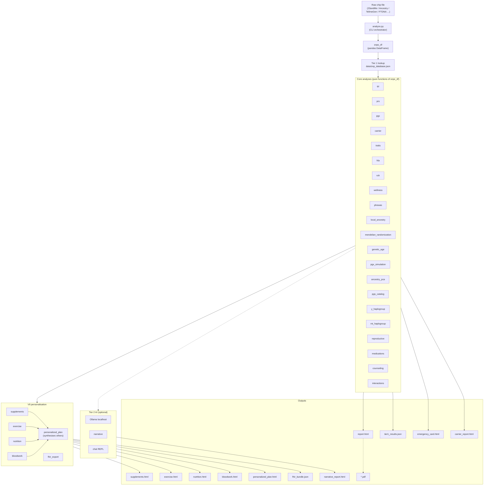

# Running GenomeLens

Operational detail split out of the README on 2026-08-24. The README is the
overview; this is the manual. Nothing here was deleted — it was moved so the
front page could be read in three minutes instead of thirty-five.

Back to the [README](../README.md) · methods in [METHODS.md](METHODS.md)

---

## Quickstart

No bioinformatics experience needed. If you can copy-paste into a terminal, you can run
this. **Prerequisites:** Python 3.10+ (`python3 --version`) and your raw DNA file.

### 1 — Get your raw DNA file
- **23andMe:** Account → *Settings* → *Download raw data* → you get a `.txt` (or `.zip`).
- **AncestryDNA / MyHeritage / TellMeGen / FamilyTreeDNA:** each has a "download raw
  data" option in account settings → a `.txt`/`.csv`.
- **Whole genome:** the `.vcf` / `.vcf.gz` from your sequencing provider.

### 2 — Install (one time, ~2 minutes)
```bash
git clone https://github.com/conallaque/genomelens.git
cd genomelens
python3 -m venv .venv && source .venv/bin/activate
pip install pandas numpy snps scipy scikit-learn requests
```

### 3 — Run it (fast path, no AI required)
```bash
# point it at wherever your file downloaded
python analyze.py ~/Downloads/genome.txt --no-ai

open report.html          # macOS   ·   use  xdg-open report.html  on Linux
```
That's it — `report.html` opens in your browser with the full analysis (plus
`supplements.html`, `nutrition.html`, `exercise.html`, `personalized_plan.html`).
Add `--bloodwork labs.json` to fold in real lab values (this unlocks biological age
**and the full health-economics model**), or `--fhir` for an HL7 FHIR R4 bundle
(EHR-*format*-compatible; educational data, not a certified clinical record).

### 4 — Run it with the local AI (Ollama)
The AI layer writes a plain-language interpretation of **every** section and powers an
offline Q&A chat — all running **locally**, so nothing ever leaves your machine.

**a. Install Ollama** (free, one time) — download from
[ollama.com/download](https://ollama.com/download) (or `brew install ollama` on macOS),
then make sure it's running (open the Ollama app, or run `ollama serve`).

**b. Download a model** (one time):
```bash
ollama pull qwen3:14b        # the default (~9 GB) — comfortable on 16 GB+ RAM
ollama pull llama3.1:8b      # lighter alternative for tighter RAM
```

**c. Run — just drop `--no-ai`:**
```bash
python analyze.py ~/Downloads/genome.txt
# using the lighter model instead of the default:
python analyze.py ~/Downloads/genome.txt --model llama3.1:8b
```

**d. Ask questions** — add `--chat` for an interactive Q&A grounded in your results:
```bash
python analyze.py ~/Downloads/genome.txt --chat
```
The AI only ever sees your deterministic findings, and a guardrail rejects any number
it tries to invent (see [Engineering notes](#engineering-notes)).

> ### ⚠ Important — read before using the chat
>
> **This is not medical advice, and the AI is not a doctor or a genetic counsellor.**
>
> - The chat assistant is an **educational tool only**. It cannot diagnose, cannot
>   prescribe, cannot interpret your results clinically, and must **never** be used to
>   start, stop, or change any medication, treatment, screening, or health decision.
> - **Language models make mistakes.** The grounding guardrail reduces fabricated
>   figures but **cannot eliminate error**. Anything the assistant says may be wrong,
>   incomplete, or misleading — including statements that sound confident and specific.
> - **Consumer and self-sequenced DNA data is not clinical-grade.** It carries false
>   positives and false negatives. A finding here is a *hypothesis to confirm*, never a
>   result to act on.
> - **A "clear" result does not mean you are not at risk.** Most disease risk is not
>   captured by this tool at all.
> - **Take every question or concern to a licensed physician and a board-certified
>   genetic counsellor**, who can order accredited confirmatory testing and interpret it
>   in the context of your personal and family history. If you believe you may have a
>   medical emergency, contact emergency services immediately.
>
> By using this software you accept that it is provided for education and research
> **"as is", without warranty of any kind**, and that you are solely responsible for any
> decisions you make. See the [LICENSE](LICENSE) and the disclaimers throughout this
> document.

### Using a whole genome instead of a chip?
Same commands — just point at your `.vcf`/`.vcf.gz` and fetch the predictor tables once:
```bash
python setup.py --predictors                      # AlphaMissense + gnomAD + REVEL (~4 GB)
python analyze.py ~/Downloads/genome.vcf.gz        # add --chat / --bloodwork as above
```
Disk/RAM/runtime for both input types are in **Runs on any laptop**, below.

> **Disclaimer.** Not medical advice. Educational and research use only.
> Genetic predispositions are probabilistic; environment, lifestyle, and
> chance dominate most outcomes. Confirm any clinically actionable finding
> with a licensed physician and a board-certified genetic counsellor.

---


## Runs on any laptop — no expensive setup

GenomeLens deliberately **trades speed for accessibility**. The heavy analyses use
tabix-indexed lookups that *stream* the genome region-by-region instead of loading it
into memory, so the whole thing runs on an ordinary laptop — just slower. No
workstation, no GPU, no cloud, and every tool is free and open-source. Developed and
tested on an **Apple M5 / 24 GB**; runs on macOS or Linux, Apple Silicon or Intel.

| Input | RAM | Disk | Typical runtime |
|---|---|---|---|
| **Standard chip** (23andMe / AncestryDNA / TellMeGen, ~0.6M SNPs) | ~2–4 GB (fine on 8 GB) | **< 1 GB** (the tool itself) | **~30 s–1 min** deterministic (see the AI note below ↓) |
| **Whole genome (~30×, VCF)** | **~8 GB** recommended (ran comfortably within 24 GB) | **~2–5 GB** for the practical predictor set (AlphaMissense ≈0.65 GB + gnomAD AF ≈3 GB + ClinVar ≈11 MB) **+ room for your VCF** (≈0.5–2 GB) | **~2–10 min** deterministic (≈2 min on GIAB; see the AI note below ↓) |

- The whole-genome **Phase-3 predictor scan is the slow part** — it queries every
  carried variant — and that is the speed-for-accessibility tradeoff. It's also a
  **one-time cost**: results cache, so you re-report and re-interpret instantly.
- **CADD is the only large table** (~81 GB if you host it locally, non-commercial).
  It's optional — skip it, or let the analyzer query it remotely on public data. The
  commercial-safe set (AlphaMissense + gnomAD) fits in **under 4 GB**.
- A **chip file needs no extra downloads at all** — the predictor/ClinVar tables are
  only used for whole-genome input.
- **The local AI is by far the slowest part — and it's entirely your choice.** The
  times above are the fast **deterministic** report (`--no-ai`). Turning the AI on runs a
  local LLM interpretation for *every* module plus the summaries — dozens of calls. This
  is true for **both** a chip and a whole genome (the AI interprets the same modules
  either way), so **with AI on, both take a long time** — the total is dominated by your
  model, not your data:
  - **Small model** (e.g. `--model llama3.1:8b`): roughly **20–60 minutes**.
  - **Large / unfiltered model** (e.g. a 30B): **2–4+ hours** on a laptop.

  It's a deliberate **speed-for-accessibility** tradeoff — and a **one-time cost** (results
  cache, so re-reports are instant). You control it: pick a smaller `--model`, use
  `--no-module-ai` to keep only the executive summary, or run `--no-ai` and read the
  deterministic report immediately. Times are on an Apple M5; older/lower-RAM machines are
  slower — but it still *runs*, which is the whole point.

Bottom line: **you don't need an expensive rig to analyze your own genome.** A regular
laptop, some patience, and disk space is enough — and nothing ever leaves the machine.


## Features

### Core analyses
- **Curated SNP catalogue** — thousands of variants annotated for disease risk,
  drug response, traits, methylation, detox, hormones, and more.
- **APOE genotype** — Alzheimer's risk and lipid metabolism inference.
- **Y-DNA haplogroup** — recursive tree walker (Macro-K → N/O/Q/P/R) with full
  N-subclade hierarchy (M231 → N1a1a → L1026/Z1936) and migration narratives.
- **mtDNA haplogroup** — maternal lineage classification.
- **Pharmacogenomics (PGx)** — CYP2D6, CYP2C19, CYP2C9, VKORC1, TPMT, DPYD,
  SLCO1B1, UGT1A1, HLA-B*57:01 etc. CPIC phenotypes + drug-level recs.
- **Polygenic Risk Scores (PRS)** — 20+ panels (CAD, T2D, breast/prostate
  cancer, Alzheimer's, …) with percentile, tier, and confidence.
- **Expanded PGS Catalog** — additional published polygenic scores.
- **Carrier status** — autosomal-recessive screening (CF, HH, FV Leiden, …).
- **Compound heterozygosity** — cross-variant interaction detection.
- **Trait predictions** — 100+ traits (eye, hair, taste, alcohol flush, …).
- **HLA imputation** — tag-SNP method for clinically relevant alleles.
- **Wellness predictions** — vitamin metabolism, sleep, fitness, stress.
- **ROH scan** — runs of homozygosity / consanguinity context.
- **Ancestry PCA + lineage cross-check** — global ancestry proportions from
  1000 Genomes, strand-aware and reconciled against the Y-DNA/mtDNA haplogroups
  (flags autosomal calls that contradict the deep paternal/maternal lineage).
- **Local ancestry painting** — chromosome-by-chromosome SVG ideogram.
- **Detoxification & environmental resilience** — Phase I/II xenobiotic handling
  (CYP1A1/1A2/1B1, GSTs, NQO1, EPHX1, NAT2), NRF2 antioxidant axis, and
  heavy-metal handling, with a wildfire-smoke resilience score + protocol.
- **Metal handling, oxidative defense & neurodegeneration** — LRRK2/GBA, HFE,
  G6PD, ATP7B, metallothioneins, ZIP transporters, catalase.
- **Gut-health panel** — FUT2 secretor status, lactase, histamine (AOC1), and
  related loci.
- **Top-prescribed-drugs screen + PharmGKB clinical annotations** — genotype
  actionability across the most common prescriptions.
- **Health economics** — modeled clinical/payer ROI for genomic interventions.
- **PheWAS** — phenome-wide biomarker percentile predictions (LDL, HDL, CRP,
  HbA1c, vitamin D, ferritin, testosterone, TSH, …).
- **Mendelian randomization** — causal-direction projections.
- **Genetic longevity** — biological-age proxy.
- **Reproductive simulator** — partner-by-partner offspring risk modelling.
- **Imputation** — Beagle 5.4 against 1000G Phase 3 (optional, ≈30-90 min).
- **QC** — callability grading, sex inference, file hash, format detection.

### V6 personalisation modules
- **Comprehensive blood-work analysis** (`--bloodwork labs.json`) — two layers:
  (1) a clinical engine classifying ≈50 biomarkers against standard *and*
  functional/optimal ranges across 12 body systems, with ≈12 calculated markers
  (non-HDL, TG:HDL, ApoB:ApoA1, HOMA-IR, eGFR, transferrin saturation, NLR,
  FIB-4, …), genotype-aware interpretation (HFE, APOE, TCF7L2, MTHFR, GC, FUT2,
  ABCG2, UGT1A1, LPA), and per-system + overall health scores; and (2) the
  original genetics-vs-labs comparison flagging confirmed/partial/diverged rows
  with SD-scaled deltas.
- **Personalised supplement stack** — tiered (essential/recommended/optional)
  recommendations driven by methylation, vitamin, hormone, inflammation, and
  detox SNPs. Includes dose, timing, form, monthly cost, and interactions.
- **Personalised exercise programming** — ACTN3, ACE, COL1A1/5A1, PPARGC1A,
  IL6, BDNF, CLOCK driven power/endurance bias, injury risk, recovery speed,
  chronotype window, and a 7-day template.
- **Personalised nutrition plan** — FTO/TCF7L2/FADS/APOE-driven macro ratio,
  food emphasis/avoid lists, caffeine + alcohol + salt + lactose + gluten +
  methylation guidance, daily meal pattern.

### Clinical / portfolio outputs
- **HL7 FHIR R4 export** (`--fhir`) — clinically *actionable* finding **types**
  (PGx, carrier, HLA, APOE), chip-derived and requiring confirmatory clinical
  testing, emitted as an HL7 FHIR R4 Bundle JSON — **format-compatible** with EHR
  ingestion (Epic / Cerner / Athena), not a certified clinical record.
- **PDF export** (`--pdf`) — paginated WeasyPrint render.
- **Emergency medical card** (`--emergency-card`) — one-page actionable summary
  for clinicians.
- **Narrative report** (`--narrative`) — warm, LLM-written prose summary.
- **Carrier-status standalone report** (`--carrier-report`).
- **Chat REPL** (`--chat`) — Q&A backed by local Ollama with full results
  loaded as context.
- **Compare runs** (`--compare prev.json`) — diff two analyses.

---


## Architecture



The pipeline is **horizontally pluggable** — every module is imported in a
`try / except ImportError` block, so deleting a single file degrades gracefully
rather than breaking the run. The V6 personalisation layer reads only the
structured dicts produced by the core modules; it never re-derives genotype
calls. The `personalized_plan` dashboard is a pure synthesiser — it imports
only its sibling V6 outputs and stitches them into a single executive-summary
page.

---


## Installation

### 1. Clone

```bash
git clone https://github.com/conallaque/genomelens.git
cd genomelens
```

### 2. Python deps

```bash
python3 -m venv .venv
source .venv/bin/activate
pip install -r requirements.txt
```

`requirements.txt` minimally needs: `pandas`, `numpy`, `snps`, `scipy`,
`scikit-learn`, `requests`. Optional: `weasyprint` (PDF), `pysam` + Beagle 5.4
(imputation).

### 3. One-time data setup (≈3 GB)

```bash
python setup.py --all
```

Downloads 1000 Genomes reference data, GWAS summary statistics, and ancestry
PCA panels. Cached locally; subsequent runs are instant.

### 4. (Optional) Local LLM via Ollama

```bash
brew install ollama          # macOS
ollama pull qwen3:14b         # default model
ollama serve                  # in another shell
```

---


## Usage

```bash
# Basic — produces report.html
python analyze.py ~/Downloads/genome.csv

# Skip the AI tier (~3× faster, no Ollama needed)
python analyze.py genome.csv --no-ai

# Add imputation (one-time ~30-90 min, cached afterwards)
python analyze.py genome.csv --impute

# Generate a paginated PDF
python analyze.py genome.csv --pdf

# Medication review
python analyze.py genome.csv --medications "sertraline, ibuprofen, warfarin"

# Compare predictions to actual blood work
python analyze.py genome.csv --bloodwork labs.json

# Clinical EHR export
python analyze.py genome.csv --fhir

# All the bells and whistles
python analyze.py genome.csv --impute --pdf --carrier-report \
    --emergency-card --narrative --bloodwork labs.json --fhir --chat
```

### `--bloodwork` JSON format

```json
{
  "sex": "M",            "age": 41,
  "total_cholesterol": 210, "ldl": 142,     "hdl": 48,
  "triglycerides": 180,  "apob": 105,       "lp_a": 35,
  "fasting_glucose": 96, "hba1c": 5.7,      "fasting_insulin": 9,
  "crp": 2.4,            "homocysteine": 11, "uric_acid": 6.2,
  "alt": 28,             "ast": 24,          "ggt": 30,
  "bilirubin_total": 0.9, "creatinine": 1.0, "bun": 15,
  "tsh": 1.8,            "ferritin": 180,   "iron": 110, "tibc": 320,
  "vitamin_d": 22,       "vitamin_b12": 410, "folate": 12,
  "hemoglobin": 14.8,    "wbc": 6.1,        "platelets": 235,
  "neutrophils": 3.6,    "lymphocytes": 1.9, "magnesium": 2.0,
  "testosterone": 480,   "shbg": 32,        "omega3_index": 6.5,
  "systolic_bp": 128,    "diastolic_bp": 82, "resting_hr": 64
}
```

Every field is optional — supply whatever your panel reports and the rest is
skipped. Keys are case-insensitive and accept common synonyms (`ldl_c`, `hgb`,
`hb`, `b12`, `e2`, `sbp`, …). Adding `sex` and `age` unlocks sex-specific
reference ranges and the eGFR / FIB-4 calculated markers. Calculated markers
(non-HDL, TG:HDL, ApoB:ApoA1, HOMA-IR, transferrin saturation, …) are derived
automatically wherever their inputs are present.

**Biological age, AHA PREVENT 10-year cardiovascular risk, and 20+ literature-
cited composite indices** are computed automatically. For **longitudinal tracking**, pass a
history of dated panels and the report charts your trajectory over time:

```json
{
  "sex": "M", "age": 41,
  "history": [
    { "date": "2024-02-10", "ldl": 165, "hdl": 38, "hba1c": 6.0, "crp": 4.0 },
    { "date": "2025-03-01", "ldl": 105, "hdl": 52, "hba1c": 5.3, "crp": 0.9 }
  ]
}
```

---


## Output files

After a full run, the working directory will contain:

| File | Trigger | Contents |
|---|---|---|
| `report.html` | always | The main report (Tier 1 + Tier 2 AI). |
| `tier1_results.json` | always | Machine-readable variant matches + summary. |
| `failed_categories.json` | AI run | Categories whose AI pass timed out — replay via `--retry-failed`. |
| `report.pdf` | `--pdf` | Paginated PDF of the main report. |
| `carrier_report.html` | `--carrier-report` | Standalone family-planning doc. |
| `emergency_card.html` | `--emergency-card` | One-page actionable summary. |
| `narrative_report.html` | `--narrative` | LLM-written prose summary. |
| `bloodwork.html` | `--bloodwork` | Comprehensive clinical panel (reference/optimal ranges, calculated markers, genotype-aware flags, system scores) + genetics-vs-labs comparison. |
| `economic_analysis.html` | auto | Modeled 10-year economic impact of acting on your results (cost avoidance + QALY value, net value, ROI). |
| `supplements.html` | auto | Tiered supplement stack with reasoning + chip gaps. |
| `exercise.html` | auto | Power/endurance bias + weekly template. |
| `nutrition.html` | auto | Macro ratios + food lists + daily plan. |
| `personalized_plan.html` | auto | **Master dashboard** synthesising the four above. |
| `fhir_bundle.json` | `--fhir` | HL7 FHIR R4 Bundle (DiagnosticReport + Provenance). |
| `changelog.json` | `--compare prev.json` | Diff vs. previous run. |

---


## Tech stack

- **Language:** Python 3.10+
- **Data:** pandas, numpy, scipy, scikit-learn
- **Genetics libs:** [`snps`](https://pypi.org/project/snps/) (file parsing),
  Beagle 5.4 (imputation), 1000 Genomes Phase 3 (reference panel)
- **AI:** Local Ollama runtime (`qwen3:14b` default; any chat model works)
- **PDF:** WeasyPrint
- **Clinical export:** HL7 FHIR R4 + Clinical Genomics IG v2.0
- **Tested chips:** 23andMe (v3 / v4 / v5), AncestryDNA, MyHeritage, FTDNA,
  TellmeGen (Illumina GSA), Living DNA
- **OS:** macOS, Linux. Windows untested.

---


## Roadmap

- Additional PRS panels from PGS Catalog API
- Bring-your-own-LLM (OpenAI / Anthropic) for users without local GPU
- Streamlit web UI for non-CLI users (still 100% local)

---


## Development

### Running tests

```bash
pip install -r requirements-dev.txt
pytest                                  # full suite
pytest -m "not slow"                    # fast subset
pytest --cov --cov-report=term-missing  # with coverage
pytest --snapshot-update tests/golden/  # regenerate golden snapshots (review the diff!)
```

The suite ships **780 tests** across:

- `tests/unit/` — per-module behavioural tests (strand-handling, threshold
  boundaries, render smoke tests).
- `tests/registry/` — invariants for the unified SNP registry (frozen
  records, allele validation, position lookup).
- `tests/golden/` — JSON snapshot regression tests; any intentional output
  change requires `--snapshot-update` + a deliberate review of the diff.

### Linting and types

```bash
ruff check .          # lint
ruff format .         # format
mypy snp_registry.py cli.py    # strict-mode modules (new V7 code)
```

The `pyproject.toml` config is intentionally conservative: ruff selects a
small focused rule set, mypy is strict only on new modules. The strict-mode
set grows as legacy modules are cleaned up.

### CI

[`.github/workflows/ci.yml`](.github/workflows/ci.yml) runs on every push and
pull request:

- **tests** — the full suite on Python 3.10 / 3.11 / 3.12, then an import of the
  CLI entry point and a full end-to-end report generation from the committed
  synthetic genome. The suite imports modules directly and never exercises the
  facade `pipeline.py` imports through, so a green suite alone is not proof the
  CLI starts — that is checked separately.
- **lint and types** — `ruff check` and `mypy` on its configured strict set,
  both clean on a clean tree.
- **dna-guard** — asserts the two `.gitignore` rules that keep genotype data
  out of the repository are still in place, and that nothing genotype-shaped
  besides the synthetic test file is tracked.

`ruff format --check` is deliberately **not** gated: the formatter reflows 132
files, collapsing hand-aligned parameter tables and comment blocks that carry
most of this codebase's explanation. Lint catches defects; the formatter has an
opinion about layout, and here the layout is load-bearing.

### Extending it

*(The licence is All Rights Reserved, so this is a note on how the code is organised rather than an invitation for pull requests.)*

The project is structured so each analysis module is independent — the
easiest way to extend it is to add a new module that takes `snps_df` and
returns a structured dict, then wire it into `analyze.py` behind a
`try / except ImportError` block.

**When adding genotype-based rules:**

- **Use the unified SNP registry** (`snp_registry.risk_dose_from_df`)
  rather than re-implementing strand-aware dose. Every new rsID must be
  declared once in `snp_registry._RECORDS` — chip strand differences,
  GRCh37/38 coordinates, and ancestral/derived alleles flow from there.
  Adding a per-module dict of rsIDs is rejected in code review; see
  `docs/MIGRATION_PLAYBOOK.md` for the reasoning.
- **Surface chip gaps explicitly.** A silent `return []` when the SNP is
  missing is indistinguishable to the user from "checked and ancestral".
  Use the `_chip_gap()` placeholder so the user can see what *couldn't* be
  evaluated.
- **Document the variance-explained reality.** Common-variant polygenic
  predictions typically explain 5–20% of trait variance; phrase tier labels
  and thresholds accordingly. "Diverged" in `wellness/bloodwork.py` means "non-genetic
  driver dominating," not "the genetic prediction is wrong."
- **Add unit tests + a golden snapshot.** New behaviour must be locked
  against regression. See `tests/unit/test_supplements.py` as the template.

For larger architectural changes (new pipeline stages, output formats, the
ongoing analyze.py decomposition), open an issue first to discuss.

---

